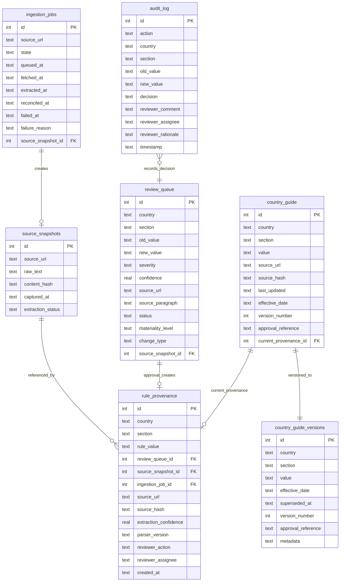

# Database Design

## Design Philosophy

The database schema is designed around one governing principle: **compliance decisions must be permanently traceable.** Every table that participates in the governance record is designed for append-only access. Every table that represents current state has a versioned shadow table that preserves historical state. Foreign key relationships create the provenance chain that links a published rule back to the government source that originated it.

The schema is not normalized for write performance. It is designed for audit completeness.

---

## Schema Overview



---

## Table Reference

### `country_guide` — Active Published Rules

The authoritative table for currently effective employment rules. Each row is a single rule for one (country, section) pair.

```sql
CREATE TABLE country_guide (
    id INTEGER PRIMARY KEY AUTOINCREMENT,
    country TEXT,
    section TEXT,
    value TEXT,
    source_url TEXT,
    source_hash TEXT,
    last_updated TEXT,
    effective_date TEXT,
    created_at TEXT,
    version_number INTEGER,
    approval_reference TEXT,
    UNIQUE(country, section)
)
```

**`UNIQUE(country, section)`** — enforces exactly one active rule per (country, section) pair. Updates are upserts: the previous value is written to `country_guide_versions` before overwriting.

**`current_provenance_id`** — FK to `rule_provenance`. Updated atomically with every approval. Enables single-query provenance chain resolution. A published rule with `current_provenance_id IS NULL` indicates a data integrity issue and should be investigated.

**Write policy:** Only `approve_pending_review_item()` in `CountryGuideRepository` writes to this table. No other code path updates the `value` column.

---

### `country_guide_versions` — Immutable Version History

Every approved rule change creates a new version row. Versions are never modified except to set `superseded_at` when the next version is created.

```sql
CREATE TABLE country_guide_versions (
    id INTEGER PRIMARY KEY AUTOINCREMENT,
    country TEXT NOT NULL,
    section TEXT NOT NULL,
    value TEXT NOT NULL,
    source_url TEXT,
    source_hash TEXT,
    effective_date TEXT NOT NULL,
    created_at TEXT NOT NULL,
    superseded_at TEXT,           -- NULL = currently active version
    version_number INTEGER NOT NULL,
    approval_reference TEXT,
    metadata TEXT DEFAULT '{}',   -- JSON: extraction_confidence, change_type
    UNIQUE(country, section, version_number)
)
```

**Temporal semantics:** A version is effective from `effective_date` until `superseded_at` (exclusive). `superseded_at = NULL` identifies the active version. The `[effective_date, superseded_at)` half-open interval enables point-in-time queries with no ambiguity.

**`metadata` JSON column:** Stores context that travels with the version — currently `extraction_confidence` and `change_type`. This field enables schema evolution: new metadata can be added to future versions without a migration.

**Immutability contract:** `value`, `effective_date`, `version_number`, and `source_hash` are set at creation and never updated. Only `superseded_at` transitions from NULL to a timestamp, exactly once, when the next version is created.

---

### `review_queue` — Governance Staging Area

Every detected semantic change between an extracted rule and the published rule creates a row here. This table is the staging area between the AI extraction pipeline and the human governance gate.

```sql
CREATE TABLE review_queue (
    id INTEGER PRIMARY KEY AUTOINCREMENT,
    country TEXT,
    section TEXT,
    old_value TEXT,                  -- Currently published rule
    new_value TEXT,                  -- What the extraction pipeline proposes
    severity TEXT,                   -- 'critical' | 'major' | 'minor'
    confidence REAL,                 -- LLM extraction confidence (0.0–1.0)
    source_url TEXT,
    source_paragraph TEXT,           -- Evidence excerpt from the source
    status TEXT DEFAULT 'pending',   -- 'pending' | 'approved' | 'rejected' | 'escalated'
    created_at TEXT,
    reviewed_at TEXT,
    reviewer_comment TEXT,
    source_hash TEXT,
    source_snapshot_id INTEGER,
    reviewer_assignee TEXT,
    reviewer_rationale TEXT,
    effective_date TEXT,
    materiality_level TEXT,          -- 'CRITICAL' | 'HIGH' | 'MODERATE' | 'LOW' | 'INFORMATIONAL'
    change_type TEXT                 -- 'NUMERIC_THRESHOLD_CHANGE' | ...
)
```

**Status lifecycle:** `pending` → `approved` | `rejected` | `escalated`

A `pending` item represents an unresolved governance decision. The compliance team's queue management objective is to reduce the count of `pending` items within SLA thresholds. The drift detection system monitors this.

**Priority ordering for API responses:** Items returned from `GET /api/queue` are ordered by: `status` (escalated first), `severity` (critical → major → minor), `confidence` (descending). This ensures reviewers see the most urgent, most actionable items first.

---

### `audit_log` — Immutable Decision Record

Append-only table recording every governance decision. There are no UPDATE or DELETE operations against this table in any code path.

```sql
CREATE TABLE audit_log (
    id INTEGER PRIMARY KEY AUTOINCREMENT,
    action TEXT,
    country TEXT,
    section TEXT,
    old_value TEXT,
    new_value TEXT,
    decision TEXT,
    reviewer_comment TEXT,
    reviewer_assignee TEXT,
    reviewer_rationale TEXT,
    timestamp TEXT
)
```

**Append-only guarantee:** The `CountryGuideRepository` and `ReviewService` expose no method that issues UPDATE or DELETE against `audit_log`. The audit endpoint (`GET /api/audit`) is read-only. External auditors can rely on the completeness and immutability of this record.

**Coverage:** Every approve, reject, escalate, and assign action writes an `audit_log` row within the same transaction as the primary operation. A missing audit record for a review action indicates a transaction boundary violation and should be treated as a data integrity issue.

---

### `rule_provenance` — Chain of Custody

Links every published rule to the complete pipeline chain that produced it: crawl event, source snapshot, AI extraction, and human review decision.

```sql
CREATE TABLE rule_provenance (
    id INTEGER PRIMARY KEY AUTOINCREMENT,
    country TEXT NOT NULL,
    section TEXT NOT NULL,
    rule_value TEXT,
    review_queue_id INTEGER,          -- The review item that was approved
    source_snapshot_id INTEGER,       -- The archived source content
    ingestion_job_id INTEGER,         -- The crawl job
    source_url TEXT,                  -- Denormalized for chain immutability
    source_hash TEXT,                 -- Denormalized for chain immutability
    source_fragment TEXT,             -- The exact evidence text
    extraction_confidence REAL,
    parser_version TEXT,              -- Model version string
    reviewer_action TEXT,             -- 'approved' | 'bulk_approved' | 'seeded'
    reviewer_assignee TEXT,
    reviewer_rationale TEXT,
    reviewer_comment TEXT,
    crawled_at TEXT,
    extracted_at TEXT,
    reviewed_at TEXT,
    created_at TEXT NOT NULL
)
```

**Denormalization intent:** `source_url`, `source_hash`, and `source_fragment` are also present in `source_snapshots` and `review_queue`. They are duplicated here because the provenance record must be a self-contained chain: even if the referenced rows were hypothetically modified (which the system prevents), this record preserves the state at publication time.

**Append-only:** `ProvenanceRepository` exposes only `write()` and `set_current()`. `set_current()` updates `country_guide.current_provenance_id` — a pointer update, not a provenance modification.

---

### `source_snapshots` — Crawled Content Archive

Raw content from official government sources, archived at crawl time. The evidence basis for all downstream extractions.

```sql
CREATE TABLE source_snapshots (
    id INTEGER PRIMARY KEY AUTOINCREMENT,
    source_url TEXT NOT NULL,
    raw_text TEXT NOT NULL,
    content_hash TEXT NOT NULL,
    captured_at TEXT NOT NULL,
    extraction_status TEXT NOT NULL   -- 'pending' | 'succeeded' | 'failed'
)
```

**`extraction_status`**: Allows the pipeline to retry failed extractions without re-crawling. A snapshot with `extraction_status = 'failed'` still has its `raw_text` available for re-extraction on the next sync.

**Storage growth:** At 87 countries × ~3 sources each × daily syncs = ~261 snapshots/day. At ~6KB average raw text, this is ~570MB/year. Manageable for both SQLite and PostgreSQL without pruning. Historical snapshots are valuable for audit investigation; a retention policy should only be applied after confirming organizational audit requirements.

---

### `ingestion_jobs` — Pipeline Execution Record

One row per source endpoint per sync cycle. The operational record of what the pipeline did.

```sql
CREATE TABLE ingestion_jobs (
    id INTEGER PRIMARY KEY AUTOINCREMENT,
    source_url TEXT NOT NULL,
    state TEXT NOT NULL,              -- Current pipeline state
    queued_at TEXT,
    fetched_at TEXT,
    normalized_at TEXT,
    extracted_at TEXT,
    reconciled_at TEXT,
    failed_at TEXT,
    failure_reason TEXT,              -- Populated when state = 'failed'
    source_snapshot_id INTEGER
)
```

**Stage timestamp design:** Each timestamp column is set when the pipeline transitions to that stage. Null values indicate the stage was not reached. The difference between adjacent timestamps is the latency for that stage. This provides per-source pipeline profiling without separate instrumentation.

**`failure_reason`:** Plain-text description of why the job failed. This is the primary diagnostic input for platform engineers. Common values: `"HTTP 404 Not Found"`, `"Groq rate limit exhausted after key rotation"`, `"JSON parse error in LLM response"`.

---

## Database Integrity Invariants

The following properties must hold at all times. Violations indicate a data integrity issue:

1. **Every active rule has exactly one active version:** For each (country, section) pair, exactly one `country_guide_versions` row has `superseded_at IS NULL`.

2. **Every published rule has a provenance record:** `country_guide.current_provenance_id IS NOT NULL` for all rules except those imported via initial seed (where `reviewer_action = 'seeded'`).

3. **Every approved review item has an audit record:** For every `review_queue` row where `status = 'approved'`, a corresponding `audit_log` row exists with the same country, section, and timestamp.

4. **Version numbers are monotonically increasing:** For each (country, section) pair, `version_number` values form an unbroken sequence starting from 1.

5. **No version interval gap:** For each (country, section) pair with multiple versions, version N's `superseded_at` equals version N+1's `effective_date`.

---

## Dual-Backend Support

`app/utils/db.py` provides transparent SQLite/PostgreSQL compatibility:

| SQLite | PostgreSQL |
|--------|-----------|
| `?` parameter placeholder | `%s` |
| `INTEGER PRIMARY KEY AUTOINCREMENT` | `SERIAL PRIMARY KEY` |
| `INSERT OR IGNORE` | `INSERT ... ON CONFLICT DO NOTHING` |
| `INSERT OR REPLACE` | `INSERT ... ON CONFLICT DO UPDATE` |
| `date(column)` | `column::date` |

**Backend selection:** If `DATABASE_URL` is set in the environment, PostgreSQL is used. Otherwise, SQLite at `DATABASE_PATH`. No code changes are required to switch backends.

---

## Design Principles

1. **Append-only audit data:** `audit_log`, `country_guide_versions`, and `rule_provenance` are never modified after creation. The governance record is permanent.

2. **Single-path publication:** `country_guide.value` is updated only through `approve_pending_review_item()`. No other write path exists.

3. **Referential traceability:** `current_provenance_id` → `rule_provenance` → `source_snapshots` + `ingestion_jobs` + `review_queue`. The full chain is traversable from a published rule in one query.

4. **Temporal correctness:** `[effective_date, superseded_at)` intervals on `country_guide_versions` enable point-in-time queries without full-history scans.

5. **Idempotent ingestion:** Content hashing on `source_snapshots` suppresses duplicate review items for unchanged sources.

6. **Fail-safe defaults:** Review items default to `status = 'pending'`. Rules default to requiring explicit approval before publication. The system's resting state is always one of human oversight, not automation.
