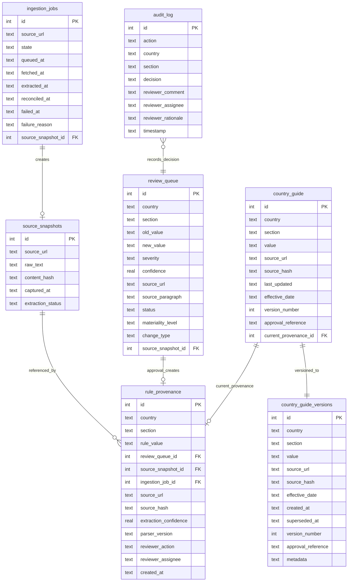

# Database Design

## Schema Overview

The platform uses 7 core tables organized around the compliance lifecycle: ingestion, review, publication, and audit.



---

## Table Details

### `country_guide` — Active Published Rules

The single source of truth for currently effective employment rules. Each row represents one rule for one country-section pair (e.g., India / annual_leave).

```sql
CREATE TABLE country_guide (
    id INTEGER PRIMARY KEY AUTOINCREMENT,
    country TEXT,
    section TEXT,
    value TEXT,
    source_url TEXT,
    source_hash TEXT,
    last_updated TEXT,
    effective_date TEXT,
    created_at TEXT,
    version_number INTEGER,
    approval_reference TEXT,
    UNIQUE(country, section)
)
```

**Design rationale**: The `UNIQUE(country, section)` constraint ensures exactly one active rule per country-section pair. Updates are upserts — the previous value is preserved in `country_guide_versions` before overwriting.

**`current_provenance_id`**: Added via migration; links to the `rule_provenance` record that established this rule value, enabling one-click provenance chain resolution.

---

### `country_guide_versions` — Immutable Version History

Every published rule change creates a new version row. Versions are never modified or deleted.

```sql
CREATE TABLE country_guide_versions (
    id INTEGER PRIMARY KEY AUTOINCREMENT,
    country TEXT NOT NULL,
    section TEXT NOT NULL,
    value TEXT NOT NULL,
    source_url TEXT,
    source_hash TEXT,
    effective_date TEXT NOT NULL,
    created_at TEXT NOT NULL,
    superseded_at TEXT,
    version_number INTEGER NOT NULL,
    approval_reference TEXT,
    metadata TEXT DEFAULT '{}',
    UNIQUE(country, section, version_number)
)
```

**Temporal query support**: The `effective_date` and `superseded_at` columns enable point-in-time queries: "What was the rule at date X?" is answered by `WHERE effective_date <= X AND (superseded_at IS NULL OR superseded_at > X)`.

**`metadata`**: JSON blob for extensibility — stores extraction confidence, change type, or any context that should travel with the version.

---

### `review_queue` — Pending & Resolved Changes

Every detected change between an extracted rule and the current guide creates a review queue item.

```sql
CREATE TABLE review_queue (
    id INTEGER PRIMARY KEY AUTOINCREMENT,
    country TEXT,
    section TEXT,
    old_value TEXT,
    new_value TEXT,
    severity TEXT,
    confidence REAL,
    source_url TEXT,
    source_paragraph TEXT,
    status TEXT DEFAULT 'pending',
    created_at TEXT,
    reviewed_at TEXT,
    reviewer_comment TEXT,
    source_hash TEXT,
    source_snapshot_id INTEGER,
    reviewer_assignee TEXT,
    reviewer_rationale TEXT,
    effective_date TEXT,
    materiality_level TEXT,
    change_type TEXT
)
```

**Status lifecycle**: `pending` → `approved` | `rejected` | `escalated`

**Ordering**: Pending items are returned ordered by status (escalated first), then severity, then confidence descending — ensuring the most urgent, highest-confidence items surface first.

---

### `audit_log` — Immutable Decision Record

Append-only table. No UPDATE or DELETE operations are ever issued against this table.

```sql
CREATE TABLE audit_log (
    id INTEGER PRIMARY KEY AUTOINCREMENT,
    action TEXT,
    country TEXT,
    section TEXT,
    old_value TEXT,
    new_value TEXT,
    decision TEXT,
    reviewer_comment TEXT,
    timestamp TEXT,
    reviewer_assignee TEXT,
    reviewer_rationale TEXT
)
```

**Audit defensibility**: Every approve/reject/escalate action writes a row with the reviewer's identity, rationale, and the before/after values. External auditors can reconstruct the complete decision history for any rule.

---

### `rule_provenance` — Source-to-Rule Traceability

Links every published rule back through the full pipeline: crawl event → snapshot → extraction → review decision.

```sql
CREATE TABLE rule_provenance (
    id INTEGER PRIMARY KEY AUTOINCREMENT,
    country TEXT NOT NULL,
    section TEXT NOT NULL,
    rule_value TEXT,
    review_queue_id INTEGER,
    source_snapshot_id INTEGER,
    ingestion_job_id INTEGER,
    source_url TEXT,
    source_hash TEXT,
    source_fragment TEXT,
    extraction_confidence REAL,
    parser_version TEXT,
    reviewer_action TEXT,
    reviewer_assignee TEXT,
    reviewer_rationale TEXT,
    reviewer_comment TEXT,
    crawled_at TEXT,
    extracted_at TEXT,
    reviewed_at TEXT,
    created_at TEXT NOT NULL
)
```

**Provenance chain resolution**: The `get_current_chain()` method performs LEFT JOINs across `source_snapshots` and `ingestion_jobs` to construct a nested response:

```json
{
  "canonical_rule": { "country", "section", "value", "last_updated" },
  "reviewer_action": { "action", "assignee", "rationale", "comment", "reviewed_at" },
  "extraction": { "confidence", "parser_version", "source_fragment", "source_hash" },
  "source_snapshot": { "snapshot_id", "content_hash", "captured_at" },
  "crawl_event": { "ingestion_job_id", "source_url", "state", "queued_at", "fetched_at" }
}
```

---

### `source_snapshots` — Crawled Content Archive

Raw HTML text captured from official sources, with content hashing for deduplication.

```sql
CREATE TABLE source_snapshots (
    id INTEGER PRIMARY KEY AUTOINCREMENT,
    source_url TEXT NOT NULL,
    raw_text TEXT NOT NULL,
    content_hash TEXT NOT NULL,
    captured_at TEXT NOT NULL,
    extraction_status TEXT NOT NULL
)
```

**Extraction status**: `pending` → `succeeded` | `failed`. Allows the pipeline to retry failed extractions without re-crawling.

---

### `ingestion_jobs` — Pipeline Execution Tracking

Tracks each crawl-extract-reconcile job through its state machine.

```sql
CREATE TABLE ingestion_jobs (
    id INTEGER PRIMARY KEY AUTOINCREMENT,
    source_url TEXT NOT NULL,
    state TEXT NOT NULL,
    queued_at TEXT,
    fetched_at TEXT,
    normalized_at TEXT,
    extracted_at TEXT,
    reconciled_at TEXT,
    failed_at TEXT,
    failure_reason TEXT,
    source_snapshot_id INTEGER
)
```

**State machine**: `queued` → `fetched` → `normalized` → `extracted` → `reconciled` | `failed`

Each transition sets the corresponding timestamp column, creating a built-in latency profile for every pipeline execution.

---

## Dual-Backend Support

The `app/utils/db.py` module provides transparent SQLite/PostgreSQL compatibility:

| SQLite Syntax | PostgreSQL Adaptation |
|---------------|----------------------|
| `?` parameter | `%s` |
| `INTEGER PRIMARY KEY AUTOINCREMENT` | `SERIAL PRIMARY KEY` |
| `INSERT OR IGNORE` | `INSERT ... ON CONFLICT DO NOTHING` |
| `date(column)` | `column::date` |

Backend selection is automatic: if `DATABASE_URL` is set, PostgreSQL is used; otherwise SQLite at the configured `DATABASE_PATH`.

---

## Design Principles

1. **Append-only audit data** — `audit_log` and `country_guide_versions` are never modified after creation
2. **Referential traceability** — Every published rule links to its provenance record, which links to its snapshot and ingestion job
3. **Temporal correctness** — `effective_date` and `superseded_at` enable point-in-time reconstruction without scanning the full history
4. **Idempotent ingestion** — Content hashing prevents duplicate review items for unchanged source content
5. **Graceful schema evolution** — `metadata` JSON columns on version rows allow new fields without migrations
