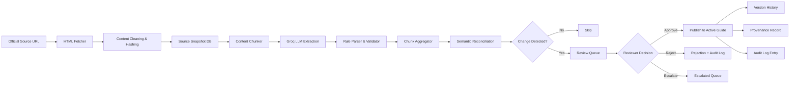

# System Overview

## 1. Feature Name

**AI-Powered Compliance Governance & Country Guide Reconciliation Platform**

## 2. Business Problem Solved

Organizations operating across multiple jurisdictions must maintain accurate, up-to-date employment guides that reflect local labor laws. Regulatory changes are published across fragmented government sources — ministry of labor websites, official gazettes, immigration portals — with no centralized notification system. A single missed change can result in:

- **Payroll liability**: Incorrect minimum wage or tax withholding calculations
- **Employment disputes**: Stale leave entitlement or termination notice guidance
- **Visa processing failures**: Outdated work permit requirements
- **Audit failures**: Inability to demonstrate when and why a compliance rule was adopted

This platform automates the detection, classification, review, and publication of regulatory changes with full provenance tracking and audit-ready governance.

## 3. Operational Pain Points Addressed

| Pain Point | How the Platform Addresses It |
|------------|------------------------------|
| Manual monitoring of government websites is slow and error-prone | Automated crawling on configurable schedules with snapshot tracking |
| Analysts cannot distinguish material changes from formatting updates | Semantic reconciliation engine classifies change type and materiality |
| No audit trail for who approved a compliance rule change and when | Immutable audit log + provenance chain from source to published rule |
| Stale guides go undetected until a compliance incident occurs | Drift detection with tunable staleness thresholds and Slack alerts |
| Compliance teams across regions operate in silos | Region-aware notifications route changes to APAC, EMEA, and Americas owners |
| Point-in-time regulatory queries are impossible without version history | Temporal versioning with effective/superseded dates on every rule |

## 4. User Personas

| Persona | Role | Interaction |
|---------|------|-------------|
| **Compliance Analyst** | Reviews and approves/rejects detected changes | Ops dashboard, review queue, before/after diffs |
| **Compliance Lead** | Monitors drift, escalations, and pipeline health | Metrics cards, drift reports, audit log |
| **Regional Owner** | Accountable for country coverage within APAC/EMEA/Americas | Slack alerts, region-filtered dashboards |
| **Client-Facing Advisor** | Consults published guides when advising employers | Country guide pages, temporal queries |
| **Engineering / Platform Team** | Maintains the pipeline, sources, and extraction quality | API endpoints, ingestion job logs, provenance debugging |
| **External Auditor** | Verifies compliance posture and decision provenance | Audit log, provenance chains, version history |

---

## 5. High-Level Architecture

```
                    ┌─────────────────────────────────────────────────────┐
                    │                  Official Sources                    │
                    │   Ministry of Labor  │  Immigration Portal  │ Gazette│
                    └──────────┬──────────────────────┬───────────────────┘
                               │                      │
                    ┌──────────▼──────────────────────▼───────────────────┐
                    │              INGESTION LAYER                        │
                    │  HTML Fetcher  │  Notion Importer  │  PDF Intake    │
                    │  Snapshot Storage  │  Content Hashing               │
                    └──────────┬──────────────────────────────────────────┘
                               │
                    ┌──────────▼──────────────────────────────────────────┐
                    │            EXTRACTION LAYER                         │
                    │  Content Chunker → Groq LLaMA 3.3 70B → Parser     │
                    │  Multi-key rotation  │  Chunk aggregation           │
                    └──────────┬──────────────────────────────────────────┘
                               │
                    ┌──────────▼──────────────────────────────────────────┐
                    │          RECONCILIATION LAYER                       │
                    │  Semantic Diff Engine  │  Change Classification     │
                    │  Materiality Scoring   │  Duplicate Detection       │
                    └──────────┬──────────────────────────────────────────┘
                               │
                    ┌──────────▼──────────────────────────────────────────┐
                    │           REVIEW & GOVERNANCE LAYER                 │
                    │  Review Queue  │  Approve/Reject/Escalate           │
                    │  Bulk Approve  │  Provenance Recording              │
                    └──────────┬──────────────────────────────────────────┘
                               │
              ┌────────────────┼────────────────────────┐
              │                │                        │
    ┌─────────▼────────┐ ┌────▼──────────────┐ ┌───────▼────────────┐
    │  PUBLICATION      │ │  DRIFT DETECTION  │ │  ALERTING          │
    │  Active Guide     │ │  Staleness Rules  │ │  Slack Webhooks    │
    │  Version History  │ │  Pending Aging    │ │  Region Routing    │
    │  Temporal Queries │ │  Coverage Gaps    │ │  APAC/EMEA/Americas│
    └──────────────────┘ └───────────────────┘ └────────────────────┘
```

---

## 6. End-to-End Data Flow



---

## 7. Key Architectural Decisions & Tradeoffs

### SQLite as Default Database

**Decision**: Use SQLite for development and single-instance deployments; PostgreSQL adapter available for production.

**Tradeoff**: SQLite provides zero-ops simplicity and ACID compliance, but limits concurrent write throughput. The `app/utils/db.py` dual-backend adapter transparently rewrites SQL syntax (`?` to `%s`, `AUTOINCREMENT` to `SERIAL`, `date()` to `::date`) so the same repository code runs on both backends.

**Why**: Data volumes are modest (hundreds of rules across 8 countries); SQLite is appropriate and eliminates infrastructure overhead. The adapter ensures a migration path when scale demands it.

### Deterministic Semantic Engine (No LLM for Reconciliation)

**Decision**: The reconciliation engine uses regex patterns and string similarity — not the LLM — to classify changes.

**Tradeoff**: A regex-based engine is less flexible than LLM-based classification but is deterministic, fast, and fully auditable. The same input always produces the same classification, which is critical for compliance governance where reviewers must trust the system's assessments.

**Why**: Regulatory change classification must be reproducible. An LLM might classify the same change differently on consecutive runs, undermining reviewer confidence and audit defensibility.

### LLM for Extraction Only

**Decision**: The LLM (Groq LLaMA 3.3 70B) is used only for structured extraction from HTML — converting unstructured government web pages into typed `EmploymentRule` objects.

**Tradeoff**: LLM extraction introduces a confidence dimension (rules have a 0–1 confidence score) and requires human validation. But the alternative — hand-crafted parsers per government website — is unmaintainable across jurisdictions.

**Why**: Government websites have heterogeneous HTML structures that change without notice. An LLM generalizes across formats while per-site parsers break on redesigns.

### Human-in-the-Loop Governance

**Decision**: Every detected change must be explicitly approved or rejected by a human reviewer before publication.

**Tradeoff**: This adds latency between detection and publication. A fully automated pipeline could publish faster, but the risk of publishing an incorrect LLM extraction is unacceptable in a compliance context.

**Why**: LLM extraction is imperfect. A hallucinated minimum wage figure or misclassified eligibility criterion could expose the organization to legal liability. The human approval layer is a deliberate governance control, not a limitation.

### External Source Registry

**Decision**: The list of official source URLs is maintained in a separate GitHub-hosted JSON file, not in the application database.

**Tradeoff**: Adding or updating a source URL requires a commit to an external repo rather than a database update. But this decouples source configuration from application deployment and provides git-native change tracking on URL modifications.

**Why**: Source URLs change when governments redesign websites. Decoupling URL management from application releases allows compliance teams to update sources without engineering involvement.

---

## 8. Security Considerations

| Concern | Mitigation |
|---------|-----------|
| Groq API key exposure | Keys loaded from environment variables, never hardcoded; multi-key rotation reduces per-key blast radius |
| SQL injection | All database queries use parameterized statements via SQLite/psycopg2 parameter binding |
| Untrusted HTML ingestion | BeautifulSoup sanitization strips script/style/nav elements before processing |
| Content integrity | MD5 content hashing on every snapshot; hash stored in provenance chain |
| Audit log immutability | Append-only table design; no UPDATE/DELETE operations on audit_log |
| Slack webhook security | Webhook URL stored in environment variables, not in code or database |

## 9. Scalability Considerations

| Dimension | Current State | Scale Path |
|-----------|--------------|------------|
| Countries | 8 | Source registry is additive; no code changes needed |
| Concurrent syncs | Sequential per country | Worker pool with per-country locking |
| Database | SQLite (single-writer) | PostgreSQL adapter ready in `db.py` |
| LLM throughput | Multi-key rotation (N keys) | Add keys to `GROQ_API_KEY` comma-separated list |
| Alerting | Slack webhooks | Pluggable notification interface |
| Ingestion formats | HTML + Notion + PDF | Adapter pattern in ingestion layer |

## 10. Failure Scenarios & Recovery

| Failure | Impact | Recovery |
|---------|--------|----------|
| Groq API rate limit | Extraction paused | Automatic key rotation; retry on next scheduled sync |
| Source website down (5xx) | No new snapshot | Retry with exponential backoff; previous snapshot preserved |
| Source website restructured | Extraction quality degrades | Confidence scores drop; low-confidence extractions flagged for manual review |
| LLM hallucination | Incorrect rule proposed | Human reviewer rejects; audit log records rejection rationale |
| Database corruption | Data loss | WAL mode for SQLite; PostgreSQL with standard backup strategies |
| Scheduler crash | Missed sync window | APScheduler misfire_grace_time=300s; next scheduled run proceeds normally |
| Slack webhook failure | Missed alert | Sync results persisted in DB regardless of alert delivery |
