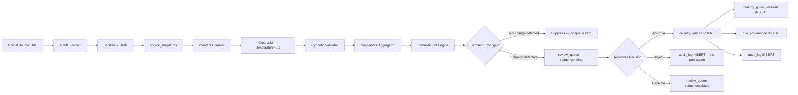

# Platform Architecture

## Governance Architecture Overview

This system implements a provenance-first compliance governance pipeline. Its architecture reflects a specific set of engineering commitments about what the system guarantees, where human authority is mandatory, and what failure modes are acceptable versus unacceptable.

The central architectural concern is not performance or developer ergonomics — it is **auditability under adversarial scrutiny**. Every design decision is evaluated against the question: "If an external auditor or regulator examined this system's behavior, would they find it defensible?"

---

## System Invariants

These properties hold regardless of configuration, load, or operational context. They are enforced at the code level and cannot be disabled:

1. **No rule is published without human approval.** The `country_guide` table is only updated through `approve_pending_review_item()`. No API endpoint, background job, or migration script writes to `country_guide.value` directly.

2. **No approval occurs without an audit record.** Approval and audit log insertion are executed within the same database transaction. A failure in audit log insertion rolls back the entire approval.

3. **Audit records are never modified.** The `audit_log` table has no UPDATE or DELETE repository methods. The API exposes only GET endpoints against it.

4. **Critical changes require individual review.** The `bulk_approve_non_critical()` operation enforces `severity != 'critical'` at the SQL level. This filter is in the repository, not in the API layer, ensuring it cannot be bypassed by API callers.

5. **Every version of every rule is retained permanently.** `country_guide_versions` rows are never deleted. `superseded_at` is set when a new version is created; the row is not removed.

6. **Provenance is recorded atomically with publication.** Provenance insertion and `current_provenance_id` update happen in the same transaction as rule publication. A rule without provenance is a system bug, not an expected state.

---

## Trust Boundary Model

The system defines three trust zones with explicit boundary enforcement:

```
┌────────────────────────────────────────────────────────────────────┐
│  UNTRUSTED ZONE: External Sources                                   │
│                                                                     │
│  Government websites, gazettes, immigration portals                │
│  • Content is treated as adversarial input                         │
│  • HTML is sanitized before processing                             │
│  • LLM extraction does not execute any code                        │
│  • Content is archived verbatim; processing is downstream          │
└──────────────────────────────┬─────────────────────────────────────┘
                               │ Sanitized text only crosses this boundary
┌──────────────────────────────▼─────────────────────────────────────┐
│  AI PROCESSING ZONE: Extraction & Classification                   │
│                                                                     │
│  LLM extraction (Groq LLaMA 3.3 70B, temperature=0.1)             │
│  Deterministic semantic classification (regex engine)              │
│  • AI output is NEVER published directly                           │
│  • Every AI output carries a confidence score                      │
│  • Classification decisions have documented reasoning              │
│  • Extraction failures are explicit, not silent                    │
└──────────────────────────────┬─────────────────────────────────────┘
                               │ Proposed changes only — not published rules
┌──────────────────────────────▼─────────────────────────────────────┐
│  GOVERNANCE ZONE: Human Review & Authorization                     │
│                                                                     │
│  Review queue, approval workflow, escalation                       │
│  • Mandatory human gate for all publication                        │
│  • Reviewer identity and rationale recorded immutably              │
│  • Critical changes require individual review                      │
│  • Audit log is append-only                                        │
└──────────────────────────────┬─────────────────────────────────────┘
                               │ Approved, provenance-linked rules only
┌──────────────────────────────▼─────────────────────────────────────┐
│  AUTHORITATIVE ZONE: Published Rules & History                     │
│                                                                     │
│  country_guide, country_guide_versions, rule_provenance            │
│  • Immutable version history                                       │
│  • Complete provenance chains                                      │
│  • Temporal queries with legal defensibility                       │
│  • Audit log covering all transitions                              │
└────────────────────────────────────────────────────────────────────┘
```

---

## High-Level Architecture

```
                    ┌─────────────────────────────────────────────────────┐
                    │          Official Government Sources                 │
                    │  Ministry of Labor · Immigration Portal · Gazette   │
                    └──────────┬──────────────────────┬───────────────────┘
                               │                      │
                    ┌──────────▼──────────────────────▼───────────────────┐
                    │              INGESTION LAYER                        │
                    │  HTML Fetcher  │  Snapshot Archival  │  Content Hash│
                    │  Ingestion Job State Machine                        │
                    └──────────┬──────────────────────────────────────────┘
                               │  Raw text (sanitized) + MD5 hash
                    ┌──────────▼──────────────────────────────────────────┐
                    │            EXTRACTION LAYER                         │
                    │  Content Chunker → Groq LLM → Pydantic Validator   │
                    │  Multi-key rotation  │  Chunk aggregation           │
                    │  Confidence scoring  │  Extraction failure logging  │
                    └──────────┬──────────────────────────────────────────┘
                               │  EmploymentRule[] with confidence scores
                    ┌──────────▼──────────────────────────────────────────┐
                    │          RECONCILIATION LAYER                       │
                    │  Semantic Diff Engine (deterministic regex)         │
                    │  Change Type Classification · Materiality Scoring   │
                    │  Duplicate Suppression · Null-change Filtering      │
                    └──────────┬──────────────────────────────────────────┘
                               │  Proposed changes (not yet published)
                    ┌──────────▼──────────────────────────────────────────┐
                    │       GOVERNANCE GATE (Mandatory Human Review)      │
                    │  Review Queue  │  Approve/Reject/Escalate           │
                    │  Provenance Recording  │  Audit Log                 │
                    └──────────┬──────────────────────────────────────────┘
                               │  Approved, provenance-linked rules
              ┌────────────────┼────────────────────────┐
              │                │                        │
    ┌─────────▼────────┐ ┌────▼──────────────┐ ┌───────▼────────────┐
    │  PUBLICATION      │ │  DRIFT DETECTION  │ │  ALERTING          │
    │  Active Guide     │ │  SLA Monitoring   │ │  Region-Routed     │
    │  Version History  │ │  Coverage Gaps    │ │  APAC/EMEA/Americas│
    │  Temporal Queries │ │  Escalation Queue │ │  Post-Sync Summary │
    └──────────────────┘ └───────────────────┘ └────────────────────┘
```

---

## End-to-End Data Flow



---

## Architectural Decisions & Rationale

### Decision 1: Deterministic Semantic Engine (No LLM for Reconciliation)

**What the decision is:** Change classification uses a compiled regex pattern library with documented rules, not an LLM.

**Why this matters for governance:** An LLM classifying the same (old, new) pair might return `NUMERIC_THRESHOLD_CHANGE` on one invocation and `NON_MATERIAL_FORMATTING` on another. This non-determinism is unacceptable in a compliance context: the decision to escalate a critical change versus surface it as informational must be reproducible and explainable to a reviewer or auditor. The regex engine's classification is deterministic, the reasoning is documented, and the pattern library is inspectable.

**Acknowledged limitation:** The regex engine is less flexible than LLM classification. A change type outside the defined pattern vocabulary falls through to `NON_MATERIAL_FORMATTING`. This is a deliberate conservative failure mode — it surfaces the change for human review rather than attempting to classify it with a model that could return an incorrect classification. Reviewers see the before/after diff regardless of the classification.

---

### Decision 2: LLM Scoped to Extraction Only

**What the decision is:** The LLM (Groq LLaMA 3.3 70B) processes only the ingestion-to-extraction stage. It is not used for reconciliation, classification, approval decisions, or any operation that modifies published data.

**Why this matters for governance:** Containing the LLM to the extraction stage means AI uncertainty is bounded. Confidence scores quantify extraction reliability, human reviewers evaluate that uncertainty, and the governance gate ensures LLM output never directly modifies authoritative data. If the LLM is deprecated, rate-limited, or replaced, it affects only the extraction layer; all historical provenance, version history, and audit records remain valid.

---

### Decision 3: Append-Only Audit Infrastructure

**What the decision is:** `audit_log`, `country_guide_versions`, `rule_provenance`, and `source_snapshots` are append-only at the application level. No repository methods, migration scripts, or API endpoints issue UPDATE or DELETE against these tables.

**Why this matters for governance:** Regulators and auditors must be able to trust that the audit record reflects what actually happened, not what the organization wishes had happened. A mutable audit log is not an audit log — it is a liability. Append-only design makes post-hoc modification structurally difficult; it is not just a policy but an architectural constraint.

---

### Decision 4: Governed Source Registry in a Separate Repository

**What the decision is:** Official source URLs and their governance metadata are maintained in a dedicated data repository ([`compliance-data`](https://github.com/guptashivansh/compliance-data)), not in the application database.

**What the registry provides beyond URLs:** Each authority entry carries `trust_level`, `precedence_rank`, `escalation_required`, `supports_replay`, and `owner_team`. This means the registry is not a flat URL list — it is a structured, governed catalogue of the organisation's regulatory intelligence sources. The `escalation_required` flag, for example, causes any change from designated high-sensitivity authorities to automatically enter the review queue as escalated, regardless of the semantic engine's materiality assessment.

**Why this matters for governance:** Source changes are configuration changes with compliance implications. A separate git-tracked repository provides:
- Change history with author attribution for every source addition, URL update, trust level change, or deactivation
- The ability to revert a source set to a prior state independently of application deployments
- A clear ownership model: the `owner_team` field in the registry assigns accountability for each source

**Acknowledged tradeoff:** Updating sources requires a commit to the registry repository rather than a database update. This is an intentional friction point — source changes should be deliberate and traceable, not ad-hoc edits.

---

### Decision 5: PostgreSQL / SQLite Dual Backend

**What the decision is:** The `app/utils/db.py` adapter transparently handles syntax differences between SQLite and PostgreSQL, so the same repository code runs on both backends.

**Why this matters operationally:** SQLite provides zero-ops local development and single-instance deployments with full ACID compliance. The adapter ensures that a move to PostgreSQL for production scale does not require rewriting repository logic. The migration path is `set DATABASE_URL` — no schema changes, no query rewrites.

---

### Decision 6: APScheduler as In-Process Scheduler

**What the decision is:** Automated sync runs are scheduled via APScheduler embedded in the Flask process, not an external job scheduler (Celery, Airflow, Kubernetes CronJob).

**Why this matters operationally:** An in-process scheduler eliminates infrastructure dependencies for single-instance deployments. The acknowledged risk is that a Flask process restart cancels an in-progress sync. This is mitigated by idempotent sync design: each source is processed independently, failed jobs record their state, and the next scheduled run reprocesses failed sources.

**Scale path:** For multi-instance or high-availability deployments, APScheduler should be replaced with an external job scheduler (Celery + Beat, Kubernetes CronJob) with a distributed lock to prevent concurrent runs for the same source.

---

## Failure Handling Framework

The system distinguishes between three categories of failure, each with a different handling strategy:

### Category 1: Recoverable Pipeline Failures

Failures that do not corrupt data and will resolve on the next sync cycle:

| Failure | Detection | Impact | Recovery |
|---------|-----------|--------|----------|
| Source website 5xx / timeout | HTTP response code | No new snapshot; previous published rule unchanged | Automatic retry (max 2); job marked `failed` with reason; next sync re-attempts |
| Groq API rate limit | 429 response | Extraction paused for current key | Automatic key rotation to next configured key; transparent retry |
| Groq API outage | Connection error / all keys exhausted | Extraction fails for affected sources | Job marked `failed`; source snapshot preserved; extraction retried on next sync |
| Scheduler process restart | Process death | In-progress sync cancelled | Next scheduled run starts fresh; idempotent design means no data corruption |

### Category 2: Quality Degradation (Detectable)

Failures that produce data, but data of degraded quality, requiring heightened human review:

| Failure | Detection | Impact | Response |
|---------|-----------|--------|----------|
| Government website restructured | Confidence scores drop significantly | Extractions propose incorrect rules | Low-confidence items are flagged; reviewers examine source paragraph against source URL |
| LLM extracts a hallucinated rule | Confidence score < 0.7; source paragraph doesn't support value | Incorrect change proposed in review queue | Human reviewer rejects; audit log records rejection; next sync re-extracts |
| Regex pattern misclassifies change type | Wrong change type or materiality assigned | Change may be under-prioritized | Human reviewer sees before/after diff regardless; classification guides but does not gate review |

### Category 3: Unacceptable Failures (Data Integrity)

These failures represent corruption of the governance record and trigger immediate investigation:

| Failure | Detection | Response |
|---------|-----------|----------|
| Approval recorded without audit log entry | Provenance without corresponding audit_log row | Immediately investigate transaction boundary; do not proceed with further approvals until root cause identified |
| Published rule without provenance | `current_provenance_id IS NULL` on active rule | Flag rule as requiring provenance reconstruction; do not serve to clients without provenance |
| Version history gap | Period with no version covering a date range | Reconstruct from audit log; create corrective version record with appropriate effective dates |

---

## Scalability Strategy

Scalability decisions are made with governance as the primary constraint. Performance optimizations that undermine auditability or compromise the review gate are not acceptable.

| Dimension | Current Approach | Scale Path |
|-----------|-----------------|------------|
| Source coverage | 87 countries × N sources per country | Source registry is additive; no code changes required |
| Sync throughput | Sequential per source endpoint | Worker pool with per-country distributed locking; requires external scheduler |
| LLM throughput | N-key rotation (one key per Groq account) | Add keys to `GROQ_API_KEY` comma-separated; rotation is automatic |
| Database concurrency | SQLite (single-writer) | PostgreSQL adapter in `db.py`; `set DATABASE_URL` activates it |
| Audit record volume | ~1 record per review action | Append-only; archive partitions for historical records beyond N years |
| Temporal query performance | `(country, section, effective_date)` composite index | Adequate for 87 countries × 7 sections × N versions; no optimization needed at current scale |

---

## Security Architecture

| Threat | Control |
|--------|---------|
| Groq API key exposure | Environment variables only; multi-key rotation reduces per-key blast radius |
| SQL injection via user input | All database queries use parameterized statements throughout the repository layer |
| Prompt injection via government source content | BeautifulSoup strips executable tags before text enters the LLM context; LLM is instruction-prompted to extract only |
| Audit log tampering | Append-only table design; no UPDATE/DELETE methods in `ProvenanceRepository` or `audit_log` handlers |
| Snapshot content integrity | MD5 hash stored with every snapshot; hash is recorded in provenance chain; hash mismatch detectable |
| Slack webhook secret exposure | Webhook URL in environment variables; never logged or returned by API |
| Unauthorized approval | Review actions are POST-only; GET requests produce no state change; reviewer identity is recorded (SSO enforcement is an integration requirement) |
