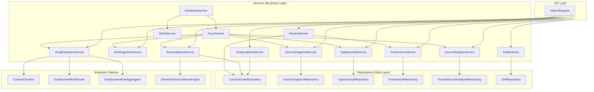

# Service Dependency Graph

## Service Architecture

The platform follows a layered service architecture with dependency injection via the `build_services()` factory in `app/__init__.py`. Services are composed at startup and passed to the Flask blueprint.



---

## Service Catalog

### Data Layer (Repositories)

| Repository | Table(s) | Key Operations |
|-----------|----------|----------------|
| `CountryGuideRepository` | `country_guide`, `country_guide_versions`, `review_queue`, `audit_log` | Upsert rules, enqueue reviews, approve/reject, temporal queries |
| `SourceSnapshotRepository` | `source_snapshots` | Create snapshots, update extraction status |
| `IngestionJobRepository` | `ingestion_jobs` | Create jobs, transition state machine, list recent |
| `ProvenanceRepository` | `rule_provenance` | Write provenance records, resolve chains, get history |
| `TrustedSourceEndpointRepository` | External JSON | Fetch active source endpoints from GitHub |
| `DriftRepository` | Read-only across `country_guide`, `review_queue`, `rule_provenance` | Aggregate data for drift analysis |

### Business Logic Layer (Services)

| Service | Dependencies | Responsibility |
|---------|-------------|----------------|
| `ReviewService` | `CountryGuideRepository`, `ProvenanceService` | Approve, reject, escalate, assign, bulk-approve review items |
| `SourceRegistryService` | `TrustedSourceEndpointRepository` | List trusted government source endpoints |
| `HtmlIngestionService` | None (stateless) | Fetch HTML, clean, truncate, hash |
| `SourceSnapshotService` | `SourceSnapshotRepository` | Persist snapshots, track extraction status |
| `IngestionJobService` | `IngestionJobRepository` | Lifecycle management for ingestion jobs |
| `GroqExtractionService` | `ContentChunker`, `EmploymentRuleParser`, `EmploymentRuleAggregator` | LLM-based structured extraction with multi-key rotation |
| `ReconciliationService` | `CountryGuideRepository`, `SemanticReconciliationEngine` | Compare extracted rules against live guide, enqueue changes |
| `ProvenanceService` | `ProvenanceRepository` | Record approval/seed provenance with parser version |
| `TemporalRuleService` | `CountryGuideRepository` | Point-in-time rule queries and version timelines |
| `DriftDetector` | `DriftRepository` | Evaluate pending/canonical drift rules, generate reports |
| `SlackService` | None (stateless functions) | Region-aware Slack notifications |
| `SchedulerService` | `SyncService`, `SlackService` | APScheduler cron trigger for automated sync |

### Pipeline Components

| Component | Type | Responsibility |
|-----------|------|----------------|
| `ContentChunker` | Stateless | Split HTML into LLM-sized chunks (max 6000 chars) |
| `EmploymentRuleParser` | Stateless | Parse and validate LLM JSON output into `EmploymentRule` models |
| `EmploymentRuleAggregator` | Stateless | Deduplicate rules across chunks, keep highest confidence |
| `SemanticReconciliationEngine` | Stateless | Classify changes by type and materiality using regex patterns |

---

## Dependency Injection

All services are constructed in `build_services()` and passed as a dictionary:

```python
services = {
    "country_guide_repository": CountryGuideRepository(db_path),
    "review_service": ReviewService(repo, provenance_service),
    "extraction_service": GroqExtractionService(api_keys, parser, chunker, aggregator),
    "reconciliation_service": ReconciliationService(repo, semantic_engine),
    # ... 14 services total
}
```

The Flask blueprint receives all services via its factory function `create_api_blueprint(...)`, avoiding global state and enabling testing with mock dependencies.

---

## Sync Pipeline Orchestration

The `run_sync()` function in `sync_service.py` is the top-level orchestrator. It does not hold state — it receives the services dictionary and coordinates calls across ingestion, extraction, and reconciliation:

```
for each trusted source endpoint:
    1. ingestion_job_service.create_job(url)
    2. html_ingestion_service.fetch_clean_text(url)
    3. source_snapshot_service.persist_snapshot(url, text, hash)
    4. extraction_service.extract_employment_rules(text, url, country, sections)
    5. reconciliation_service.reconcile_extracted_rules(country, rules, url, hash, snapshot_id)
    6. Update job state at each transition
```

Failures at any stage mark the job as `failed` with a reason, but do not halt processing of other endpoints.
