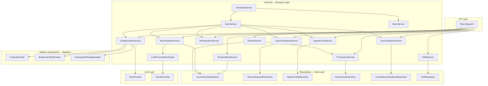

# Service Architecture

## Layered Design with Explicit Boundaries

The service architecture enforces a strict separation between persistence, business logic, and external communication. This separation is not a code organization preference — it is a governance requirement. Repository methods own database transactions; services own governance logic; the API layer owns request validation. Mixing these responsibilities would make it possible to approve a rule without writing an audit log entry (if service logic were in the API layer) or to modify published rules without going through the governance gate (if the API layer could write directly to `country_guide`).

---

## Service Dependency Graph



---

## Service Catalog

### Data Layer — Repositories

Repositories own all SQL operations. No service or API handler writes SQL directly.

| Repository | Tables | Write Operations |
|-----------|--------|-----------------|
| `CountryGuideRepository` | `country_guide`, `country_guide_versions`, `review_queue`, `audit_log` | `approve_pending_review_item()` (4 writes in one transaction), `reject_pending_review_item()`, `escalate_review_item()`, `enqueue_review_item()` |
| `SourceSnapshotRepository` | `source_snapshots` | `create_snapshot()`, `mark_extraction_succeeded()`, `mark_extraction_failed()` |
| `IngestionJobRepository` | `ingestion_jobs` | `create_job()`, `mark_fetched()`, `mark_normalized()`, `mark_extracted()`, `mark_reconciled()`, `mark_failed()` |
| `ProvenanceRepository` | `rule_provenance` | `write()` (INSERT only), `set_current()` (pointer update on `country_guide`) |
| `TrustedSourceEndpointRepository` | External JSON | `list_active()` (read-only from GitHub-hosted JSON) |
| `DriftRepository` | Read-only across `country_guide`, `review_queue`, `rule_provenance` | None — read-only |

**Transaction ownership:** `CountryGuideRepository.approve_pending_review_item()` is the most critical transaction in the system. It executes four writes (audit log, guide upsert, version insert, version supersede) atomically. The transaction boundary is at the repository level, not the service level.

---

### Business Logic Layer — Services

| Service | Transaction Guarantee | Governance Responsibility |
|---------|----------------------|--------------------------|
| `ReviewService` | Delegates to `CountryGuideRepository` + calls `ProvenanceService` in sequence | Validates review action, coordinates approval and provenance recording, exposes governed approval/reject/escalate/assign/bulk-approve interface |
| `GroqExtractionService` | No database writes; reads only | Manages LLM API calls, key rotation, chunk processing, confidence aggregation |
| `ReconciliationService` | Writes via `CountryGuideRepository.enqueue_review_item()` | Applies semantic diff engine, suppresses duplicates, creates review queue items |
| `ProvenanceService` | Writes via `ProvenanceRepository.write()` and `set_current()` | Constructs and records provenance chains for approval, bulk-approval, and seed operations |
| `LLMReconciliationEngine` | No database writes; reads only | Classifies materiality level and change type for a detected change via an injected `LLMProvider` (Claude); retries on malformed response or transient failure; raises after exhausting attempts so the caller can fail open |
| `TemporalRuleService` | No writes | Point-in-time rule queries and version timeline construction |
| `DriftDetector` | No writes | Evaluates drift rules, deduplicates findings, aggregates reports |
| `SyncService` | Coordinates across all pipeline services | Top-level orchestrator; does not hold database state; fault-isolates per-source failures |
| `SchedulerService` | No writes | APScheduler cron configuration; triggers `SyncService` and `SlackService` |
| `SlackService` | No writes | Stateless Slack notification functions with region routing |

---

### Pipeline Components — Stateless

These components are pure functions with no database access. They can be safely tested in isolation with mock inputs.

| Component | Input | Output | Governance Role |
|-----------|-------|--------|-----------------|
| `ContentChunker` | Raw text string | List of `{chunk_index, chunk_count, text}` | Ensures LLM context budget compliance |
| `EmploymentRuleParser` | LLM JSON response string, allowed sections | List of validated `EmploymentRule` objects | Drops invalid extractions before they enter the governance pipeline |
| `EmploymentRuleAggregator` | List of `EmploymentRule` objects from all chunks | Deduplicated list (highest confidence per section) | Resolves conflicting extractions from the same source |

---

## Dependency Injection

All services are constructed in `build_services()` in `app/__init__.py` and passed as a typed dictionary to the Flask blueprint:

```python
services = {
    "country_guide_repository": CountryGuideRepository(db_path),
    "source_snapshot_repository": SourceSnapshotRepository(db_path),
    "ingestion_job_repository": IngestionJobRepository(db_path),
    "provenance_repository": ProvenanceRepository(db_path),
    "trusted_source_endpoint_repository": TrustedSourceEndpointRepository(source_registry_url),
    "review_service": ReviewService(country_guide_repository, provenance_service),
    "extraction_service": GroqExtractionService(groq_api_keys, parser, chunker, aggregator),
    "reconciliation_service": ReconciliationService(country_guide_repository, reconciliation_engine=LLMReconciliationEngine(ClaudeProvider(anthropic_api_keys))),
    "provenance_service": ProvenanceService(provenance_repository, parser_version),
    "temporal_rule_service": TemporalRuleService(country_guide_repository),
    "drift_detector": DriftDetector(drift_repository),
    "sync_service": SyncService(),
    "scheduler_service": SchedulerService(sync_service, slack_service),
    "slack_service": SlackService(webhook_urls),
}
```

**Governance implication of dependency injection:** No service creates its own database connection or builds its own dependencies. All external dependencies (API keys, database paths, webhook URLs) are injected from environment variables at startup. This means the governance behavior of any service can be tested by injecting mock repositories — the governance logic is isolated from infrastructure concerns.

---

## Sync Pipeline Orchestration

`SyncService.run_sync()` is the only entry point for a full pipeline run. It does not hold state and it does not own transactions:

```python
def run_sync(services: dict, countries: list[str] | None = None) -> SyncResult:
    endpoints = services["source_registry"].list_trusted_source_endpoints(countries)
    for endpoint in endpoints:
        job_id = services["ingestion_job_service"].create_job(endpoint.url)
        try:
            result = services["ingestion_service"].fetch_clean_text(endpoint.url)
            if result.success:
                snapshot = services["snapshot_service"].persist_snapshot(...)
                services["ingestion_job_service"].mark_fetched(job_id, snapshot.id)
                extraction = services["extraction_service"].extract_employment_rules(...)
                if extraction.success:
                    services["ingestion_job_service"].mark_extracted(job_id)
                    changes = services["reconciliation_service"].reconcile_extracted_rules(...)
                    services["ingestion_job_service"].mark_reconciled(job_id)
                else:
                    services["ingestion_job_service"].mark_failed(job_id, extraction.failure)
            else:
                services["ingestion_job_service"].mark_failed(job_id, result.failure)
        except Exception as e:
            services["ingestion_job_service"].mark_failed(job_id, str(e))
            # Continue to next endpoint — fault isolation
```

**Fault isolation design:** The `except` block around each endpoint's processing ensures that an uncaught exception in one source's processing (network timeout, unexpected API response format) does not halt the entire sync cycle. The exception is recorded in the job's `failure_reason`, and processing continues to the next source endpoint.

---

## Service Boundary Enforcement

The following operations are only available through specific service methods, never through direct repository access from the API layer:

| Operation | Enforced Through | Why |
|-----------|-----------------|-----|
| Publishing a rule | `ReviewService.approve_review_item()` | Ensures audit log + provenance are always written with the approval |
| Bulk approving rules | `ReviewService.bulk_approve_non_critical()` | Enforces critical-severity exclusion at service level |
| Recording provenance | `ProvenanceService.record_approval()` | Ensures `parser_version` is always set from the service constructor |
| Source endpoint list | `SourceRegistryService.list_trusted_source_endpoints()` | Ensures only active, authorized sources are processed |

No Flask route handler writes directly to `country_guide`, `audit_log`, or `rule_provenance`. Routes call services; services call repositories; repositories execute transactions.
