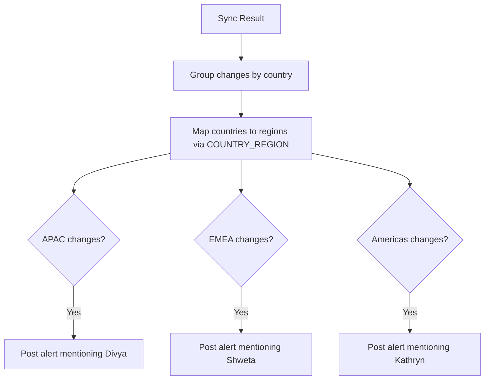

# Alerting & Notifications

## 1. Feature Name

**Region-Routed Slack Alerting for Compliance Events**

## 2. Business Problem Solved

Compliance teams are distributed across regions (APAC, EMEA, Americas), each with a designated owner. When the sync pipeline detects changes or failures, the right person needs to know immediately — not a generic channel notification, but a targeted alert to the responsible regional owner with actionable context.

## 3. Functional Overview

After each sync pipeline run, the `SlackService` generates one Slack message per affected region, routed to the regional owner, with:

- Color-coded severity (green = no issues, yellow = changes detected, red = failures)
- Count of changes detected and endpoints processed
- List of countries with changes, scoped to the region
- List of failed sources with error context
- Action buttons linking to the Review Queue and Dashboard

## 4. Region Routing

### Region Owners

| Region | Owner | Countries |
|--------|-------|-----------|
| **APAC** | Divya | India, Australia, Singapore, New Zealand, Philippines, Pakistan, + 20 more |
| **EMEA** | Shweta | UAE, South Africa, + 40 more |
| **Americas** | Kathryn | US, Canada, Brazil, Mexico, + 20 more |

The `COUNTRY_REGION` mapping covers 100+ countries, ensuring any new country added to the source registry is automatically routed to the correct regional owner.

### Routing Logic



## 5. Slack Message Format

Each region alert is a Slack attachment with:

```
🔄 Compliance Sync — APAC Region
Owner: Divya | Triggered by: scheduler

📊 Summary
• 5 changes detected across 3 countries
• 24 endpoints processed
• 1 failure

🌍 Countries with changes
• India (3 changes)
• Singapore (2 changes)

❌ Failed sources
• https://labour.gov.in/overtime — timeout after 30s

[Review Queue]  [Dashboard]
```

### Color Coding

| Condition | Color | Meaning |
|-----------|-------|---------|
| No changes, no failures | Green | All clear |
| Changes detected, no failures | Yellow | Review needed |
| Any failures | Red | Investigation needed |

## 6. Technical Architecture

### SlackService Functions

| Function | Responsibility |
|---------|---------------|
| `send_sync_alert(webhook_url, sync_result, triggered_by)` | Top-level orchestrator; posts one message per affected region |
| `_post_region_alert(webhook_url, region, owner, ...)` | Builds and sends a single Slack attachment |

### Trigger Points

| Trigger | Context |
|---------|---------|
| **Manual sync** | User clicks "Sync Now" in ops dashboard; `triggered_by="manual"` |
| **Scheduled sync** | APScheduler cron job fires; `triggered_by="scheduler"` |

### Webhook Security

The Slack webhook URL is loaded from the `SLACK_WEBHOOK_URL` environment variable. It is never hardcoded, logged, or stored in the database.

## 7. Scheduler Integration

The `SchedulerService` uses APScheduler to run sync on a configurable cron schedule:

```python
start_scheduler(
    flask_app,
    services,
    cron_expression="0 8 * * *",   # Daily at 08:00 UTC
    slack_webhook_url=webhook_url
)
```

**Configuration**:

| Parameter | Value | Purpose |
|-----------|-------|---------|
| Cron expression | Standard 5-field format | Sync schedule |
| Misfire grace time | 300 seconds | Allow late execution if the app was restarting |
| Trigger type | `cron` | APScheduler CronTrigger |

### Cron Examples

| Expression | Schedule |
|-----------|----------|
| `0 8 * * *` | Daily at 08:00 UTC |
| `0 8 * * 1-5` | Weekdays at 08:00 UTC |
| `0 */6 * * *` | Every 6 hours |
| `0 8,20 * * *` | Twice daily (08:00 and 20:00 UTC) |

## 8. APIs Involved

Alerting is not exposed via API endpoints — it is triggered internally by the sync pipeline. The sync result is available via:

| Endpoint | Method | Returns |
|----------|--------|---------|
| `POST /api/sync` | POST | Sync result (changes, failures, per-country breakdown) |
| `GET /api/metrics` | GET | Current pipeline health metrics |

## 9. Failure Scenarios

| Failure | Impact | Recovery |
|---------|--------|----------|
| Slack webhook URL not configured | No alerts sent; sync still runs and persists results | Configure `SLACK_WEBHOOK_URL` env var |
| Slack API returns error | Alert delivery fails; sync results preserved in DB | Retry on next sync; monitor Slack service status |
| Region mapping missing for a country | Country changes not routed to any owner | Add country to `COUNTRY_REGION` mapping |
| Webhook URL rotated | Alerts fail silently | Update env var and restart |

## 10. Observability

- **Sync results persisted**: Regardless of Slack delivery success, all sync results are stored in the database
- **Triggered-by tracking**: Every alert records whether it was triggered by `manual` or `scheduler`
- **Per-region visibility**: Each region gets its own alert, so owners see only relevant countries

## 11. Future Enhancements

- **Email notifications**: Send email digests in addition to Slack for regions that prefer email
- **Configurable webhook per region**: Route each region to a different Slack channel
- **Drift alerts**: Include drift report summaries in post-sync notifications
- **Escalation alerts**: Notify when items sit in escalated status beyond SLA thresholds
- **Quiet hours**: Suppress non-critical alerts outside business hours for each region's timezone
