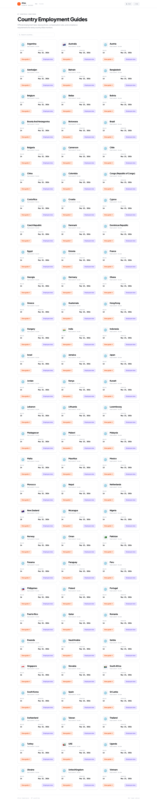
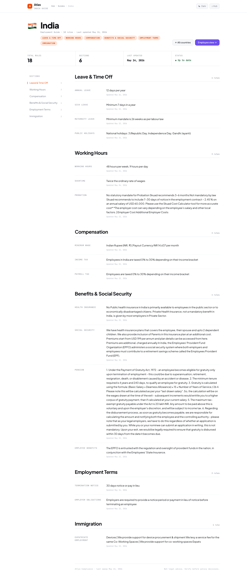

# Country Guides

The country guide pages are the client-facing output of the reconciliation pipeline — the published, reviewed, and provenance-tracked employment rules that advisors reference when counseling employers.

## Guide List

The guide list (`/guide`) displays a card grid of all monitored countries with:

- Country flag emoji
- Total published rule count
- Last-updated date (most recent approval across all sections)

---

## Country Detail

Each country page (`/guide/<country>`) shows the full employment guide organized into 7 categories:

### Section Groups

| Group | ID | Sections |
|-------|-----|---------|
| **Leave & Time Off** | `leave` | annual_leave, sick_leave, maternity_leave, public_holidays |
| **Working Hours** | `hours` | working_hours, overtime, probation |
| **Compensation** | `compensation` | minimum_wage, income_tax, payroll_tax, withholding_tax |
| **Benefits & Social Security** | `benefits` | health_insurance, social_security, pension, employee_benefits |
| **Employment Terms** | `employment` | termination_notice, employer_obligations, industrial_relations |
| **Immigration** | `immigration` | work_permit, work_visa, expatriate_employment |
| **Workplace Safety** | `safety` | workplace_safety, osh_obligations |

### Page Features

- **Sticky sidebar**: Quick navigation between section groups; follows scroll position
- **Per-rule metadata**: Last-updated timestamp displayed for each rule
- **Summary cards**: Total rules, sections covered, last update date
- **Light/dark mode**: Theme toggle in the header
- **Source attribution**: Each rule traces back to its official source via provenance

### Data Source

The guide page reads directly from the `country_guide` table — the single source of truth for active, approved rules. Only rules that have passed through the review workflow appear here.

---

## Monitored Countries

| Country | Flag | Status |
|---------|------|--------|
| India | :flag_in: | Active — 7 section groups |
| Australia | :flag_au: | Active — 7 section groups |
| Singapore | :flag_sg: | Active — 7 section groups |
| South Africa | :flag_za: | Active — 7 section groups |
| UAE | :flag_ae: | Active — 7 section groups |
| New Zealand | :flag_nz: | Active — 7 section groups |
| Philippines | :flag_ph: | Active — 7 section groups |
| Pakistan | :flag_pk: | Active — 7 section groups |

---

## API Access

For programmatic access to guide data:

| Endpoint | Returns |
|----------|---------|
| `GET /api/guide` | All rules across all countries |
| `GET /api/guide/India` | All rules for India |
| `GET /api/guide/India/minimum_wage/at?date=2024-09-15` | Historical rule at a specific date |
| `GET /api/guide/India/minimum_wage/history` | Full version timeline |
