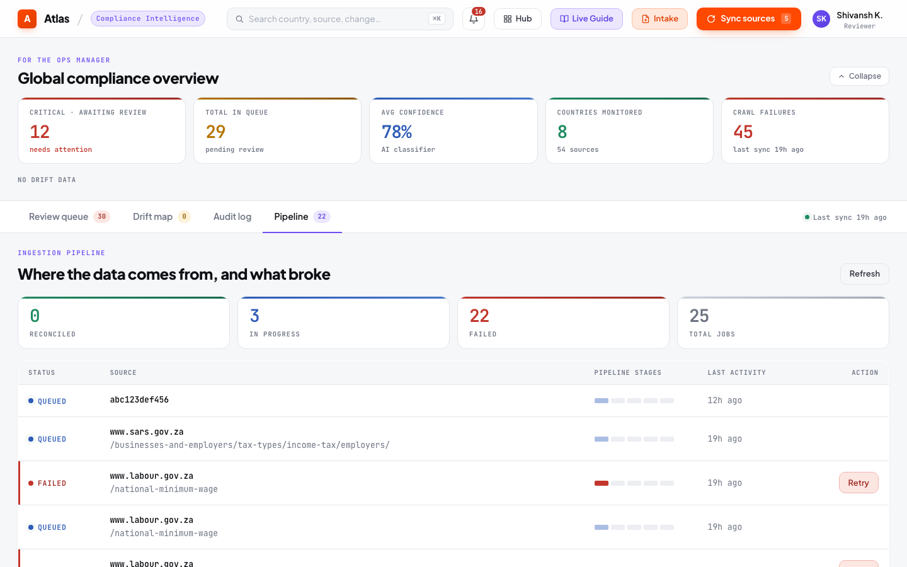
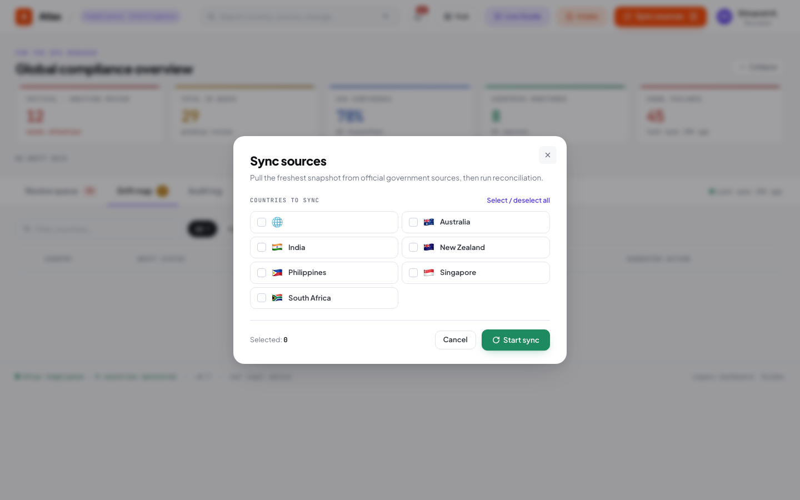
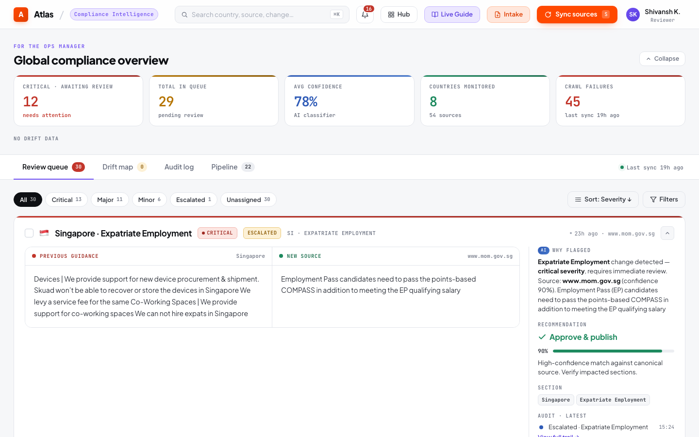
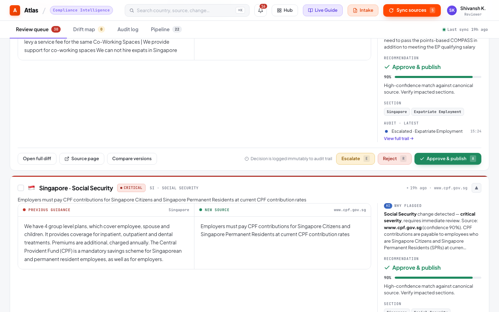
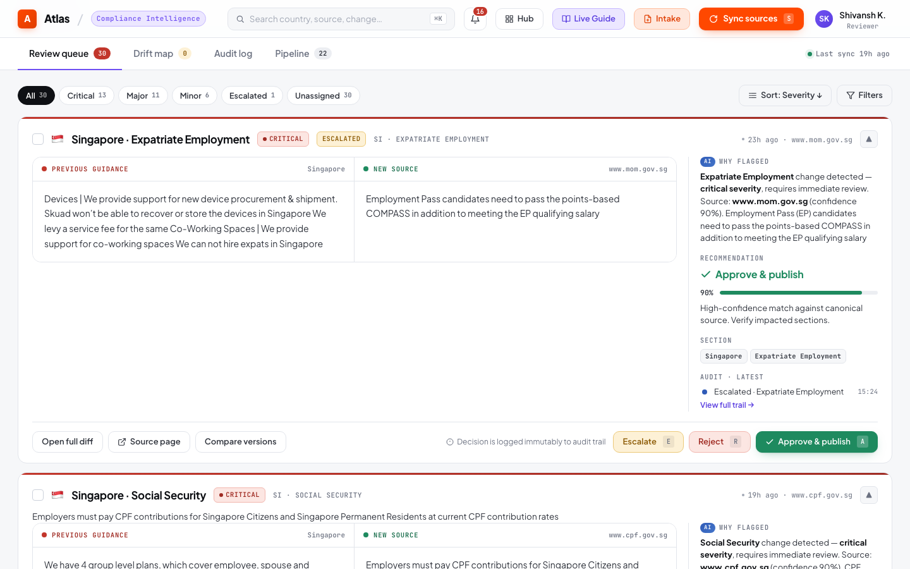
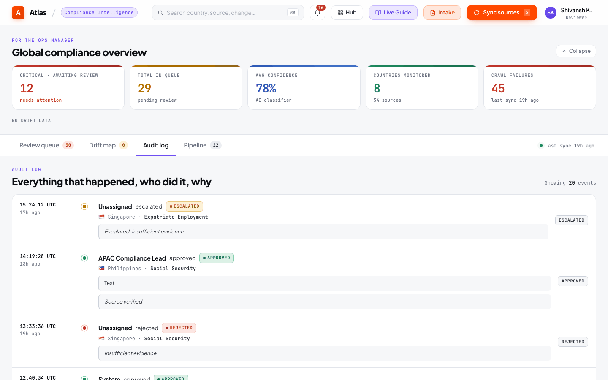
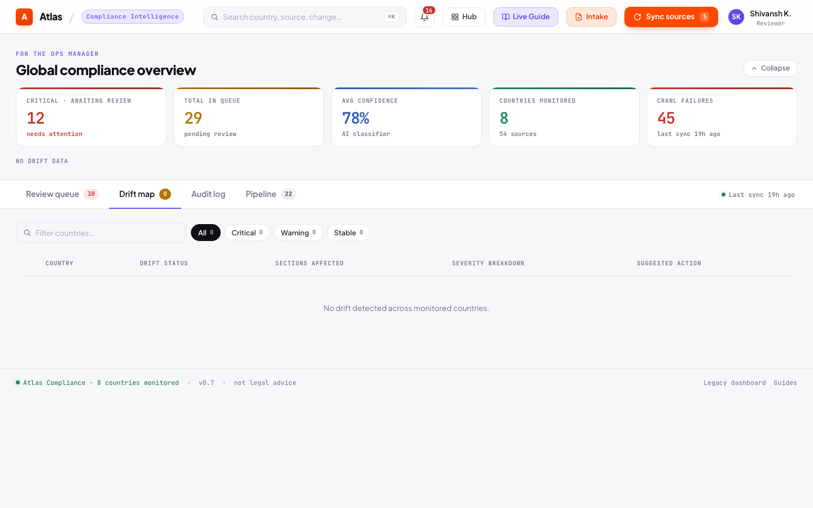

# Operational Runbook

## Overview

The compliance operations dashboard (`/ops`) is the primary interface for governance workflows. This runbook describes operational procedures for compliance analysts and leads, not just UI navigation. Every section describes what to do, not just what you can see.

---

## Daily Operations Protocol

### Morning Review Sequence (Recommended)

The following sequence is recommended for daily compliance operations. It is designed to ensure critical items are addressed before routine work:

1. **Check pipeline health** — Open the Pipeline tab. Confirm the last sync ran successfully. If it failed, identify which sources failed and whether they affect critical jurisdictions. If a sync is more than 24 hours old, trigger a manual sync.

2. **Check CRITICAL drift findings** — Open the Drift tab. Any CRITICAL finding requires immediate action. Do not proceed to queue review until all CRITICAL drift items have an assigned owner and a resolution timeline.

3. **Review escalated items** — In the Review Queue, filter to `status = escalated`. These represent decisions that a previous reviewer flagged as requiring senior judgment. They surface at the top of the queue automatically. Each escalated item without resolution ages toward a CRITICAL drift signal at 7 days.

4. **Review critical-severity pending items** — Filter by `severity = critical`. These are the highest-materiality proposed changes. Each requires individual review; they cannot be bulk-approved.

5. **Process remaining pending items** — Work through remaining pending items in queue order (major severity, then minor, then informational). Use bulk approve for non-critical items only when you have reviewed the affected country's drift report and are satisfied the bulk approval is appropriate.

---

## Pipeline Health Panel

{ loading=lazy }

The pipeline health panel shows recent ingestion jobs from `GET /api/ingestion-jobs`.

### Interpreting Job States

| State | Meaning | Action |
|-------|---------|--------|
| `reconciled` | Normal completion | None required |
| `extracted` | Extraction complete, reconciliation pending | Transient; investigate if stuck for > 5 minutes |
| `failed` | Job failed — reason recorded | Read `failure_reason`; determine if source should be manually re-synced |
| `fetched` | Fetch complete, extraction pending | Transient during active sync |
| `queued` | Queued but not yet fetched | Transient during active sync |

### Investigating a Failed Job

1. Note the `failure_reason` for the failed job
2. Determine the failure category:
   - **HTTP 404/403:** The source URL is no longer valid. Notify the platform engineering team to update the source registry.
   - **HTTP 5xx / timeout:** Transient server issue. The next scheduled sync will retry.
   - **Groq rate limit:** API quota exhausted. Add a Groq key to the `GROQ_API_KEY` environment variable, or wait for the rate limit window to reset.
   - **JSON parse error:** LLM returned malformed output. Check application logs for the raw response. If persistent, the source HTML may have changed in a way that confuses the extraction prompt.
3. If the failed source is critical (covers minimum wage, tax, or immigration for a high-priority jurisdiction), trigger a manual re-sync for that country immediately.

### Triggering a Manual Sync

{ loading=lazy }

**Full sync:** Click **Sync Now** without selecting specific countries. All active source endpoints are processed.

**Country-scoped sync:** Click **Sync Now**, select specific countries in the modal. This conserves Groq API quota for targeted checks — use this when you need to verify a specific country after a known regulatory event or a source failure.

After sync completion, the metrics cards refresh and new review items appear in the queue.

---

## Metrics Cards

{ loading=lazy }

The metrics panel (`GET /api/metrics`) provides the compliance posture at a glance:

| Metric | Interpretation |
|--------|---------------|
| **Pending Reviews** | Total changes awaiting human decision. If this grows across sessions, reviewer capacity is insufficient. |
| **Critical Changes** | Critical-severity items pending review. This number should be zero at the end of every review session — critical changes should not age past a single business day. |
| **Drift Alerts** | Countries with active drift findings. Any non-zero count requires investigation. |
| **Approved Today** | Review throughput for the current day. Use this to track reviewer productivity. |
| **Last Sync** | Timestamp of the most recent sync completion. If this is more than 25 hours ago, the scheduled sync may have failed. |
| **Monitored Sources** | Total active source endpoints in the source registry. Changes here require source registry maintenance. |

---

## Review Queue Operations

### Understanding Priority Ordering

The review queue orders items by:
1. **Status** — Escalated items appear before pending items
2. **Severity** — Critical before major before minor
3. **Confidence** — Within severity, higher-confidence extractions appear first

This ordering reflects a governance priority: address the most urgent, most actionable items first. Do not reorder the queue or filter to lower-severity items before processing higher-severity items.

### Per-Item Review Workflow

{ loading=lazy }

For each pending item:

1. **Read the change type and materiality** — `NUMERIC_THRESHOLD_CHANGE CRITICAL` requires closer examination than `NON_MATERIAL_FORMATTING INFORMATIONAL`.

2. **Read the source paragraph** — This is the primary evidence. The extracted value must be directly supported by the source paragraph. If it is not, the extraction is incorrect and should be rejected.

3. **Verify against the source URL** — For CRITICAL and HIGH materiality items, open the source URL to verify the source paragraph is current and the full context supports the extracted value. Government pages update; the archived snapshot may lag by hours.

4. **Evaluate the confidence score** — Confidence below 0.7 indicates the model was uncertain. This does not mean the extraction is wrong, but it requires heightened attention to the source paragraph.

5. **Make a decision with documented rationale** — Every decision requires a `rationale` and `comment`. These become permanent audit records. A rationale of "confirmed" is not sufficient; "Rate confirmed in Budget 2025 gazette notification, effective April 1, 2025" is the appropriate level of detail.

6. **Set the effective date** — Set this to the date the rule became legally effective in the jurisdiction, not today's date unless the change is effective immediately.

### Approval

{ loading=lazy }

Click **Approve** when:
- The source paragraph directly supports the new value
- The change type and materiality are correctly classified
- You can attest that this rule reflects the current legal requirement

After approval: the rule is published, a provenance record is created, and an audit log entry is written — all within the same transaction.

### Rejection

Click **Reject** when:
- The source paragraph does not support the extracted value
- The extraction appears to be from a superseded or draft regulation
- The change is a formatting artifact that was incorrectly classified as material

Rejection rationale is required. Explain why the extraction does not reflect the actual regulatory state. This rationale is in the permanent audit record.

### Escalation

Click **Escalate** when:
- You need a senior compliance lead, legal counsel, or subject matter expert to review before a decision
- The jurisdictional application of the rule is ambiguous
- The change could have significant client impact that warrants a second opinion

After escalation: the item moves to the top of the queue with `status = escalated`. The drift monitoring system tracks resolution time; unresolved escalations after 7 days trigger a CRITICAL drift alert.

### Bulk Approve

{ loading=lazy }

Bulk approve is available when a country has non-critical pending items. Before using it:

1. Review the country's drift report — ensure there are no unresolved CRITICAL findings
2. Confirm you are comfortable approving all non-critical pending items without individual review
3. Understand that each item receives its own audit log entry and provenance record — the operation is individually traceable

Bulk approve does not process: critical-severity items, escalated items, or items in countries other than the selected one.

---

## Audit Log

{ loading=lazy }

The audit log tab displays an immutable record of every review decision. It is filterable by country and date range.

### Using the Audit Log for Investigations

**"Who approved this rule?"**
Filter by country and section. Find the most recent `approved` entry. The `reviewer_assignee` field names the approving reviewer.

**"When was this rule last reviewed?"**
Find the most recent audit entry for the (country, section) pair. The `timestamp` field records the decision time.

**"What was the previous value?"**
Find the relevant approval entry. The `old_value` field contains the rule value that was replaced.

**"Why was a rule rejected?"**
Filter to `decision = rejected` for the relevant country/section. The `reviewer_rationale` field contains the rejection reason.

---

## Drift Reports

{ loading=lazy }

The drift tab shows compliance drift findings computed on-demand from current database state.

### Responding to Drift Findings

| Severity | Required Response |
|----------|------------------|
| CRITICAL | Assign a named owner with a resolution target. Do not close the day's review session with an unresolved CRITICAL finding. |
| WARNING | Schedule resolution within the next review cycle. Monitor for progression to CRITICAL. |
| INFO | Note in the review log. No immediate action required if workload is balanced. |

### Drift Clearance

Drift findings clear automatically when the underlying condition resolves:
- `pending_review_aging` — Clears when the pending item is approved, rejected, or escalated
- `escalation_bottleneck` — Clears when the escalated item is resolved
- `coverage_gap` — Clears when a rule for the affected section is published

There is no manual acknowledgment or suppression. The only way to clear a drift finding is to resolve the underlying governance gap.

---

## Provenance Investigation

For any published rule, the full provenance chain can be accessed at:

```
GET /api/provenance/{country}/{section}
```

This returns:
- The current rule value and when it was last updated
- Who approved it and their documented rationale
- The AI extraction confidence and model version
- The source snapshot ID and content hash
- The crawl job timing

This chain is the response to audit questions about how the organization knows a rule is correct and who is accountable for it.

For historical rules, use:

```
GET /api/provenance/{country}/{section}/history
GET /api/guide/{country}/{section}/at?date=YYYY-MM-DD
```
