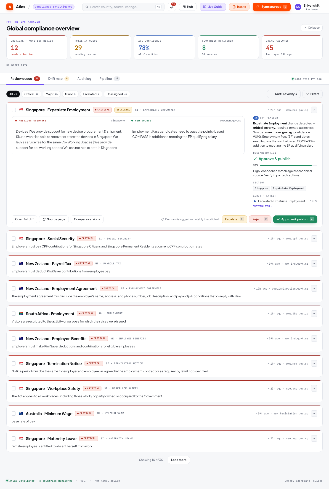
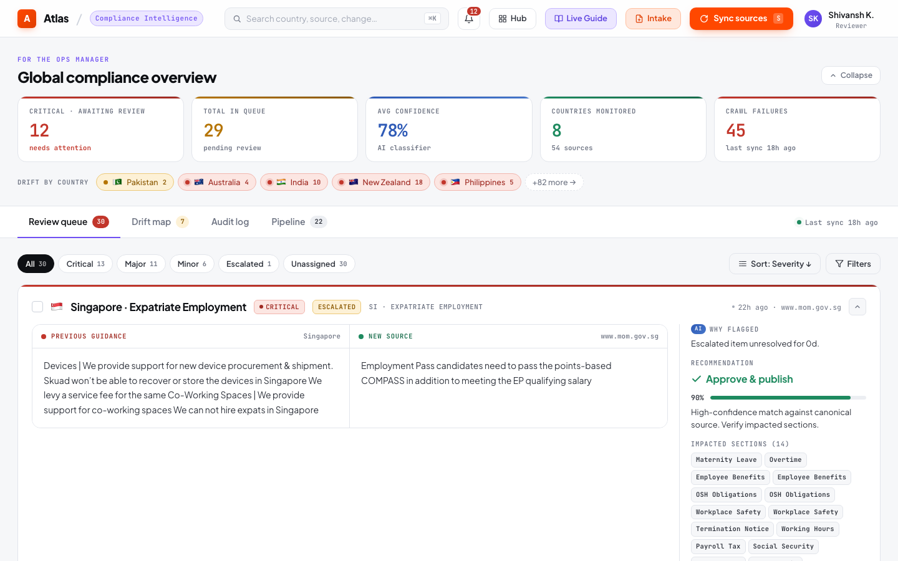

# Ops Dashboard

The ops dashboard (`/ops`) is the primary interface for compliance operations — monitoring pipeline health, reviewing changes, and managing the compliance posture.

---

## Metrics Cards

The top row displays real-time KPIs pulled from `GET /api/metrics`:

| Metric | Source | What It Tells You |
|--------|--------|-------------------|
| **Monitored Sources** | Active source endpoints count | Total official government sources being tracked |
| **Pending Reviews** | `review_queue WHERE status='pending'` | Changes awaiting reviewer decision |
| **Critical Changes** | `review_queue WHERE severity='critical' AND status='pending'` | High-materiality changes requiring urgent attention |
| **Approved Today** | `review_queue WHERE status='approved' AND reviewed_at >= today` | Review throughput for the current session |
| **Countries Active** | `DISTINCT country FROM country_guide` | Countries with at least one published rule |
| **Drift Alerts** | `DriftDetector.detect_all()` count | Countries with detected compliance drift |
| **Last Sync** | Most recent ingestion job timestamp | When the pipeline last ran |

---

## Review Queue

The review queue shows all pending changes with:

### Priority Ordering

Items are sorted by:
1. **Status**: Escalated items first, then pending
2. **Severity**: Critical → major → minor
3. **Confidence**: Highest confidence first

### Per-Item Display

- **Severity badge**: Color-coded (red = critical, orange = major, blue = minor)
- **Materiality chip**: CRITICAL / HIGH / MODERATE / LOW / INFORMATIONAL
- **Change type**: NUMERIC_THRESHOLD_CHANGE, ELIGIBILITY_CHANGE, REQUIREMENT_ADDED, etc.
- **Before/after diff**: Word-level semantic highlighting
- **Source paragraph**: Relevant excerpt from the official government source
- **Confidence score**: LLM extraction confidence (0–100%)
- **Source URL**: Link to the original government page

### Actions

| Action | Button | Effect |
|--------|--------|--------|
| **Approve** | Green "Approve & publish" | Publishes change, creates version + provenance + audit entry |
| **Reject** | Red "Reject" | Dismisses change, creates audit entry |
| **Escalate** | Yellow "Escalate" | Routes to senior reviewer, surfaces first in queue |
| **Bulk Approve** | Country-scoped button | Approves all non-critical pending items for a country |

### Filters

- **Country**: Filter by specific country
- **Severity**: critical / major / minor
- **Status**: pending / escalated / approved / rejected
- **Materiality**: CRITICAL / HIGH / MODERATE / LOW / INFORMATIONAL

---

## Sync Controls

Click **Sync Now** to trigger a manual pipeline run. A modal allows selecting specific countries to sync, conserving Groq API quota for targeted checks.

After sync completes, the metrics cards refresh and any detected changes appear in the review queue.

---

## Audit Log Tab

The audit log tab displays an immutable record of every review decision:

| Column | Content |
|--------|---------|
| Timestamp | When the decision was made |
| Country / Section | Which rule was affected |
| Decision | Approved / Rejected / Escalated |
| Reviewer | Who made the decision |
| Rationale | Why the decision was made |
| Old Value | Previous rule text |
| New Value | Updated rule text (for approvals) |

Filterable by country and date range via `GET /api/audit?country=India&since=2025-01-01`.

---

## Drift Reports

The drift tab shows compliance drift reports per country:

- **Overall severity**: CRITICAL / WARNING / INFO / NONE
- **Affected sections**: Which rules have detected drift
- **Evidence**: Explanation of why drift was detected (e.g., "Critical item pending for 18 days")
- **Recommended action**: What the compliance team should do

---

## Pipeline Health

The pipeline tab shows recent ingestion jobs with:

- **State**: queued → fetched → extracted → reconciled (or failed)
- **Timestamps**: Per-stage timing for latency analysis
- **Failure reasons**: When a source fails, the error is recorded and displayed
