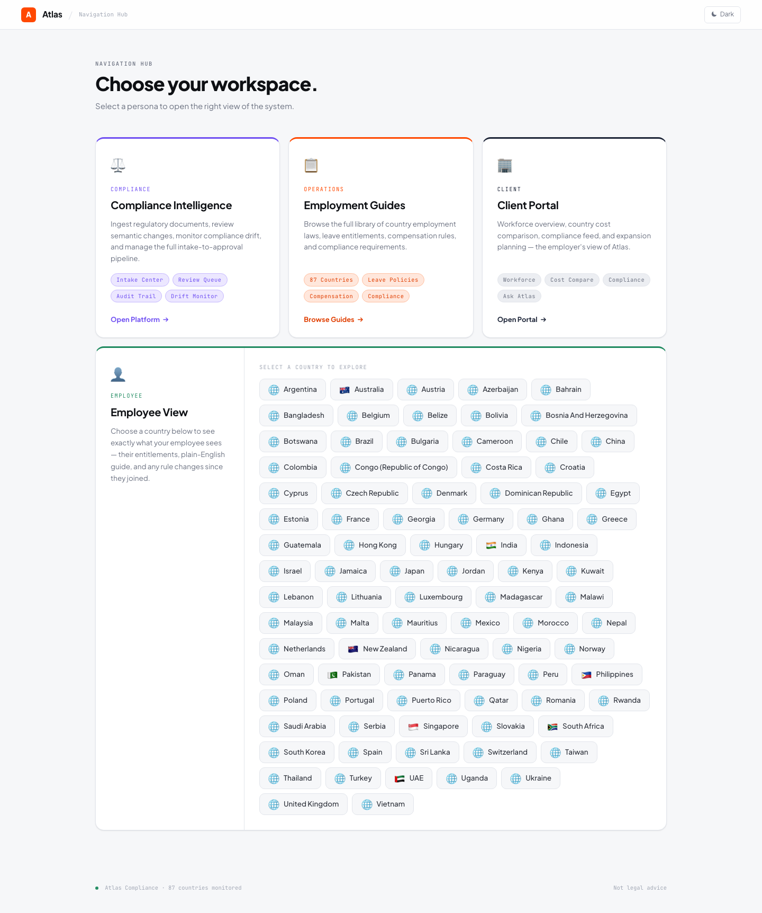

# Country Guide Reconciliation

An automated compliance operations platform that detects, reviews, and publishes changes to employment guides by monitoring official government sources.

## What It Does

1. **Crawls official government sources** for 8 countries (India, Australia, Singapore, South Africa, UAE, New Zealand, Philippines, Pakistan)
2. **Extracts structured compliance data** using Groq's LLaMA 3.3 70B
3. **Detects meaningful differences** via semantic reconciliation
4. **Routes changes to compliance reviewers** for human-in-the-loop approval
5. **Publishes approved changes** with full audit trail and source attribution



## Key Features

- Real-time compliance metrics dashboard
- Semantic word-level diffs with source evidence
- Impact assessment (Critical / Moderate / Low / Informational)
- Immutable audit trail for every decision
- Client-facing employment guide with 7 rule categories
- Temporal rule versioning for historical queries
- Compliance drift detection with Slack alerts

## Quick Start

```bash
# Install dependencies
pip install -r requirements.txt

# Initialize the database
python app.py

# Seed from Notion (one-time baseline)
python notion_import.py

# Open http://localhost:8080
```

## Tech Stack

| Component | Technology |
|-----------|-----------|
| Framework | Flask (Python) |
| Database | SQLite |
| LLM | Groq API (LLaMA 3.3 70B) |
| Templating | Jinja2 |
| Alerts | Slack Webhooks |
| Docs | MkDocs Material |
