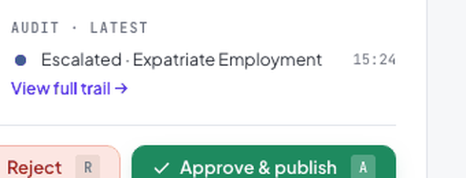
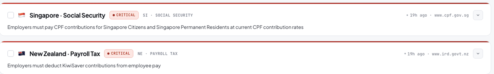
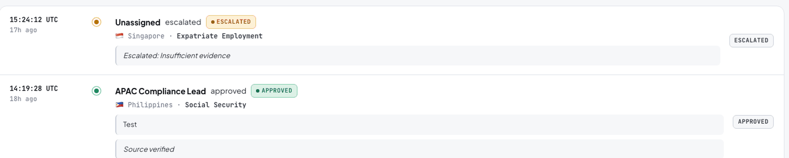

# Compliance Governance Infrastructure

This system is the authoritative source of truth for employment regulation across 87 jurisdictions. It ingests official government sources, extracts structured regulatory rules, classifies changes by materiality, routes them through a mandatory human review gate, and publishes approved changes with a complete, immutable provenance chain linking every published rule back to the government document that originated it.

---

## Governance Philosophy

Multi-jurisdiction employment compliance operates under a fundamental constraint: the cost of a missed regulatory change is asymmetric. A minimum wage miscalculation, a stale termination notice period, or an outdated work permit requirement can expose the organization to penalties, employment disputes, or visa processing failures that exceed the cost of the entire compliance operation.

This system is built around four principles that govern every architectural decision:

---

**Provenance-first.** No rule is considered authoritative unless its origin can be traced to a specific government document, captured at a specific time, extracted by a versioned model, reviewed by an identified person, and approved with a documented rationale. This chain cannot be bypassed; bypassing it produces an audit finding.

{ loading=lazy }

---

**Human authority over AI output.** The LLM extracts; humans decide. The system uses a large language model to convert unstructured government HTML into structured rule objects — a task for which AI generalization across heterogeneous formats is appropriate. The system never allows AI output to become a published rule without explicit human approval. This is not a limitation of the AI; it is a deliberate governance control.

{ loading=lazy }

---

**Deterministic classification over probabilistic judgment.** Change classification — determining whether a detected difference is a numeric threshold change, an eligibility scope modification, or a formatting artifact — uses a deterministic regex-based engine, not an LLM. The same (old, new) pair always produces the same classification. Auditors can reconstruct the reasoning. LLM classification would undermine that reproducibility.

{ loading=lazy }

---

**Immutable audit record.** Every decision, at every stage of the pipeline, is written to append-only tables. No UPDATE or DELETE operation exists for audit data. The complete history of who decided what, when, and why is always reconstructable from the database.

{ loading=lazy }

---

## What This System Guarantees

The following are system-level guarantees, not aspirational claims:

| Guarantee | Mechanism |
|-----------|-----------|
| No regulatory change is published without human approval | `review_queue` is the mandatory gate; `country_guide` is only updated via `approve_pending_review_item()` |
| Every published rule has a traceable provenance chain | Approval atomically writes provenance; `current_provenance_id` is a FK constraint |
| Critical-severity changes cannot be bulk-approved | `bulk_approve_non_critical()` enforces `severity != 'critical'` at the repository level |
| Audit records cannot be modified or deleted | No UPDATE/DELETE endpoints or repository methods exist for `audit_log` |
| Every version of every rule is retained | `country_guide_versions` is append-only; superseded versions are never deleted |
| Point-in-time rule state is always reconstructable | Version rows carry `[effective_date, superseded_at)` intervals; temporal queries are deterministic |
| Source content is archived at crawl time | `source_snapshots` stores the raw text and MD5 hash of every crawled page before extraction |
| Every monitored source has a defined trust level and ownership | The source registry ([`compliance-data`](https://github.com/guptashivansh/compliance-data)) assigns `trust_level`, `precedence_rank`, `escalation_required`, and `owner_team` to every authority — source coverage is governed, not ad-hoc |

---

## What This System Does Not Guarantee

Honesty about system boundaries is as important as stating capabilities:

- The system does not guarantee that the source registry is complete. The [`compliance-data`](https://github.com/guptashivansh/compliance-data) registry defines which government authorities are monitored, with `trust_level`, `precedence_rank`, `escalation_required`, and `owner_team` per authority. Jurisdictions or regulatory domains not yet added to the registry are not monitored. Coverage expansion is a registry maintenance responsibility, tracked in that repository.
- The system does not guarantee LLM extraction accuracy. Confidence scores flag uncertain extractions, but human reviewers are the authority on whether an extraction reflects the source document.
- The system does not authenticate reviewers. Reviewer identity is captured and recorded, but the system does not enforce that the identity belongs to an authorized person. Role-based access control is an integration requirement for production deployment.
- The system does not guarantee real-time change detection. Government sources are crawled daily at **08:00 UTC** (`SYNC_CRON_SCHEDULE=0 8 * * *`). A regulatory change published at 08:01 UTC will not be detected until the following day's sync. The maximum detection lag is 24 hours.

---

## Compliance Coverage

Employment guides are maintained across 87 countries spanning APAC, EMEA, and the Americas. Each country covers up to 7 regulatory sections:

| Section | Examples |
|---------|---------|
| **Leave** | Annual leave entitlement, sick leave, parental leave, public holidays |
| **Working Hours** | Maximum working hours, overtime eligibility, rest periods |
| **Compensation** | Minimum wage, overtime rates, salary payment frequency |
| **Benefits & Social Security** | Pension contributions, health insurance mandates, provident fund |
| **Employment Terms** | Probation periods, notice periods, termination procedures |
| **Immigration** | Work permit categories, visa processing timelines, eligibility conditions |
| **Workplace Safety** | Mandatory safety obligations, reporting requirements |

??? note "Full country list (click to expand)"

    | Region | Countries |
    |--------|-----------|
    | **APAC** (18) | Australia, Bangladesh, China, Hong Kong, India, Indonesia, Japan, Malaysia, Nepal, New Zealand, Pakistan, Philippines, Singapore, South Korea, Sri Lanka, Taiwan, Thailand, Vietnam |
    | **EMEA** (53) | Austria, Azerbaijan, Bahrain, Belgium, Bosnia And Herzegovina, Botswana, Bulgaria, Cameroon, Congo (Republic of Congo), Croatia, Cyprus, Czech Republic, Denmark, Egypt, Estonia, France, Georgia, Germany, Ghana, Greece, Hungary, Israel, Jordan, Kenya, Kuwait, Lebanon, Lithuania, Luxembourg, Madagascar, Malawi, Malta, Mauritius, Morocco, Netherlands, Nigeria, Norway, Oman, Poland, Portugal, Qatar, Romania, Rwanda, Saudi Arabia, Serbia, Slovakia, South Africa, Spain, Switzerland, Turkey, UAE, Uganda, Ukraine, United Kingdom |
    | **Americas** (16) | Argentina, Belize, Bolivia, Brazil, Chile, Colombia, Costa Rica, Dominican Republic, Guatemala, Jamaica, Mexico, Nicaragua, Panama, Paraguay, Peru, Puerto Rico |

---

## Pipeline Stages

The governance pipeline is sequential by design. Each stage has a defined responsibility boundary, and no stage can be skipped.

| Stage | Responsibility | Output |
|-------|----------------|--------|
| **Ingestion** | Fetch official sources, archive raw content with content hash | `source_snapshots` record |
| **Extraction** | Convert unstructured HTML to structured rule objects | `EmploymentRule` objects with confidence scores |
| **Reconciliation** | Classify the semantic difference between extracted and published rules | `review_queue` entry with change type and materiality |
| **Review** | Human examines source evidence and approves, rejects, or escalates | `audit_log` entry; `country_guide` updated on approval |
| **Publication** | Approved rule becomes authoritative; version history updated | `country_guide_versions` row; `rule_provenance` record |
| **Drift Detection** | Continuous assessment of compliance posture staleness | `DriftReport` per country with recommended actions |
| **Alerting** | Region-routed notifications to accountability owners | Slack messages to designated regional leads |

---

## Personas and Their Trust Relationship with the System

| Persona | Trust Relationship |
|---------|-------------------|
| **Compliance Analyst** | Trusts that the review queue presents complete, accurate evidence for every detected change. Is accountable for every decision they record. |
| **Compliance Lead** | Trusts that drift reports reflect current system state computed on-demand, not cached. Can rely on metrics for operational oversight. |
| **Regional Owner** | Trusts that Slack alerts fire reliably after sync completion, with accurate change counts. Is accountable for country coverage in their region. |
| **External Auditor** | Trusts that the audit log is append-only and complete. Can reconstruct the provenance chain for any published rule using only the database. |
| **Platform Engineer** | Trusts that the ingestion job state machine accurately reflects pipeline execution. Is responsible for source URL maintenance and extraction quality monitoring. |
| **Legal Counsel** | Trusts that temporal queries return the rule that was in effect at a specific date, backed by an immutable version record. |

---

## Technical Foundation

| Component | Technology | Governance Rationale |
|-----------|-----------|---------------------|
| Application Framework | Flask (Python) | Explicit, auditable request handling; no magic |
| Database | SQLite (development) / PostgreSQL (production) | ACID transactions; append-only tables for audit data |
| LLM Provider | Groq API (LLaMA 3.3 70B, temperature=0.1) | Near-deterministic extraction; fast inference for structured output |
| Semantic Engine | Regex pattern library (deterministic) | Reproducible classification; full reasoning traceability |
| Alerting | Slack Webhooks (region-routed) | Direct notification to regional accountability owners |
| Scheduler | APScheduler (in-process cron) | Configurable schedule with misfire recovery |

---

## Documentation Structure

| Section | Audience | What to Read For |
|---------|----------|-----------------|
| [Platform Architecture](architecture/overview.md) | Solution Architects, Engineering Leads | System guarantees, trust boundaries, failure handling, architectural rationale |
| [Database Design](architecture/database.md) | Data Architects, Auditors | Schema integrity, append-only guarantees, temporal model |
| [Service Architecture](architecture/services.md) | Engineering Teams | Service boundaries, dependency model, transaction ownership |
| [Ingestion Layer](modules/ingestion.md) | Platform Engineers | Source reliability, snapshot integrity, failure isolation |
| [LLM Extraction](modules/llm-extraction.md) | Engineers, Compliance Leads | AI trust boundaries, confidence model, extraction governance |
| [Semantic Reconciliation](modules/semantic-reconciliation.md) | Compliance Leadership, Architects | Deterministic classification rationale, materiality framework |
| [Review & Governance Workflow](modules/review-workflow.md) | Compliance Analysts, Leads, Auditors | Governance protocol, reviewer accountability, publishing safety |
| [Provenance & Audit Trail](modules/provenance.md) | Auditors, Legal, Compliance Leads | Chain of custody, audit readiness, historical reconstruction |
| [Temporal Versioning](modules/temporal-versioning.md) | Legal, Auditors, Advisors | Point-in-time queries, version integrity, dispute evidence |
| [Drift Detection](modules/drift-detection.md) | Compliance Operations | SLA monitoring, escalation thresholds, coverage assurance |
| [Sync Pipeline](modules/sync-pipeline.md) | Platform Engineers, Compliance Leads | End-to-end orchestration, failure recovery, operational reliability |
| [Operational Runbook](guide/ops-dashboard.md) | Compliance Analysts, Ops Teams | Governance workflows, triage procedures, escalation paths |
| [Alerting](guide/alerting.md) | Regional Owners, Compliance Leads | Alert routing, notification contracts, response expectations |
| [API Reference](api.md) | Engineering, Integration Teams | Endpoint contracts, request/response schemas |
