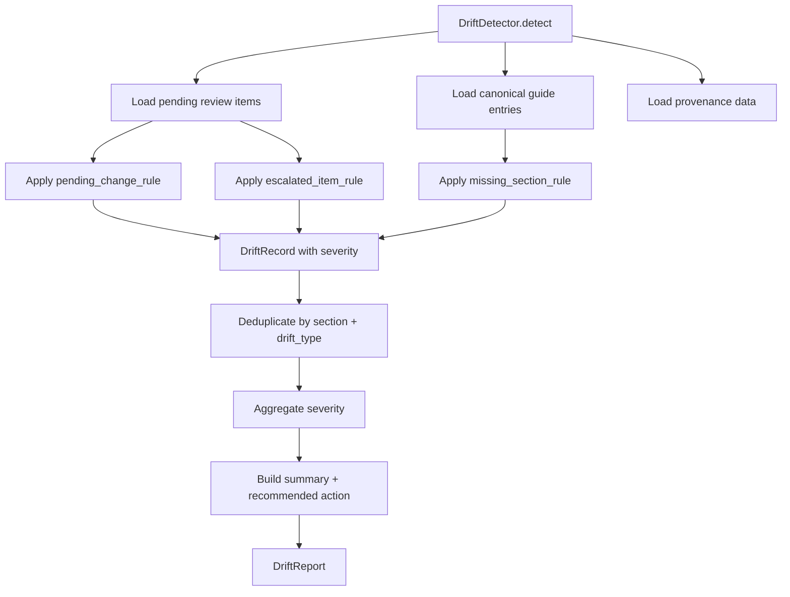

# Drift Detection

## 1. Feature Name

**Automated Compliance Drift Detection & Alerting**

## 2. Business Problem Solved

Even with automated pipelines, compliance gaps emerge: reviews sit unactioned for weeks, critical changes are escalated but not resolved, published rules go months without re-verification, or new sections appear in the review queue that have no corresponding published rule. Drift detection continuously evaluates the health of the compliance posture and surfaces risks before they become incidents.

## 3. Operational Pain Points Addressed

- **Stale reviews**: Pending items age without action; no visibility into review queue aging
- **Escalation bottlenecks**: Escalated items signal disagreement or complexity but have no SLA tracking
- **Coverage gaps**: New regulatory sections may exist in source data but have no published rule
- **Compliance complacency**: Without active monitoring, teams assume "no alerts = no problems"

## 4. User Personas Involved

| Persona | Interaction |
|---------|-------------|
| Compliance Lead | Reviews drift reports; acts on critical/warning alerts |
| Regional Owner | Receives Slack alerts for drift in their region's countries |
| Platform Engineer | Tunes drift rule thresholds; adds new canonical rules |

## 5. Functional Overview

{ loading=lazy }


The drift detector evaluates two categories of rules:

**Pending Rules** — Analyze the review queue for aging and urgency:

- How long have pending items been unreviewed?
- Are there escalated items that have been sitting for too long?

**Canonical Rules** — Analyze published rules for staleness and gaps:

- When was each rule last verified against its source?
- Are there sections in the review queue with no corresponding published rule?

Each evaluation produces `DriftRecord` objects with severity (CRITICAL / WARNING / INFO), which are aggregated into a `DriftReport` per country.

## 6. End-to-End Workflow



## 7. Technical Architecture

### Drift Rules

Rules are implemented as callable predicates that receive context and return an optional `DriftRecord`:

**`pending_change_rule`** — Evaluates unreviewed items:

| Condition | Severity |
|-----------|----------|
| Critical-severity item pending > 14 days | CRITICAL |
| Critical-severity item pending > 7 days | WARNING |
| Major-severity item pending > 14 days | WARNING |
| Any item pending > 7 days | INFO |

**`escalated_item_rule`** — Evaluates escalated items:

| Condition | Severity |
|-----------|----------|
| Escalated item unresolved > 7 days | CRITICAL |
| Any escalated item | WARNING |

**`missing_section_rule`** — Evaluates coverage gaps:

| Condition | Severity |
|-----------|----------|
| Section in review queue has no published rule in country_guide | WARNING |

### Tunable Thresholds

```python
PENDING_DAYS_CRITICAL = 14
PENDING_DAYS_WARNING = 7
ESCALATED_DAYS_CRITICAL = 7
STALE_DAYS_CRITICAL = 90
STALE_DAYS_WARNING = 30
STALE_DAYS_INFO = 14
```

These are defined as module-level constants in `app/drift/rules.py` and can be adjusted without code changes to the detection logic.

### DriftRecord Model

```python
@dataclass
class DriftRecord:
    country: str
    section: str
    drift_type: str                # "pending_review_aging", "escalation_bottleneck", "coverage_gap"
    severity: str                  # "CRITICAL", "WARNING", "INFO"
    current_value: Optional[str]
    proposed_value: Optional[str]
    pending_item_id: Optional[int]
    days_pending: Optional[int]
    last_verified_at: Optional[str]
    evidence: str                  # Human-readable explanation
    recommended_action: str        # What the compliance team should do
```

### DriftReport Model

```python
@dataclass
class DriftReport:
    country: str
    generated_at: str
    drift_detected: bool
    severity: str                  # Aggregate: max severity across all records
    affected_sections: list[str]
    summary: str                   # "2 CRITICAL, 1 WARNING drift items for India"
    recommended_action: str        # Context-specific action text
```

### Deduplication

Multiple rules may fire for the same (section, drift_type) combination. The detector deduplicates by keeping the highest-severity record for each unique pair.

### Severity Aggregation

The report's overall severity is the maximum across all drift records:

```python
SEVERITY_ORDER = {"CRITICAL": 3, "WARNING": 2, "INFO": 1, "NONE": 0}
```

## 8. Data Flow

```
DriftRepository reads (no writes):
    → country_guide (canonical rules with last_updated)
    → review_queue (pending/escalated items with created_at)
    → rule_provenance (last verification dates)
        ↓
DriftDetector applies rule functions
        ↓
DriftRecord[] (per section, per drift type)
        ↓
Deduplicate → Aggregate → Summarize
        ↓
DriftReport {
    country: "India",
    drift_detected: true,
    severity: "CRITICAL",
    affected_sections: ["minimum_wage", "annual_leave"],
    summary: "1 CRITICAL, 1 WARNING drift items for India",
    recommended_action: "Review critical pending items immediately"
}
```

## 9. Backend Components

| Component | File | Lines | Responsibility |
|-----------|------|-------|----------------|
| `DriftDetector` | `app/drift/detector.py` | 110 | Orchestrates rule evaluation, deduplication, report generation |
| `DriftRepository` | `app/drift/repository.py` | 150 | Read-only queries across guide, queue, and provenance tables |
| `DriftRecord` | `app/drift/report.py` | 71 | Individual drift finding |
| `DriftReport` | `app/drift/report.py` | 71 | Aggregated country-level report |
| Drift rules | `app/drift/rules.py` | 150+ | Predicate functions with tunable thresholds |

## 10. APIs Involved

| Endpoint | Method | Purpose |
|----------|--------|---------|
| `GET /api/drift` | GET | All drift reports across all countries |
| `GET /api/drift/<country>` | GET | Drift report for a specific country |

## 11. Database Design Implications

The drift detector is **read-only** — it queries existing tables but never writes drift state to the database. This is a deliberate design choice:

- Drift is computed on-demand from current state, not cached
- No stale drift data can mislead reviewers
- No additional tables to maintain or migrate
- Drift severity is always consistent with the current review queue and guide state

## 12. Observability & Monitoring

- **Dashboard integration**: Drift report count displayed as a metric card on the ops dashboard
- **Per-country drill-down**: API returns affected sections, severity, evidence, and recommended actions
- **Slack integration**: Drift alerts can be included in post-sync Slack notifications
- **No false positives**: Rules are designed to fire only on actionable conditions with clear evidence

## 13. Risk Mitigation

| Risk | Mitigation |
|------|-----------|
| Drift thresholds are too aggressive (noisy) | Thresholds are tunable constants; start conservative, tighten based on team capacity |
| Drift thresholds are too lenient (missed risk) | CRITICAL thresholds (14 days pending, 7 days escalated) are based on regulatory SLA expectations |
| Drift computation is expensive | Read-only queries with no joins; no full-table scans; O(rules × drift_rules) per country |
| Drift report is outdated between syncs | Drift is computed on-demand via API call, not cached |

## 14. Business Impact

- **Proactive risk management**: Compliance gaps are surfaced before they cause incidents
- **SLA visibility**: Days-pending metrics make review bottlenecks visible to leadership
- **Coverage assurance**: Missing-section detection ensures every regulatory area has a published rule
- **Continuous compliance posture**: Drift reports provide a real-time compliance health score per country

## 15. Future Enhancements

- **Staleness rules**: Alert when a published rule hasn't been re-verified against its source in N days
- **Provenance completeness rules**: Flag rules with incomplete provenance chains
- **Drift trending**: Track drift severity over time to measure compliance posture improvement
- **Drift SLAs**: Configure per-country or per-materiality SLAs with automatic escalation
- **Drift-based scheduling**: Automatically increase sync frequency for countries with high drift
