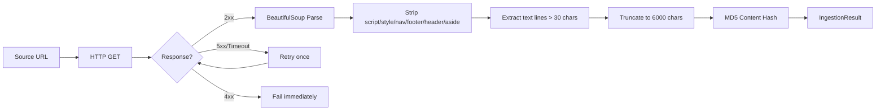
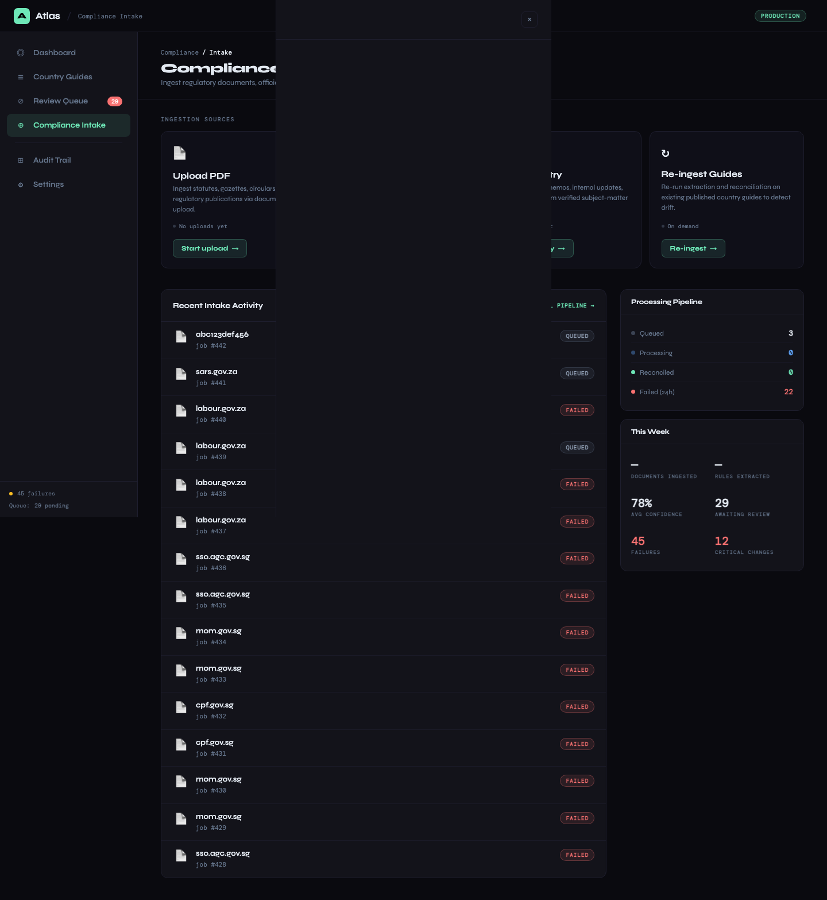
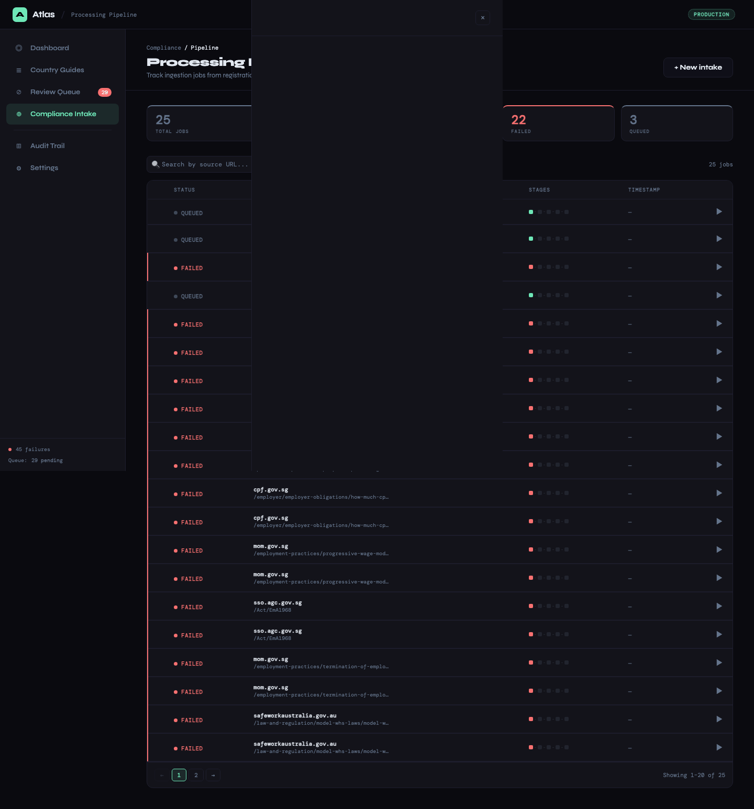
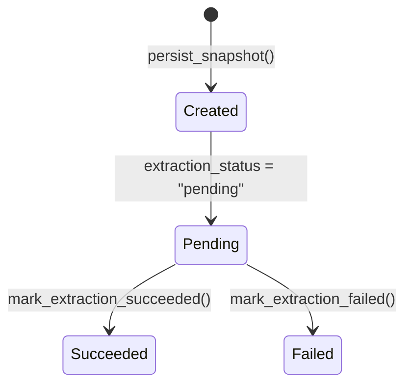
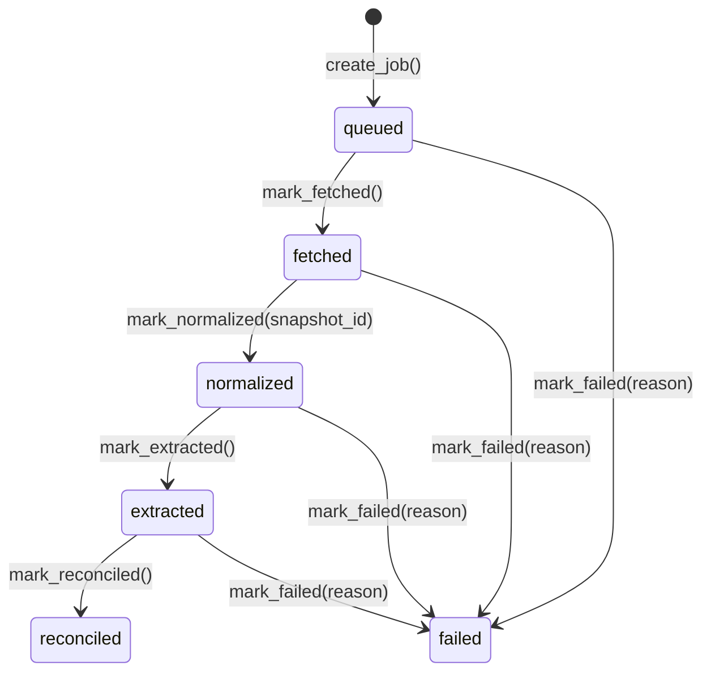

# Ingestion Layer

## 1. Feature Name

**Multi-Source Regulatory Content Ingestion (HTML, Notion, PDF)**

## 2. Business Problem Solved

Employment regulations are published across heterogeneous formats — government ministry websites (HTML), internal knowledge bases (Notion), and official gazette documents (PDF). The ingestion layer normalizes all sources into clean text with content hashing, snapshot archival, and pipeline tracking, providing a unified input to the extraction engine regardless of source format.

## 3. Operational Pain Points Addressed

- **Source format diversity**: HTML, Notion pages, and PDFs each require different parsing strategies
- **Content deduplication**: Without hashing, the pipeline re-processes unchanged sources, wasting LLM quota
- **No archive of source material**: When a government website changes, the previous version is lost unless archived
- **Ingestion failures are invisible**: Timeouts, 404s, and rate limits happen silently; no tracking means no accountability

## 4. User Personas Involved

| Persona | Interaction |
|---------|-------------|
| Platform Engineer | Configures source endpoints, monitors ingestion job logs, debugs failures |
| Compliance Analyst | Views source evidence (snapshot) when reviewing changes |
| Compliance Lead | Monitors ingestion success rates and failure patterns |

## 5. Functional Overview


Three ingestion adapters feed into a common pipeline:

| Adapter | Source | Use Case |
|---------|--------|----------|
| `HtmlIngestionService` | Government websites | Ongoing regulatory monitoring |
| `NotionIngestionService` | Skuad Notion workspace | One-time baseline import |
| PDF intake (via `/api/intake/pdf`) | Uploaded gazette documents | Ad-hoc regulatory document processing |

All adapters produce the same output: cleaned text + content hash, stored as a source snapshot.

## 6. End-to-End Workflow

### HTML Ingestion



**Configuration**:

| Parameter | Value |
|-----------|-------|
| Timeout | 30 seconds |
| Max retries | 2 (1 initial + 1 retry) |
| User-Agent | Browser-like string |
| Min line length | 30 characters |
| Max content length | 6,000 characters |
| Hash algorithm | MD5 |

### Notion Ingestion

The Notion adapter uses the unofficial `loadPageChunk` API to traverse a specific page hierarchy:

```
Root Page
  → "Quick Country Guides" header
    → column_list → columns
      → Sub-headers (APAC, MEA, etc.)
        → ‣ Page mentions (country employment guide links)
          → Individual country page content
```

**Rate limiting**: 1.5-second sleep between API calls; exponential backoff (5s + doubling) on 429 responses.

**Country discovery**: Regex pattern `^(.+?)\s*[-–]\s*Employment Guide` auto-discovers country names from page titles.

**Content format**: Notion pages contain pipe-separated tables which are parsed deterministically — no LLM is needed for this structured format.

### PDF Intake





The `/api/intake/pdf` endpoint accepts multipart form uploads, extracts text content, and feeds it into the standard extraction pipeline.

## 7. Technical Architecture

### Source Snapshot Lifecycle



Every snapshot is immutable after creation. The `extraction_status` field tracks whether the downstream LLM extraction succeeded or failed, allowing failed extractions to be retried without re-crawling.

### Ingestion Job State Machine



Each state transition sets the corresponding timestamp column, creating a per-stage latency profile:

```json
{
    "id": 89,
    "source_url": "https://labour.gov.in/...",
    "state": "reconciled",
    "queued_at": "2025-03-14T07:59:00",
    "fetched_at": "2025-03-14T08:00:02",
    "normalized_at": "2025-03-14T08:00:03",
    "extracted_at": "2025-03-14T08:00:45",
    "reconciled_at": "2025-03-14T08:01:30",
    "failed_at": null,
    "failure_reason": null
}
```

## 8. Backend Components

| Component | File | Lines | Responsibility |
|-----------|------|-------|----------------|
| `HtmlIngestionService` | `app/ingestion/html_ingestion_service.py` | 120 | HTTP fetch, HTML cleaning, content hashing |
| `NotionIngestionService` | `app/ingestion/notion_ingestion_service.py` | 287 | Notion API traversal, page content extraction |
| `SourceSnapshotService` | `app/ingestion/source_snapshot_service.py` | 45 | Snapshot persistence and status tracking |
| `IngestionJobService` | `app/ingestion/ingestion_job_service.py` | 55 | Job lifecycle management |
| `SourceSnapshotRepository` | `app/repositories/source_snapshot_repository.py` | 74 | SQL operations for snapshots |
| `IngestionJobRepository` | `app/repositories/ingestion_job_repository.py` | 103 | SQL operations for jobs |

## 9. APIs Involved

| Endpoint | Method | Purpose |
|----------|--------|---------|
| `GET /api/ingestion-jobs` | GET | List recent ingestion jobs with states and timestamps |
| `POST /api/intake/pdf` | POST | Upload and process a PDF document |
| `POST /api/sync` | POST | Trigger sync (which internally creates ingestion jobs) |

## 10. Database Design Implications

**`source_snapshots`**: Stores the raw text of every crawled page. This grows linearly with (sources × sync frequency). For 87 countries × 3 sources each × daily sync = ~261 snapshots/day, or ~95K/year. At ~6KB average, this is ~570MB/year — manageable for SQLite or PostgreSQL.

**`ingestion_jobs`**: One row per source per sync. The `list_recent_jobs(limit=25)` query keeps the API lightweight; historical jobs remain queryable for debugging.

## 11. Risk Mitigation

| Risk | Mitigation |
|------|-----------|
| Government website blocks crawlers | Browser-like User-Agent; configurable retry logic |
| Government website serves stale cached content | Content hashing detects unchanged pages; no duplicate review items created |
| Notion API changes or breaks | Used only for one-time baseline import; ongoing sync uses HTML ingestion |
| Large pages exceed LLM context | 6,000-character truncation + chunking in extraction layer |
| Source URL returns malicious content | BeautifulSoup strips executable tags; content is processed as text only |

## 12. Observability & Monitoring

- **Ingestion job log**: Per-source state machine with timestamps for every stage
- **Failure tracking**: Failed jobs record the reason and timestamp; queryable via API
- **Snapshot archive**: Every crawled page is archived for debugging extraction issues
- **Latency profiling**: Stage timestamps reveal bottlenecks (fetch slow? extraction slow? reconciliation slow?)

## 13. Future Enhancements

- **RSS/Atom feed monitoring**: Subscribe to government publication feeds for real-time change detection
- **Headless browser ingestion**: Use Playwright for JavaScript-rendered government sites
- **Content hash deduplication**: Skip extraction entirely when the snapshot hash matches the previous crawl
- **Parallel ingestion**: Fetch multiple sources concurrently with rate limiting per domain
- **Source health dashboard**: Track per-source uptime, response time, and extraction success rate over time
