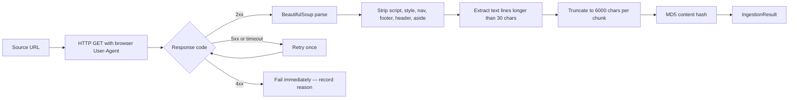
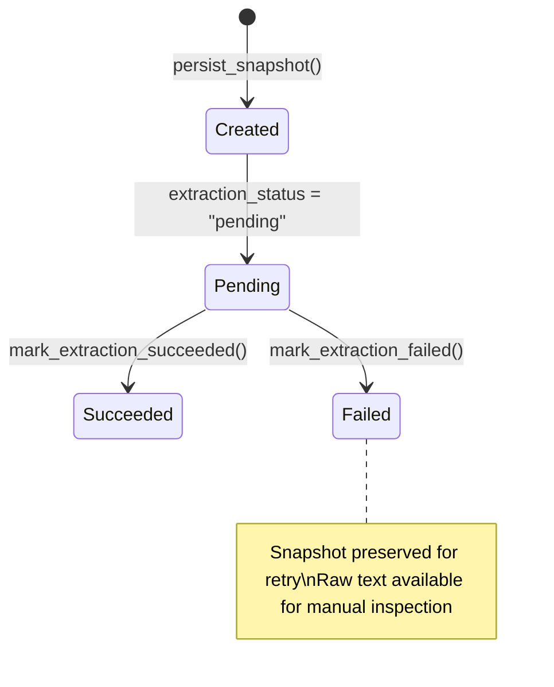

# Ingestion Layer

## Operational Purpose

The ingestion layer is the first stage of the compliance pipeline. Its responsibility is narrow and precisely defined: retrieve content from official government sources, sanitize it, archive a complete snapshot with a content hash, and produce cleaned text for downstream extraction. It does not interpret content; it preserves it.

The ingestion layer's reliability is a prerequisite for the accuracy of everything downstream. A missed fetch means no extracted rule. A corrupted fetch means a potentially incorrect extraction. An unarchived fetch means no evidence for the provenance chain.

---

## Source Snapshot Guarantee

Every successful fetch produces a `source_snapshot` record before any extraction occurs. The snapshot contains the raw cleaned text and its MD5 hash, captured at fetch time. This snapshot is:

- **Immutable after creation.** The `raw_text` and `content_hash` fields are never updated.
- **Preserved regardless of extraction outcome.** If extraction fails, the snapshot is still in the database. The failed extraction can be retried without re-crawling.
- **The evidentiary basis for provenance.** Every provenance chain links back to the snapshot that provided the evidence for an extraction. If a reviewer or auditor questions an extraction, the archived source text is the reference.

---

## HTML Ingestion Processing Steps



### Processing Parameters

| Parameter | Value | Rationale |
|-----------|-------|-----------|
| HTTP timeout | 30 seconds | Government websites can be slow; 30 seconds captures most responses while bounding per-source wait time |
| Max retries | 2 (1 initial + 1 retry) | Retry on transient 5xx or timeout; fail fast on 4xx (client errors do not resolve with retries) |
| User-Agent | Browser-like string | Reduces the likelihood of automated request blocking; does not misrepresent the system as human |
| Minimum line length | 30 characters | Filters navigation elements, breadcrumbs, and UI chrome that survived HTML stripping |
| Max content length | 6,000 characters per chunk | LLM context budget management; see ContentChunker |
| Hash algorithm | MD5 | Deduplication and change detection, not security; MD5 is appropriate for this use case |

---

## Why 4xx Fails Immediately (No Retry)

A 4xx response indicates a client error — typically that the URL is no longer valid (404 Not Found) or access is restricted (403 Forbidden). These conditions will not resolve with a retry:

- A 404 means the government page has been restructured, renamed, or removed. Retrying does not fix this.
- A 403 means the server is explicitly rejecting the request. Retrying the same request will produce the same rejection.

The correct operational response to a 4xx is to investigate and update the source URL in the source registry. The failure is recorded with its reason; the platform engineering team can identify 4xx failures in the `ingestion_jobs` table and take corrective action.

Automatic retry on 4xx would mask this signal by appearing to "process" the source when it is actually unreachable, potentially causing the previous stale snapshot to be re-used for extraction.

---

## Content Sanitization

The HTML sanitization pipeline removes elements that contain page structure rather than regulatory content:

```
<script>  — Executable code
<style>   — CSS stylesheets
<nav>     — Navigation menus
<footer>  — Page footers (disclaimers, copyright notices)
<header>  — Page headers (logos, site navigation)
<aside>   — Sidebars (related links, advertisements)
```

This stripping is not complete HTML sanitization — it does not protect against all web injection vectors. Its purpose is content normalization: extracting the substantive regulatory text from the structural chrome of government websites, which otherwise pollutes the LLM's extraction context.

**What remains after stripping:** The main body content — tables, paragraphs, headings, and list items — which is where regulatory rules are published.

---

## Content Hash and Deduplication

After cleaning and truncation, an MD5 hash is computed over the processed text. This hash serves two functions:

**Change detection at sync time:** If the hash matches the hash of the most recent snapshot for the same URL, the content has not changed. Extraction and reconciliation are skipped. This prevents unnecessary LLM calls for unchanged sources.

**Integrity verification in provenance:** The hash is stored in the snapshot record and carried through to the provenance chain. An auditor examining a published rule can verify that the snapshot's content hash matches the hash in the provenance record — a mismatch would indicate post-hoc modification of the snapshot.

---

## Notion Ingestion (Baseline Import Only)

The Notion ingestion service is used exclusively for the one-time baseline import of existing country guides. It is not used for ongoing regulatory monitoring.

The Notion adapter traverses a specific page hierarchy in the organization's Notion workspace:

```
Root Page
  → "Quick Country Guides" header
    → column_list → columns
      → Sub-headers (APAC, MEA, etc.)
        → Page mentions (country employment guide links)
          → Individual country page content
```

**Rate limiting:** 1.5-second sleep between API calls; exponential backoff (5 seconds, doubling) on 429 responses.

**Content format:** Notion pages contain pipe-separated tables in a deterministic format. No LLM is required — the tables are parsed directly. This is the appropriate architecture for structured internal content.

**Ongoing monitoring:** For ongoing regulatory monitoring, HTML ingestion from official government sources replaces Notion as the authoritative source. Notion content represents the organization's prior interpretation of the law; government sources represent the law itself.

---

## PDF Intake

The `/api/intake/pdf` endpoint accepts multipart form uploads of gazette documents and other PDF-based official publications. PDF text is extracted, passed through the same cleaning and truncation pipeline as HTML content, and fed into the standard extraction workflow.

PDF intake is an ad-hoc capability for regulatory documents that are not published as web pages (official gazettes, ministry circulars). It follows the same governance protocol as HTML-sourced changes: extraction → review queue → human approval.

---

## Ingestion Job Lifecycle

Each source processed by the sync pipeline creates an `ingestion_job` record. The job tracks the source through five states:

```
queued → fetched → normalized → extracted → reconciled
                                               ↑
                     failed ← (from any state)
```

Each state transition sets a timestamp column, providing a built-in latency profile per source. A source where `extracted_at - normalized_at` is unexpectedly long signals an extraction bottleneck for that specific URL.

**Failure recording:** When a job fails, `failed_at` is set and `failure_reason` records the specific error. This is the primary diagnostic data for platform engineers investigating why a source was not updated on a given sync cycle.

---

## Source Snapshot Lifecycle



A failed extraction snapshot is never deleted. The raw text is available for manual inspection or re-extraction via a subsequent sync.

---

## Backend Components

| Component | File | Lines | Responsibility |
|-----------|------|-------|----------------|
| `HtmlIngestionService` | `app/ingestion/html_ingestion_service.py` | 120 | HTTP fetch, HTML sanitization, content hashing |
| `NotionIngestionService` | `app/ingestion/notion_ingestion_service.py` | 287 | Notion API traversal, page content extraction (baseline import only) |
| `SourceSnapshotService` | `app/ingestion/source_snapshot_service.py` | 45 | Snapshot persistence and extraction status tracking |
| `IngestionJobService` | `app/ingestion/ingestion_job_service.py` | 55 | Job lifecycle state machine |
| `SourceSnapshotRepository` | `app/repositories/source_snapshot_repository.py` | 74 | SQL operations for snapshots |
| `IngestionJobRepository` | `app/repositories/ingestion_job_repository.py` | 103 | SQL operations for jobs |

---

## Risk Mitigation

| Risk | Mitigation |
|------|-----------|
| Government website blocks automated requests | Browser-like User-Agent; retry logic; failure is recorded for engineering follow-up |
| Government website serves stale cached content | Content hash detects unchanged content; stale content produces the same hash as the previous crawl, suppressing duplicate review items |
| Website restructured — meaningful content moves | HTML stripping removes chrome; body content is preserved; extraction confidence drops if the structure changes significantly, alerting reviewers |
| Large pages exceed LLM context | 6,000-character chunking ensures all content is covered across multiple chunks; aggregation preserves the highest-confidence extraction per section |
| Source content contains injection attempts | BeautifulSoup strips executable elements; content is processed as text; the LLM is not given tool-use capability |
| Snapshot corrupted post-creation | MD5 hash stored at creation time; hash is carried to provenance record; mismatch detectable |
