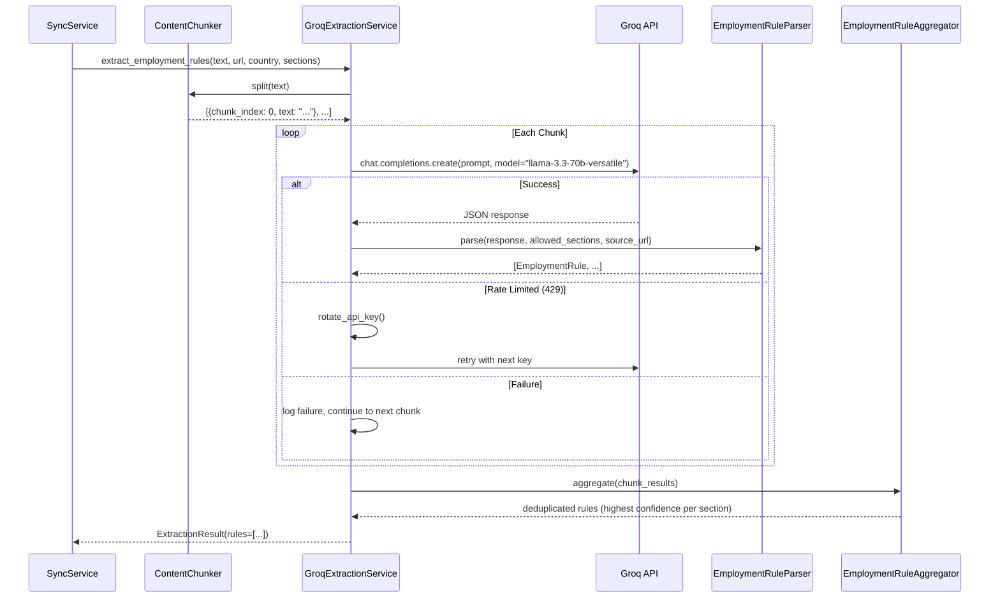

# LLM Extraction Service

## 1. Feature Name

**Groq-Powered Structured Rule Extraction with Multi-Key Rotation**

## 2. Business Problem Solved

Government employment law is published as unstructured HTML across hundreds of pages with varying formats — tables, prose, bullet lists, PDF-embedded content. No two countries' labor ministry websites share the same structure. The extraction service uses a large language model to convert raw HTML into typed, validated `EmploymentRule` objects that can be programmatically compared and versioned.

## 3. Operational Pain Points Addressed

- **Format heterogeneity**: Per-country parsers break when government websites redesign; an LLM generalizes across formats
- **Extraction consistency**: Human analysts reading the same page may extract different rules; the LLM with temperature=0.1 provides near-deterministic extraction
- **Scale**: Manual extraction of 7 rule categories across 8 countries from dozens of pages is a multi-day effort; the pipeline completes in minutes
- **Quality visibility**: Every extracted rule carries a confidence score (0.0–1.0) that flags uncertain extractions for manual review

## 4. User Personas Involved

| Persona | Interaction |
|---------|-------------|
| Platform Engineer | Configures API keys, monitors extraction success rates, tunes prompts |
| Compliance Analyst | Sees confidence scores on review queue items; low confidence triggers closer inspection |
| Compliance Lead | Monitors extraction failure rates via metrics dashboard |

## 5. Functional Overview


The extraction service takes cleaned HTML text and a target country/sections list, then:

1. Chunks the content to fit LLM context windows
2. Sends each chunk to Groq's LLaMA 3.3 70B model
3. Parses the JSON response into validated `EmploymentRule` objects
4. Aggregates results across chunks (highest confidence per section wins)
5. Returns an `ExtractionResult` with the list of rules and any failures

## 6. End-to-End Workflow



## 7. Technical Architecture

### Content Chunking

`ContentChunker` splits text into chunks of at most 6,000 characters, breaking on sentence boundaries (regex: `(?<=[.!?])\s+|\n+`). Each chunk carries metadata:

```python
{"chunk_index": 0, "chunk_count": 3, "text": "..."}
```

**Why 6,000 characters?** This leaves room for the system prompt, country/section context, and response formatting within the LLM's context window while ensuring sufficient content for meaningful extraction.

### Groq API Integration

| Parameter | Value | Rationale |
|-----------|-------|-----------|
| Model | `llama-3.3-70b-versatile` | Strong structured extraction; fast inference |
| Temperature | `0.1` | Near-deterministic output for reproducible extraction |
| Max attempts | `2` per chunk | One retry on transient failures |
| Response format | JSON (prompted) | Structured output for parser validation |

### Multi-Key Rotation

The service accepts a comma-separated list of Groq API keys. On receiving a 429 (rate limit) response:

1. The current key index advances to the next key
2. The request retries immediately with the new key
3. If all keys are exhausted, the chunk is marked as failed

This provides N× rate limit headroom where N is the number of configured keys, without requiring any coordination logic.

### Employment Rule Model

Every extracted rule is validated as a Pydantic model:

```python
class EmploymentRule(BaseModel):
    section: str        # Must be in allowed_sections list
    value: str          # Non-empty rule text
    confidence: float   # 0.0 to 1.0
    severity: str       # "critical" | "major" | "minor"
    source_paragraph: str  # Evidence from the source text
```

**Validators**:
- `section` is checked against the allowed sections for the country
- `severity` is normalized to lowercase
- `value` and `source_paragraph` must be non-empty strings

Invalid rules are silently dropped by the parser (logged at WARNING level), not propagated to reconciliation.

### Chunk Aggregation

When a section appears in multiple chunks, the `EmploymentRuleAggregator` keeps only the highest-confidence extraction per section. Results are returned sorted by section name for deterministic ordering.

## 8. Data Flow

```
Cleaned HTML text (≤6000 chars per chunk)
    ↓
Prompt construction: "Extract employment rules for {country} covering {sections}..."
    ↓
Groq API → raw JSON string
    ↓
Strip markdown fences (```json...```) → JSON.loads
    ↓
Validate each object as EmploymentRule (Pydantic)
    ↓
Drop invalid items → keep valid EmploymentRule list per chunk
    ↓
Aggregate across chunks → highest confidence per section
    ↓
ExtractionResult { status, rules[], failure? }
```

## 9. Backend Components

| Component | File | Lines | Responsibility |
|-----------|------|-------|----------------|
| `GroqExtractionService` | `app/extraction/groq_extraction_service.py` | 237 | API calls, key rotation, retry logic |
| `ContentChunker` | `app/extraction/content_chunker.py` | 49 | Sentence-boundary chunking |
| `EmploymentRuleParser` | `app/extraction/employment_rule_parser.py` | 55 | JSON parsing, Pydantic validation |
| `EmploymentRuleAggregator` | `app/extraction/employment_rule_aggregator.py` | 25 | Cross-chunk deduplication |
| `EmploymentRule` | `app/models/employment_rule.py` | 36 | Pydantic model with validators |
| `ExtractionResult` | `app/models/workflow_results.py` | 59 | Result envelope with success/failure |

## 10. Database Design Implications

Extraction outputs flow into:

- **`source_snapshots.extraction_status`**: Set to `"succeeded"` or `"failed"` after extraction
- **`review_queue.confidence`**: The extraction confidence score (0.0–1.0) is carried through to the review queue
- **`review_queue.source_paragraph`**: The evidence text from the LLM extraction
- **`rule_provenance.extraction_confidence`**: Recorded in the provenance chain
- **`rule_provenance.parser_version`**: Fixed string `"groq/llama-3.3-70b-versatile/v1"` for model lineage


## 11. AI/LLM Usage

| Aspect | Detail |
|--------|--------|
| Provider | Groq |
| Model | LLaMA 3.3 70B Versatile |
| Task | Structured data extraction from unstructured HTML |
| Temperature | 0.1 (near-deterministic) |
| Output format | JSON array of rule objects |
| Confidence | Model self-reports confidence per rule (0.0–1.0) |
| Hallucination mitigation | Human review gate; confidence scoring; source paragraph evidence |

**Why Groq and not OpenAI/Anthropic for extraction?**

- **Inference speed**: Groq's LPU architecture provides significantly faster inference for this structured extraction task
- **Cost**: Generous free tier and competitive pricing for the volume of extraction calls
- **Accuracy**: LLaMA 3.3 70B performs well on structured extraction with low temperature

## 12. Human-in-the-Loop Governance Controls

- The LLM's extraction is **never published directly**. Every extracted rule enters the review queue for human approval.
- Confidence scores below a threshold are visually flagged in the ops dashboard.
- The source paragraph (evidence) is displayed alongside the extracted rule so reviewers can verify accuracy.
- Extraction failures are logged and visible in the ingestion jobs API — a compliance lead can see exactly which sources failed extraction and why.

## 13. Risk Mitigation

| Risk | Mitigation |
|------|-----------|
| LLM hallucinates a rule that doesn't exist in the source | Source paragraph evidence displayed to reviewer; rejection workflow with rationale |
| LLM misinterprets a numeric value (e.g., currency conversion) | Semantic reconciliation engine independently validates numeric changes |
| Model version changes alter extraction quality | `parser_version` recorded in provenance; quality regression detectable via confidence trends |
| Groq API outage | Extraction marked as failed; previous published rules remain active; retry on next sync |
| Prompt injection via government website content | LLM is instructed to extract only; no tool use or action capabilities |

## 14. Observability & Monitoring

- **Extraction status per snapshot**: `source_snapshots.extraction_status` tracks success/failure
- **Confidence distribution**: Queryable via the review queue to detect model quality regression
- **Ingestion job latency**: Timestamps on `extracted_at` vs `fetched_at` measure extraction duration
- **Key rotation events**: Logged at WARNING level when a key hits rate limits
- **Parser validation drops**: Invalid rules logged at WARNING level with the raw response content

## 15. Future Enhancements

- **Model A/B testing**: Run two models in parallel and compare extraction quality before switching
- **Confidence calibration**: Correlate LLM-reported confidence with reviewer acceptance rate to calibrate thresholds
- **Extraction caching**: Skip re-extraction when the source snapshot hash hasn't changed
- **Multi-model fallback**: Try a primary model; fall back to a secondary model on failure
- **Structured output mode**: Use Groq's JSON mode when available for guaranteed valid JSON responses
