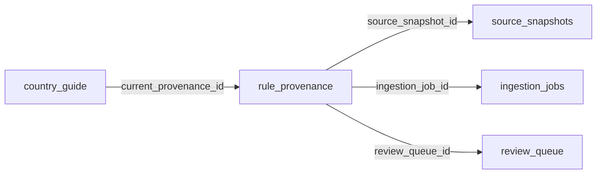

# Provenance & Audit Trail

## 1. Feature Name

**End-to-End Rule Provenance Tracking & Immutable Audit Trail**

## 2. Business Problem Solved

In regulated environments, it is not enough to know that a compliance rule exists — stakeholders must be able to answer: "Where did this rule come from? Who approved it? What was the source evidence? When was it adopted?" The provenance system provides a complete, tamper-evident chain from government source URL to published employment rule.

## 3. Operational Pain Points Addressed

- **"Where did this number come from?"** — Client advisors cannot trace a published rule back to its official source
- **Audit failures**: External auditors require documentary evidence of due diligence for every compliance rule
- **Accountability gaps**: No record of who reviewed a change or what evidence they considered
- **Model lineage**: When extraction quality degrades, there is no way to determine which model version produced a given rule
- **Temporal reconstruction**: Cannot determine what rules were effective at a specific historical date

## 4. User Personas Involved

| Persona | Interaction |
|---------|-------------|
| External Auditor | Examines provenance chains to verify governance controls |
| Compliance Lead | Reviews provenance when a rule is disputed or questioned |
| Client Advisor | Traces a published rule to its official source when advising employers |
| Platform Engineer | Debugs extraction quality by checking parser version and confidence |

## 5. Functional Overview

The provenance system records a linked chain for every published rule:

```
Government Source URL
    → Crawl Event (ingestion job with timestamps)
        → Source Snapshot (raw HTML with content hash)
            → LLM Extraction (confidence, parser version, source fragment)
                → Review Decision (reviewer, rationale, comment, timestamp)
                    → Published Rule (value, effective date, version number)
```

## 6. End-to-End Workflow

### Provenance Creation

Provenance records are created at three points:

1. **On approval**: `ReviewService.approve_review_item()` → `ProvenanceService.record_approval()`
2. **On bulk approval**: `ReviewService.bulk_approve_non_critical()` → `ProvenanceService.record_bulk_approval()`
3. **On initial seed**: `notion_import.py` → `ProvenanceService.record_seed()`

### Provenance Chain Resolution



The `get_current_chain()` method performs LEFT JOINs across all linked tables in a single query, returning a nested response:

```json
{
    "canonical_rule": {
        "country": "India",
        "section": "minimum_wage",
        "value": "INR 23,500/month for scheduled employment",
        "last_updated": "2025-04-01T00:00:00"
    },
    "reviewer_action": {
        "action": "approved",
        "assignee": "divya@compliance.team",
        "rationale": "Confirmed in Budget 2025 gazette notification",
        "comment": "Rate effective from April 1, 2025",
        "reviewed_at": "2025-03-15T14:30:00"
    },
    "extraction": {
        "confidence": 0.92,
        "parser_version": "groq/llama-3.3-70b-versatile/v1",
        "source_fragment": "The minimum wage for scheduled employment...",
        "source_hash": "a1b2c3d4e5f6..."
    },
    "source_snapshot": {
        "snapshot_id": 142,
        "content_hash": "md5:abcdef1234567890",
        "captured_at": "2025-03-14T08:00:00",
        "extraction_status": "succeeded"
    },
    "crawl_event": {
        "ingestion_job_id": 89,
        "source_url": "https://labour.gov.in/...",
        "state": "reconciled",
        "queued_at": "2025-03-14T07:59:00",
        "fetched_at": "2025-03-14T08:00:00",
        "reconciled_at": "2025-03-14T08:01:30"
    }
}
```

## 7. Technical Architecture

### Provenance Record Schema

```sql
CREATE TABLE rule_provenance (
    id INTEGER PRIMARY KEY AUTOINCREMENT,
    country TEXT NOT NULL,
    section TEXT NOT NULL,
    rule_value TEXT,
    review_queue_id INTEGER,
    source_snapshot_id INTEGER,
    ingestion_job_id INTEGER,
    source_url TEXT,
    source_hash TEXT,
    source_fragment TEXT,
    extraction_confidence REAL,
    parser_version TEXT,
    reviewer_action TEXT,         -- 'approved' | 'bulk_approved' | 'seeded'
    reviewer_assignee TEXT,
    reviewer_rationale TEXT,
    reviewer_comment TEXT,
    crawled_at TEXT,
    extracted_at TEXT,
    reviewed_at TEXT,
    created_at TEXT NOT NULL
)
```

### Linking Mechanism

The `country_guide` table has a `current_provenance_id` column that points to the most recent provenance record for each rule. This is updated atomically with each approval:

```python
provenance_repository.write(...)        # → returns provenance_id
provenance_repository.set_current(      # → UPDATE country_guide
    country, section, provenance_id     #    SET current_provenance_id = ?
)
```

### Reviewer Action Types

| Action | When Created | Context |
|--------|-------------|---------|
| `approved` | Single-item approval | Reviewer examined the change individually |
| `bulk_approved` | Bulk approve action | Reviewer approved all non-critical items for a country |
| `seeded` | Initial Notion import | Baseline data imported without review (pre-pipeline) |

### Parser Version Tracking

Every provenance record includes `parser_version` (default: `"groq/llama-3.3-70b-versatile/v1"`). This enables:

- Quality regression detection: If a model version change degrades extraction, affected rules can be identified
- Reproducibility: The exact model that produced an extraction is recorded
- Migration: When switching models, historical provenance remains attributed to the original model

## 8. Backend Components

| Component | File | Key Methods |
|-----------|------|-------------|
| `ProvenanceService` | `app/services/provenance_service.py` (91 lines) | `record_approval()`, `record_bulk_approval()`, `record_seed()` |
| `ProvenanceRepository` | `app/repositories/provenance_repository.py` (219 lines) | `write()`, `set_current()`, `get_current_chain()`, `get_history()` |

## 9. APIs Involved

| Endpoint | Method | Purpose |
|----------|--------|---------|
| `GET /api/provenance/<country>` | GET | All current provenance chains for a country |
| `GET /api/provenance/<country>/<section>` | GET | Single provenance chain for a rule |
| `GET /api/provenance/<country>/<section>/history` | GET | Full provenance history (all versions) |

## 10. Auditability & Traceability

The provenance system provides **5 levels of traceability**:

| Level | Question Answered | Data Source |
|-------|------------------|-------------|
| **Rule** | What is the current rule value? | `country_guide` |
| **Decision** | Who approved it and why? | `rule_provenance.reviewer_*` |
| **Extraction** | How confident was the AI? What did it extract? | `rule_provenance.extraction_*` |
| **Snapshot** | What did the source page look like when crawled? | `source_snapshots` |
| **Crawl** | When was the source fetched? What was the pipeline state? | `ingestion_jobs` |

### Audit Scenarios

**Scenario**: An auditor asks "How do you know India's minimum wage is INR 23,500?"

**Response chain**:
1. The rule was published on 2025-04-01 (country_guide.last_updated)
2. It was approved by Divya on 2025-03-15 with rationale "Confirmed in Budget 2025 gazette" (provenance.reviewer_*)
3. The AI extracted it with 92% confidence from the labour ministry website (provenance.extraction_confidence)
4. The source page was captured on 2025-03-14 with hash md5:abcdef... (source_snapshots)
5. The crawl completed successfully in 1.5 minutes (ingestion_jobs timestamps)

## 11. Risk Mitigation

| Risk | Mitigation |
|------|-----------|
| Provenance record deleted or modified | Append-only design; no UPDATE/DELETE endpoints |
| Broken chain (missing snapshot or job) | LEFT JOINs return null for missing links rather than failing |
| Model version not tracked | Default parser_version is set at ProvenanceService construction time |
| Seed data has no review provenance | `reviewer_action='seeded'` distinguishes imported rules from reviewed ones |

## 12. Security Considerations

- Provenance records are append-only. The API provides only GET endpoints for provenance data.
- Source fragments are stored in the provenance record, not fetched live from the source URL, ensuring the evidence is immutable.
- Content hashes (MD5) on snapshots detect post-hoc tampering with archived source material.

## 13. Business Impact

- **Audit readiness**: The organization can demonstrate a complete chain of custody for every published compliance rule
- **Regulatory defensibility**: When a rule is challenged, the evidence chain shows due diligence
- **Incident investigation**: If a rule is found to be incorrect, the provenance chain identifies the root cause (extraction error? reviewer mistake? source was wrong?)
- **Model governance**: Parser version tracking supports AI model governance requirements

## 14. Future Enhancements

- **Provenance visualization**: Interactive graph showing the full chain from source to rule
- **Digital signatures**: Cryptographically sign provenance records for tamper evidence
- **External attestation**: Link provenance to external compliance management systems
- **Provenance-based alerting**: Alert when a rule's provenance chain is incomplete or suspect
- **Diff provenance**: Track not just what changed but the semantic classification that was applied
