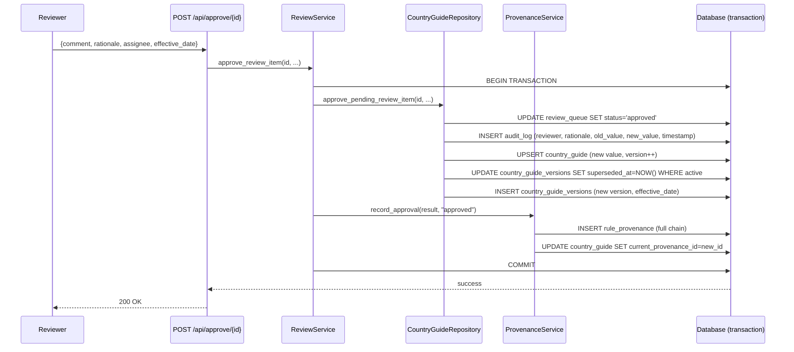

# Review & Governance Workflow

## Governance Protocol

The review workflow is not a UI feature — it is the primary governance control that separates AI-assisted detection from human-authorized publication. Every regulatory change that the extraction pipeline detects enters this workflow as a proposed change. No proposed change becomes a published rule without an explicit, documented human decision.

This section describes the governance protocol: the rules, constraints, and accountability structures that govern how the review workflow operates. It is not a description of buttons and filters.

---

## Why a Mandatory Review Gate Exists

The extraction pipeline uses a large language model to convert unstructured government HTML into structured rule objects. LLMs are probabilistic — they operate well on average but can produce incorrect outputs on specific inputs. Common failure modes include:

- **Numeric misreading**: Extracting "INR 21,000" when the source says "INR 21,000 per month for skilled workers" and the correct minimum wage for unskilled workers is different
- **Scope ambiguity**: Extracting a rule that applies to a subset of workers as if it applies universally
- **Stale content**: Government websites sometimes show cached versions; the extracted rule reflects the cached state, not the current law
- **Formatting hallucination**: Producing a well-formatted, plausible rule value that is not supported by the source paragraph

The review gate exists because the cost of publishing an incorrect rule — and the subsequent compliance exposure — exceeds the cost of human review. This is not a shortcoming of the AI; it is the correct governance architecture for this risk profile.

---

## Review Item Anatomy

Every item in the review queue carries the following information, all of which the reviewer is expected to consult before making a decision:

| Field | Purpose | Governance Role |
|-------|---------|----------------|
| `old_value` | The currently published rule | Establishes what the reviewer is changing from |
| `new_value` | What the extraction pipeline proposes | The subject of the review decision |
| `change_type` | Semantic classification (e.g., `NUMERIC_THRESHOLD_CHANGE`) | Guides reviewer attention to the nature of the change |
| `materiality_level` | CRITICAL / HIGH / MODERATE / LOW / INFORMATIONAL | Determines urgency and bulk-approve eligibility |
| `source_paragraph` | The exact text from the official source that produced the extraction | The primary evidence the reviewer evaluates |
| `source_url` | The government page that was crawled | Enables reviewer to verify against the live source |
| `confidence` | LLM extraction confidence (0.0–1.0) | Signal of extraction reliability; low confidence requires closer scrutiny |
| `severity` | Critical / major / minor (extraction-level severity) | Secondary signal; also gates bulk approve eligibility |

A reviewer who approves without reading the source paragraph has not performed a review — they have rubber-stamped AI output. The governance protocol requires engagement with the evidence.

---

## Decision Protocol

### Approve

**When to use:** The reviewer has examined the source paragraph, verified the proposed value reflects the official source, and is prepared to be accountable for publishing this rule.

**What happens on approval:**
1. `review_queue.status` → `approved`
2. `audit_log` — INSERT with reviewer identity, rationale, comment, old value, new value, timestamp
3. `country_guide` — UPSERT with the new rule value and version increment
4. `country_guide_versions` — INSERT of the new version with effective date
5. `country_guide_versions` — SET `superseded_at = NOW()` on the previous active version
6. `rule_provenance` — INSERT of the full provenance chain
7. `country_guide.current_provenance_id` — UPDATE to the new provenance record

Steps 2 through 7 execute within a single database transaction. If any step fails, the entire transaction rolls back and the review item remains in `pending` status.

**Approval payload requirements:**

```json
{
    "comment": "Verified against official gazette dated 2025-03-01",
    "assignee": "divya@compliance.team",
    "rationale": "Rate update confirmed in Budget 2025 announcement",
    "effective_date": "2025-04-01"
}
```

The `effective_date` field is the date the rule becomes effective in the jurisdiction — which may differ from the approval date. Setting it accurately is critical for temporal queries and contract dispute resolution. It defaults to the approval timestamp if not provided, but reviewers should always set it explicitly.

---

### Reject

**When to use:** The proposed change does not accurately reflect the official source, the extraction is incorrect, or the reviewer has verified the rule has not changed.

**What happens on rejection:**
1. `review_queue.status` → `rejected`
2. `audit_log` — INSERT with reviewer identity, rationale, and the rejection reason
3. No modifications to `country_guide`, `country_guide_versions`, or `rule_provenance`

A rejection is not a permanent suppression. If the same source is re-crawled on the next sync and the extraction produces the same proposed change with higher confidence, a new review item will be created.

**Rejection payload requirements:**
```json
{
    "comment": "Source paragraph does not support this value; appears to be from a superseded regulation",
    "assignee": "divya@compliance.team",
    "rationale": "Extraction error — source text refers to historical rate, not current"
}
```

Rejection rationale is mandatory. "Rejected" without reasoning is not a governance record — it is noise.

---

### Escalate

**When to use:** The reviewer requires input from a senior compliance lead, legal counsel, or subject matter expert before making a decision. Common escalation reasons include jurisdictional ambiguity, contested interpretation, or a change that could have material client impact.

**What happens on escalation:**
1. `review_queue.status` → `escalated`
2. The item surfaces at the top of the review queue (ahead of pending items)
3. The drift detection engine treats unresolved escalated items as a CRITICAL drift signal after 7 days

Escalation is not a deferral without consequence. The drift detection layer enforces resolution SLAs on escalated items.

---

### Bulk Approve

**What it is:** A country-scoped operation that approves all `non-critical` pending items for a single country in one action.

**Eligibility criteria enforced at the repository level (not API layer):**
- `status IN ('pending')` — escalated items are excluded from bulk approve
- `severity != 'critical'` — critical-severity items require individual review
- Scoped to a single country — cross-country bulk operations do not exist

**Each item receives individual treatment:**
- Each approved item generates its own audit log entry
- Each approved item generates its own provenance record
- There is no "bulk approval" record — the operation produces N individual approval records for N items

**Compliance justification for bulk approve:** Non-critical changes (formatting corrections, minor threshold adjustments below the materiality threshold, informational classification updates) can represent significant operational volume with low individual risk. Bulk approve is an efficiency control for low-risk items, not a mechanism for bypassing governance.

---

## Review Queue Priority Ordering

The review queue presents items in deliberate order:

1. **Status**: Escalated items before pending — escalations represent unresolved decisions
2. **Severity**: Critical → major → minor — highest risk surfaces first
3. **Confidence**: Highest confidence first — reviewers should act on reliable extractions before uncertain ones

This ordering is not arbitrary. It ensures that the most actionable, highest-risk, most reliable items receive attention first in each review session.

---

## Reviewer Accountability Model

Every action in the review workflow records the reviewer's identity in `audit_log.reviewer_assignee` and `rule_provenance.reviewer_assignee`. This creates a permanent record of who was accountable for every published rule.

**What the system records:**
- Identity of the reviewer at time of decision
- Rationale they provided
- Comment they attached
- Timestamp of the decision
- The before/after values they evaluated

**What the system does not enforce (and why):**
- The system does not authenticate that `reviewer_assignee` corresponds to a real, authorized person. This is a deliberate boundary — authentication is the responsibility of the SSO/identity layer that wraps this system in production deployment. The compliance governance workflow does not duplicate identity management.
- The system does not enforce that a reviewer cannot approve their own escalated item. This is also a policy enforcement concern, not a workflow concern. Organizations that require separation of duties should configure that at the access control layer.

**Accountability gap for seeded rules:** Rules imported via the initial Notion baseline (`notion_import.py`) carry `reviewer_action = 'seeded'`. These rules have no individual reviewer — they were imported as the starting state. Auditors examining seeded rules should understand they predate the governance pipeline. Over time, as seeded rules are superseded by pipeline-detected changes, they will be replaced with fully-provenanced versions.

---

## Staged Publishing Safety

Publishing a rule is not instantaneous and irreversible. The system provides several safety properties around publication:

**Transaction atomicity:** Approval, audit logging, guide update, version creation, and provenance recording all occur in a single transaction. A partial failure produces a visible error and leaves the review item in its pre-approval state. There is no state where a rule is published but has no audit record.

**Effective date as a staging control:** Reviewers can set `effective_date` to a future date. The rule is published to the system's `country_guide` table immediately, but temporal queries for dates before `effective_date` will return the previous version. This enables "publish now, effective later" workflows for regulatory changes with known future effective dates.

**Correction protocol:** If a reviewer approves an incorrect change, the correction procedure is:
1. A subsequent sync will re-extract the source and, if the current published value is now incorrect relative to the source, create a new review item.
2. The reviewer approves the corrected value with a comment referencing the error.
3. Both the erroneous approval and the correction are permanently visible in the audit log and version history.

There is no deletion or amendment of the erroneous approval. The error and the correction are both part of the record. This is correct governance — the audit log reflects what actually happened.

---

## Governance Controls Summary

| Control | Enforcement Point | Cannot Be Bypassed By |
|---------|------------------|----------------------|
| No auto-publish | `country_guide` only updated via `approve_pending_review_item()` | API callers, background jobs, migrations |
| Critical changes require individual review | `bulk_approve_non_critical()` SQL filter at repository level | API layer, service layer |
| Every approval creates an audit record | Same transaction as the approval | Application logic, API layer |
| Audit records cannot be modified | No UPDATE/DELETE in `audit_log` repository | Any application code path |
| Rejection requires rationale | Payload validation on reject endpoint | API callers without rationale |
| Escalated items have SLA monitoring | Drift detection triggers CRITICAL after 7 days | No operational mechanism suppresses this |

---

## Workflow State Machine

```mermaid
stateDiagram-v2
    [*] --> Pending: Pipeline detects semantic change
    Pending --> Approved: Reviewer approves with rationale
    Pending --> Rejected: Reviewer rejects with rationale
    Pending --> Escalated: Reviewer escalates to senior lead
    Escalated --> Approved: Senior reviewer approves
    Escalated --> Rejected: Senior reviewer rejects
    Approved --> [*]: Published to active guide + version history + provenance
    Rejected --> [*]: Dismissed — no publication; audit record only
    note right of Escalated: DriftDetector fires CRITICAL\nif unresolved for >7 days
```



---

## Sequence: Full Approval Transaction



---

## API Surface

| Endpoint | Method | Governance Role |
|----------|--------|-----------------|
| `GET /api/queue` | GET | Retrieve pending items ordered by priority |
| `POST /api/approve/<id>` | POST | Publish a proposed change with full audit trail |
| `POST /api/reject/<id>` | POST | Dismiss a proposed change with rejection record |
| `POST /api/escalate/<id>` | POST | Route to senior reviewer; triggers drift SLA |
| `POST /api/assign/<id>` | POST | Assign accountability to a named reviewer |
| `POST /api/bulk-approve` | POST | Approve all non-critical pending items (country-scoped) |
| `GET /api/audit` | GET | Immutable audit log, filterable by country and date |

---

## Failure Handling

| Failure Scenario | System Behavior | Governance Implication |
|-----------------|-----------------|----------------------|
| Database error mid-transaction | Full rollback; review item remains pending | No partial state; approval must be retried |
| Provenance insertion fails | Transaction rollback; approval does not complete | Rule is not published; no orphaned audit record |
| Reviewer approves incorrect rule | No automatic correction; next sync may detect the error | Error is permanently visible in audit log; correction creates a new version |
| Bulk approve runs during concurrent single approval | PostgreSQL row-level locking prevents race; SQLite serializes | No double-approval possible |
| Escalated item sits unresolved beyond 7 days | DriftDetector fires CRITICAL for that country | Visible on dashboard and in Slack alerts; compliance lead is accountable |

---

## Auditability: Questions the Audit Log Answers

| Question | Answer Source |
|---------|---------------|
| Who published this rule? | `audit_log.reviewer_assignee` |
| When was it published? | `audit_log.timestamp` |
| What was the stated rationale? | `audit_log.reviewer_rationale` |
| What was the previous value? | `audit_log.old_value` |
| What evidence supported the change? | `rule_provenance.source_fragment` |
| Which government page was the source? | `rule_provenance.source_url` |
| How confident was the AI extraction? | `rule_provenance.extraction_confidence` |
| Which model version extracted the rule? | `rule_provenance.parser_version` |
| When was the source page crawled? | `source_snapshots.captured_at` |
| What was the raw content hash of the source? | `source_snapshots.content_hash` |
