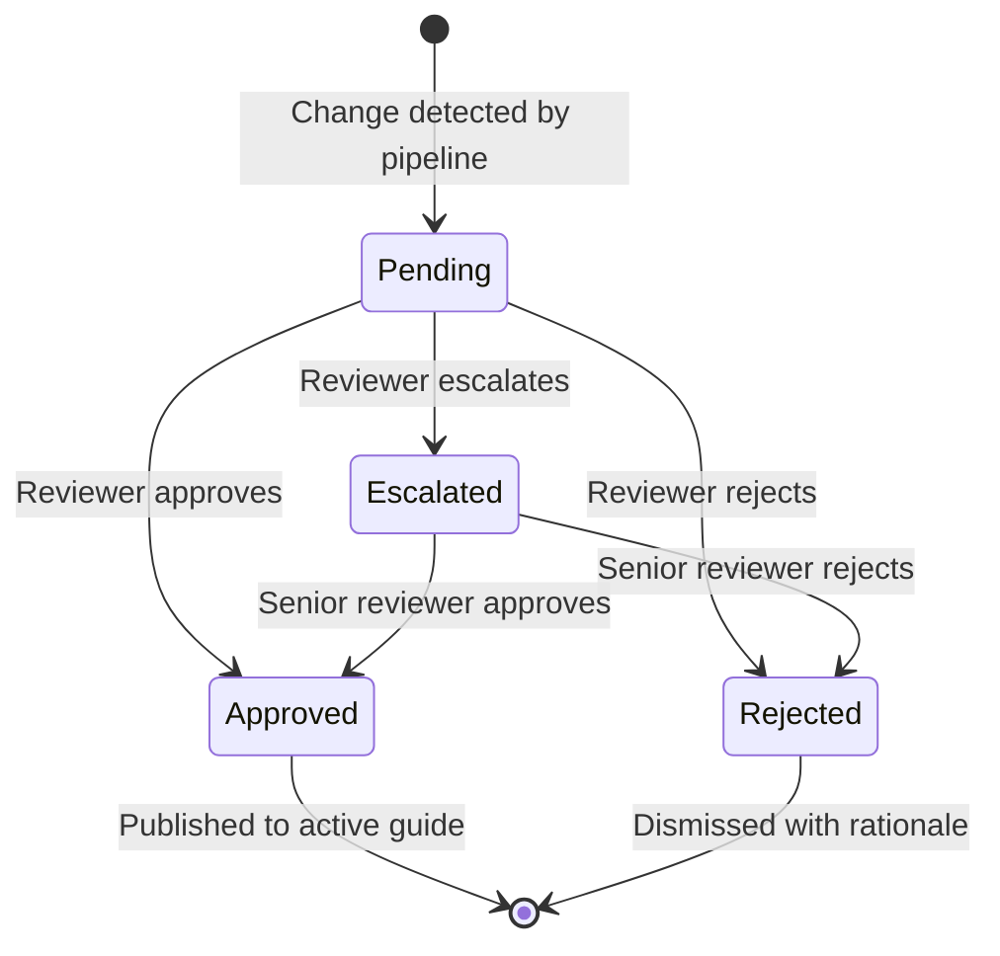
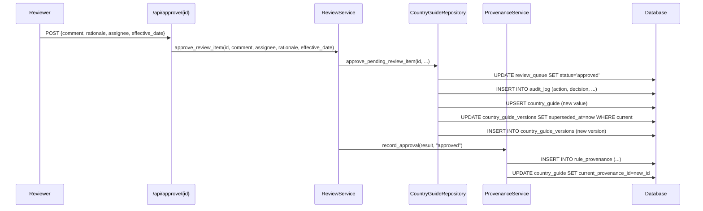

# Review & Approval Workflow

## 1. Feature Name

**Human-in-the-Loop Compliance Change Governance**

## 2. Business Problem Solved

AI-detected regulatory changes cannot be trusted without human validation. An LLM might misinterpret a government source, extract a hallucinated rule, or misclassify the materiality of a change. The review workflow provides a structured governance layer where compliance analysts examine every proposed change with full source evidence before publication.

## 3. Operational Pain Points Addressed

- **Unvalidated AI output**: Without a review gate, LLM extraction errors propagate directly to client-facing guides
- **No decision accountability**: In manual workflows, changes are made via email or chat with no record of who approved what
- **Inconsistent review depth**: Some changes get scrutinized, others are rubber-stamped; materiality classification guides reviewer attention
- **Bottleneck on individual reviewers**: Bulk approve and assignment features distribute the workload
- **No escalation path**: Critical disagreements have no formal escalation mechanism

## 4. User Personas Involved

| Persona | Actions |
|---------|---------|
| Compliance Analyst | Review queue triage, approve/reject individual changes, examine diffs |
| Compliance Lead | Monitor pending counts, review escalated items, bulk approve low-risk changes |
| Regional Owner | Receives Slack alerts, reviews country-specific changes for their region |
| External Auditor | Reads audit log to verify governance controls were followed |

## 5. Functional Overview

The review workflow supports 5 core actions:

| Action | Description | Audit Impact |
|--------|-------------|--------------|
| **Approve** | Publish the change to the active guide + version history | Provenance record + audit log entry |
| **Reject** | Dismiss the change with documented rationale | Audit log entry (no publication) |
| **Escalate** | Flag for senior compliance review | Status change to "escalated"; surfaces first in queue |
| **Assign** | Route to a specific reviewer | Assignee recorded; accountability established |
| **Bulk Approve** | Approve all non-critical pending items for a country | One audit log entry per item; provenance for each |

## 6. End-to-End Workflow



### Approval Flow Detail



## 7. Technical Architecture

### Review Queue Ordering

Pending items are returned in a deliberate priority order:

1. **Status**: Escalated items first, then pending
2. **Severity**: Critical → major → minor
3. **Confidence**: Highest confidence first (most reliable extractions surface first)

This ensures reviewers address the most urgent, most reliable changes first.

### Bulk Approve Guard Rails

`bulk_approve_non_critical()` applies strict filters:

- Only items with `status IN ('pending', 'escalated')` are eligible
- Only items where `severity != 'critical'` are included
- Each item gets its own audit log entry (not a single batch entry)
- Each item gets its own provenance record
- The operation is scoped to a single country to prevent accidental cross-country bulk actions

### Review Payload

Every review action accepts a structured payload:

```json
{
    "comment": "Verified against official gazette dated 2025-03-01",
    "assignee": "divya@compliance.team",
    "rationale": "Rate update confirmed in Budget 2025 announcement",
    "effective_date": "2025-04-01"
}
```

## 8. Data Flow

```
Review queue item (pending)
    ↓ Reviewer examines: old_value ↔ new_value diff
    ↓ Reviewer reads: source_paragraph evidence
    ↓ Reviewer checks: confidence score, materiality level, change type
    ↓
Decision: Approve / Reject / Escalate
    ↓
On Approve:
    → review_queue.status = 'approved'
    → audit_log INSERT (decision, comment, rationale, timestamp)
    → country_guide UPSERT (new value, new version_number)
    → country_guide_versions INSERT (new version, effective_date)
    → country_guide_versions UPDATE (previous version superseded_at = now)
    → rule_provenance INSERT (full chain: source → extraction → review)
    → country_guide.current_provenance_id = new provenance id

On Reject:
    → review_queue.status = 'rejected'
    → audit_log INSERT (decision='rejected', comment, rationale)
    → No changes to country_guide or versions
```

## 9. Backend Components

| Component | File | Key Methods |
|-----------|------|-------------|
| `ReviewService` | `app/review/review_service.py` (120 lines) | `approve_review_item()`, `reject_review_item()`, `escalate_review_item()`, `assign_review_item()`, `bulk_approve_non_critical()` |
| `CountryGuideRepository` | `app/repositories/country_guide_repository.py` (691 lines) | `approve_pending_review_item()`, `reject_pending_review_item()`, `list_pending_review_items()` |
| `ProvenanceService` | `app/services/provenance_service.py` (91 lines) | `record_approval()`, `record_bulk_approval()` |

## 10. Frontend/UI Components


The review queue in the ops dashboard provides:

- **Before/after toggle**: Side-by-side or inline diff view
- **Severity badges**: Color-coded (red=critical, orange=major, blue=minor)
- **Materiality chips**: CRITICAL / HIGH / MODERATE / LOW / INFORMATIONAL
- **Source paragraph**: Scrollable excerpt from the government source
- **Confidence indicator**: Visual confidence bar (0–100%)
- **Action buttons**: Approve, Reject, Escalate per item
- **Bulk approve**: Country-scoped button for non-critical items
- **Filters**: By country, severity, status, materiality level

## 11. APIs Involved

| Endpoint | Method | Purpose |
|----------|--------|---------|
| `GET /api/queue` | GET | List pending review items (ordered by priority) |
| `POST /api/approve/<id>` | POST | Approve a single review item |
| `POST /api/reject/<id>` | POST | Reject a single review item |
| `POST /api/escalate/<id>` | POST | Escalate to senior reviewer |
| `POST /api/assign/<id>` | POST | Assign to a specific reviewer |
| `POST /api/bulk-approve` | POST | Approve all non-critical items for a country |
| `GET /api/audit` | GET | Audit log (filterable by country, since date) |

## 12. Auditability & Traceability

The review workflow generates three types of audit artifacts:

1. **Audit log entry**: Immutable record of the decision, reviewer identity, timestamp, rationale, and before/after values
2. **Provenance record**: Links the published rule to the review decision, extraction, snapshot, and crawl event
3. **Version history entry**: The old rule is superseded and the new version is created with explicit effective_date

An auditor can answer:
- "Who approved this rule?" → `audit_log.reviewer_assignee`
- "When was it approved?" → `audit_log.timestamp`
- "What was the rationale?" → `audit_log.reviewer_rationale`
- "What was the source evidence?" → `rule_provenance.source_fragment`
- "What was the extraction confidence?" → `rule_provenance.extraction_confidence`
- "What was the previous value?" → `audit_log.old_value` or `country_guide_versions` with `superseded_at`

## 13. Human-in-the-Loop Governance Controls

| Control | Implementation |
|---------|---------------|
| No auto-publish | Every change requires explicit human action |
| Critical changes cannot be bulk-approved | `bulk_approve_non_critical` filters by severity |
| Escalation path | Escalated items surface first in the queue with distinct status |
| Reviewer identity tracking | Every action records the assignee |
| Decision rationale required | Comment and rationale fields on every action |
| Effective date control | Reviewers can set when a change becomes effective, not just approve the value |

## 14. Security Considerations

- Review actions are POST endpoints; no state changes occur on GET
- Reviewer identity is recorded but not authenticated at this layer (enterprise SSO integration is a future enhancement)
- Audit log is append-only; no API endpoint exists for modifying or deleting audit entries
- Bulk approve is scoped to a single country to limit blast radius

## 15. Failure Scenarios & Recovery

| Failure | Recovery |
|---------|----------|
| Approval fails mid-transaction (DB error) | SQLite transaction rollback; review item remains pending |
| Provenance recording fails after approval | Approval succeeds but provenance chain is incomplete; logged as warning |
| Reviewer approves wrong item | Rejection of the previous version; re-sync to detect the correct change |
| Bulk approve includes an unwanted item | Individual rejection post-bulk-approve; audit log preserves the original bulk action |

## 16. Business Impact

- **Governance compliance**: Every regulatory change is reviewed, documented, and traceable — satisfying audit requirements
- **Risk reduction**: Critical changes cannot be published without explicit human approval
- **Operational efficiency**: Bulk approve for non-critical changes reduces reviewer workload by 60–80%
- **Accountability**: Named reviewers with documented rationale for every decision

## 17. Future Enhancements

- **Role-based access control**: Only senior compliance can approve CRITICAL changes
- **Approval workflows**: Multi-step approval (analyst → lead → legal) for high-materiality changes
- **SLA tracking**: Alert when pending items exceed configurable review SLAs
- **Review analytics**: Track approval rates, rejection reasons, and reviewer throughput
- **Comment threading**: Allow discussion on review items before decision
