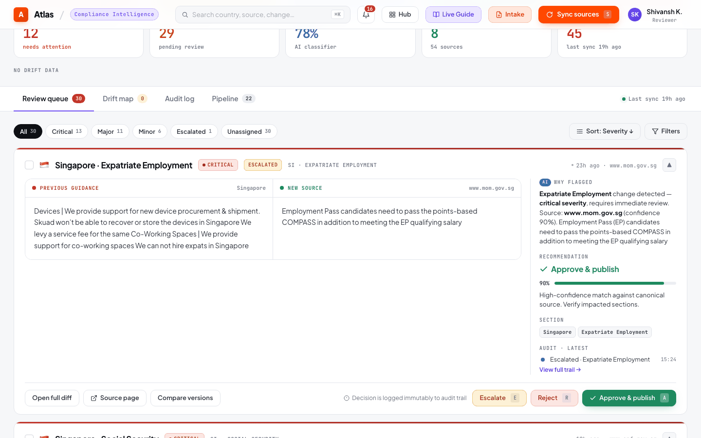
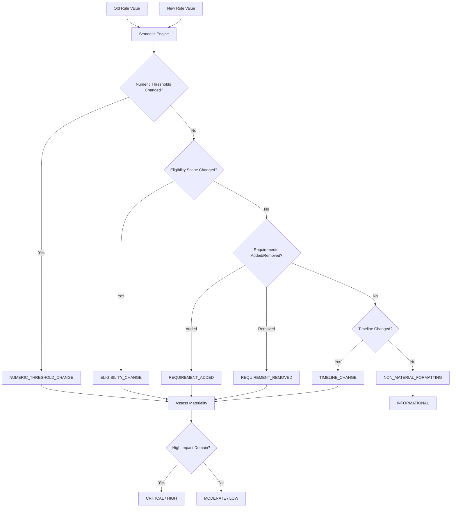
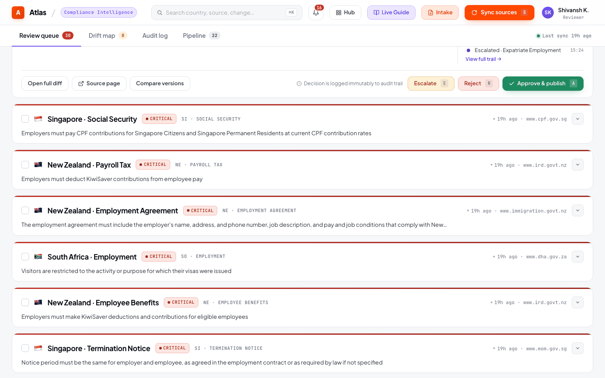

# Semantic Reconciliation Engine

## 1. Feature Name

**Deterministic Semantic Change Classification & Materiality Assessment**

## 2. Business Problem Solved

When a government source changes, the raw text diff is often unhelpful. A formatting change ("15 days" → "fifteen days") is noise; a threshold change ("15 days" → "20 days") is a compliance-critical event. The semantic reconciliation engine distinguishes between these automatically, assigning a change type and materiality level that determines reviewer priority.

## 3. Operational Pain Points Addressed

- **Alert fatigue**: Without materiality classification, every detected change looks equally important, overwhelming reviewers
- **Missed critical changes**: Numeric threshold changes (minimum wage, tax rates) can be buried in formatting noise
- **Inconsistent triage**: Different analysts classify the same change differently; the engine provides deterministic, reproducible classification
- **Audit defensibility**: Regulators may ask "how did you determine this change was material?" — the engine provides documented reasoning

## 4. User Personas Involved

| Persona | Interaction |
|---------|-------------|
| Compliance Analyst | Sees materiality badges (Critical/Moderate/Low) on review queue items |
| Compliance Lead | Filters review queue by materiality to prioritize critical changes |
| External Auditor | Examines classification reasoning attached to each change |
| Platform Engineer | Tunes regex patterns and materiality thresholds |

## 5. Functional Overview

{ loading=lazy }


The engine compares an old rule value against a new rule value and produces a `SemanticReconciliationResult` with:

- **`semantic_change_detected`**: Boolean — is this a meaningful change?
- **`materiality_level`**: CRITICAL / HIGH / MODERATE / LOW / INFORMATIONAL
- **`change_type`**: NUMERIC_THRESHOLD_CHANGE / ELIGIBILITY_CHANGE / REQUIREMENT_ADDED / REQUIREMENT_REMOVED / TIMELINE_CHANGE / NON_MATERIAL_FORMATTING
- **`human_readable_summary`**: Plain-English description of what changed
- **`reasoning`**: Step-by-step explanation of how the classification was derived

## 6. End-to-End Workflow



## 7. Technical Architecture

### Regex Pattern Library

The engine uses 5 compiled regex patterns to detect specific categories of semantic change:

**`NUMERIC_PATTERN`** — Extracts numeric values with units and comparators:

```
Matches: "15 days", "≥ 3 months", "INR 21,000/month", "2.5%"
Captures: (value, unit, comparator)
```

**`REQUIREMENT_PATTERN`** — Detects mandatory language:

```
Keywords: "must", "shall", "required", "mandatory", "obligated", "compulsory"
```

**`ELIGIBILITY_PATTERN`** — Detects scope changes:

```
Keywords: "eligible", "applies to", "citizens", "residents", "employees",
          "workers", "contractors", "covered under"
```

**`HIGH_IMPACT_PATTERN`** — Flags regulated domains:

```
Keywords: "minimum wage", "tax", "pension", "termination", "severance",
          "social security", "health insurance", "work permit"
```

**`TIMELINE_CONTEXT_PATTERN`** — Detects deadline/notice changes:

```
Keywords: "deadline", "notice", "effective", "within", "before", "after",
          "grace period", "expiry"
```

### Classification Cascade

The engine applies patterns in priority order (highest materiality first):

1. **Numeric threshold extraction** — Extract all numbers from old and new text; compare sets
2. **Eligibility scope analysis** — Detect additions/removals of scope keywords
3. **Requirement language detection** — Check for new mandatory language or removal of existing requirements
4. **Timeline comparison** — Compare deadline/notice period values
5. **Fallback** — If none of the above trigger, classify as `NON_MATERIAL_FORMATTING`

### Materiality Assessment

After determining the change type, materiality is assigned based on domain impact:

| Change Type | High-Impact Domain | Materiality |
|------------|-------------------|-------------|
| NUMERIC_THRESHOLD_CHANGE | minimum wage, tax rate | CRITICAL |
| NUMERIC_THRESHOLD_CHANGE | leave days, notice period | HIGH |
| ELIGIBILITY_CHANGE | any | HIGH |
| REQUIREMENT_ADDED | any | MODERATE |
| REQUIREMENT_REMOVED | any | CRITICAL |
| TIMELINE_CHANGE | any | MODERATE |
| NON_MATERIAL_FORMATTING | any | INFORMATIONAL |

## 8. Data Flow

```
ReconciliationService receives (old_value, new_value) pair
    ↓
SemanticReconciliationEngine.reconcile(old_rule, new_rule)
    ↓
Pattern matching cascade (numeric → eligibility → requirement → timeline → formatting)
    ↓
SemanticReconciliationResult {
    semantic_change_detected: true,
    materiality_level: "CRITICAL",
    change_type: "NUMERIC_THRESHOLD_CHANGE",
    human_readable_summary: "Minimum wage increased from INR 21,000 to INR 23,500",
    reasoning: "Numeric value 21000 changed to 23500 in high-impact domain 'minimum wage'"
}
    ↓
Stored in review_queue.materiality_level and review_queue.change_type
```

## 9. Backend Components

| Component | File | Responsibility |
|-----------|------|----------------|
| `SemanticReconciliationEngine` | `app/reconciliation/semantic_reconciliation_service.py` (391 lines) | Pattern matching, classification, materiality scoring |
| `ReconciliationService` | `app/reconciliation/reconciliation_service.py` (166 lines) | Orchestrates comparison, deduplication, review enqueueing |
| `MaterialityLevel` | `app/reconciliation/schemas.py` | Enum: CRITICAL, HIGH, MODERATE, LOW, INFORMATIONAL |
| `ChangeType` | `app/reconciliation/schemas.py` | Enum: 6 change types |
| `SemanticReconciliationResult` | `app/reconciliation/schemas.py` | Pydantic model for engine output |

{ loading=lazy }

## 10. Database Design Implications

Two columns on `review_queue` carry the semantic classification:

- `materiality_level TEXT` — "CRITICAL", "HIGH", "MODERATE", "LOW", "INFORMATIONAL"
- `change_type TEXT` — "NUMERIC_THRESHOLD_CHANGE", "ELIGIBILITY_CHANGE", etc.

These columns drive:
- **Queue ordering**: Critical items surface first
- **Bulk approve eligibility**: Only non-critical items can be bulk-approved
- **Dashboard filtering**: Reviewers can filter by materiality level
- **Drift detection**: Drift rules reference materiality when assessing pending item urgency

## 11. AI/LLM Usage

**The semantic reconciliation engine deliberately does not use an LLM.** This is a key architectural decision:

- **Determinism**: The same (old, new) pair always produces the same classification. LLMs may classify differently on consecutive runs.
- **Speed**: Regex matching is sub-millisecond; LLM classification adds seconds per comparison.
- **Auditability**: The reasoning field documents exactly which pattern matched and why. An LLM's reasoning is opaque.
- **Cost**: Zero API calls for reconciliation, regardless of change volume.

The LLM is used upstream (extraction only) where its generalization across diverse HTML formats is essential. Reconciliation operates on structured rule text where regex patterns are sufficient.

## 12. Human-in-the-Loop Governance Controls

- Materiality classification **guides** reviewers but does not auto-approve. Even INFORMATIONAL changes require explicit human action.
- Bulk approve is restricted to non-critical items. Critical and high-materiality changes must be individually reviewed.
- The `reasoning` field is stored with the review item so reviewers can evaluate the engine's classification before acting.

## 13. Auditability & Traceability

Every review queue item records:
- The exact old and new text that were compared
- The engine's classification (change_type + materiality_level)
- The source URL and paragraph that triggered the change
- The extraction confidence from the upstream LLM

This means an auditor can reconstruct: "The engine detected a NUMERIC_THRESHOLD_CHANGE of CRITICAL materiality because the minimum wage value changed from 21,000 to 23,500 in the source paragraph from [ministry URL]."

## 14. Risk Mitigation

| Risk | Mitigation |
|------|-----------|
| Regex misclassifies a critical change as informational | Human reviewer sees the before/after diff regardless of classification |
| Pattern doesn't cover a new type of change | Falls through to NON_MATERIAL_FORMATTING; still surfaces in review queue |
| Numeric extraction misreads a non-numeric context | Confidence score from extraction provides secondary signal |
| Eligibility pattern false-positives on general text | Pattern keywords are scoped to employment/regulatory language |

## 15. Future Enhancements

- **LLM-assisted fallback**: Use the LLM as a secondary classifier when the regex engine produces NON_MATERIAL_FORMATTING but the text diff is large
- **Jurisdiction-specific patterns**: Country-specific regex for local terminology (e.g., "EPF" for India, "CPF" for Singapore)
- **Confidence scoring on classification**: Not just extraction confidence, but classification confidence based on pattern match strength
- **Change type expansion**: Add PENALTY_CHANGE, EXEMPTION_CHANGE, DEFINITION_CHANGE as distinct types
