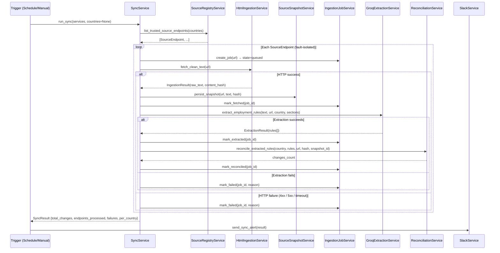

# Sync Pipeline

## Operational Role

The sync pipeline is the scheduled execution unit that coordinates all pipeline stages for all configured source endpoints. It is not a feature that users trigger casually — it is the core operational process whose reliability determines whether the system maintains current regulatory coverage.

Every sync run produces a complete execution record: which sources were processed, which succeeded, which failed, and why. This record is the primary operational input for the compliance team and the platform engineering team.

---

## Execution Model

The pipeline is sequential per source endpoint, fault-isolated across endpoints:

- **Sequential:** Each source endpoint is processed in order — fetch, extract, reconcile, record. There is no parallelism within the sync run.
- **Fault-isolated:** A failure on one source endpoint (website down, Groq API limit, invalid content) does not halt processing of subsequent endpoints. The failed job is recorded with its failure reason; other endpoints continue.
- **Idempotent design:** The same source URL can be processed repeatedly without corrupting data. If a source produces the same content hash as the previous crawl, the extraction and reconciliation steps produce no new review items. Duplicate review items for the same (country, section, new_value) triple are suppressed.

---

## Source Registry

The set of official government source URLs is maintained in a GitHub-hosted JSON file with a three-tier hierarchy:

```
countries → authorities → source_endpoints
```

Each `SourceEndpoint` is a frozen dataclass:

```python
@dataclass(frozen=True)
class SourceEndpoint:
    country: str
    authority: str
    url: str
    sections: tuple[str, ...]  # Which regulatory sections this source covers
```

**Active filtering:** Only endpoints where `status: "active"` under authorities with `is_active: true` are included in a sync run. Disabling a source requires no code change — it requires only updating the JSON file in the source registry repository.

**Governance implication of external registry:** Source URL changes are tracked in git. Adding a new source, modifying an existing URL, or disabling a source all produce a commit with author, timestamp, and message. This is the compliance record of source management decisions.

---

## Pipeline State Machine

Each source endpoint processed by the sync pipeline creates an `ingestion_job` record that transitions through a defined state machine. The state machine is the operational record of what happened to each source on each sync run.

```
queued → fetched → normalized → extracted → reconciled
                                               ↑
                     failed ← (from any state above)
```

Each transition sets the corresponding timestamp column (`queued_at`, `fetched_at`, `normalized_at`, `extracted_at`, `reconciled_at`, `failed_at`). The `failure_reason` column records the error detail when a job fails.

**Latency profiling from timestamps:** The difference between any two timestamps reveals stage latency for a specific source. If `extracted_at - normalized_at` is unusually long for a given source, it indicates an extraction bottleneck for that source. This data is available without separate instrumentation.

---

## End-to-End Sequence



---

## Sync Result Contract

Every sync run returns a `SyncResult` object:

```python
{
    "total_changes": 12,
    "endpoints_processed": 24,
    "failures": 2,
    "per_country": {
        "India": {"changes": 5, "failures": 0},
        "Singapore": {"changes": 3, "failures": 1, "failure_reason": "Groq rate limit exhausted"},
        ...
    }
}
```

This result is:
1. Returned to the trigger (API response for manual syncs, return value for scheduled syncs)
2. Sent to Slack via the regional alerting service
3. Preserved in the `ingestion_jobs` table (each job carries its own result)

The result is not cached or stored as a separate entity. The source of truth for sync history is always the `ingestion_jobs` table.

---

## Failure Handling

### Stage-Level Failures

Each stage of the pipeline has defined failure behavior:

| Stage | Failure Condition | Handling |
|-------|------------------|----------|
| Fetch | 4xx response | Fail immediately; log `failure_reason`; no retry |
| Fetch | 5xx or timeout | Retry once; if second attempt fails, mark job `failed` |
| Fetch | Connection refused | Mark job `failed`; subsequent endpoints unaffected |
| Extraction | Groq 429 (rate limit) | Rotate to next key; retry immediately |
| Extraction | All keys rate-limited | Mark job `failed`; previous published rule unchanged |
| Extraction | JSON parse error | Mark job `failed`; log raw response at WARNING |
| Reconciliation | Database error | Mark job `failed`; source snapshot preserved for manual retry |

### Cross-Endpoint Failure Isolation

A failure on endpoint N does not prevent processing of endpoint N+1. The loop continues to completion, recording a final failure count in the sync result. This means a single unreachable government website does not halt coverage updates for all other monitored countries.

### Recovery from Sync Failures

Failed jobs do not automatically retry within the same sync run. Recovery occurs on the next scheduled sync, which re-attempts all active source endpoints from the beginning. This design is correct because:

- The failure may be transient (government website maintenance window)
- Immediate retry loops can exacerbate rate limit failures
- The next scheduled sync provides a natural retry interval

For urgent cases (e.g., a critical minimum wage update was missed due to source unavailability), a manual sync can be triggered immediately via the ops dashboard, scoped to the affected country.

---

## Scheduled vs. Manual Trigger

| Trigger Type | Use Case | Configuration |
|-------------|---------|---------------|
| Scheduled (APScheduler) | Routine regulatory monitoring | Configured in `SchedulerService`; default daily at 08:00 UTC |
| Manual (POST /api/sync) | Targeted check after alert of regulatory change | Country-scoped to minimize Groq API quota consumption |
| Selective manual (POST /api/sync with country list) | Re-sync after known failure | Payload: `{"countries": ["India", "Singapore"]}` |

**Misfire handling:** APScheduler is configured with `misfire_grace_time=300` seconds. If the scheduler was offline when a sync was due, it will run the sync within 5 minutes of coming back online, not skip it entirely.

---

## Operational Observability

The sync pipeline exposes its state through three channels:

**Ingestion job table:** Every pipeline execution produces one row per source endpoint with full state machine timestamps and failure reasons. Query via `GET /api/ingestion-jobs`.

**Sync result metrics:** The post-sync Slack alert includes total changes, endpoints processed, failure count, and per-country breakdown. This gives regional owners immediate visibility without requiring dashboard access.

**Pipeline health API:** `GET /api/metrics` aggregates the current pipeline state — pending reviews, critical changes, failure counts — updated on each API call from current database state.

---

## Content Hash Deduplication

After a successful fetch, the content hash of the raw text is compared against the most recent snapshot for the same source URL. If the hashes match, the content has not changed since the last crawl. In this case:

- The new snapshot is still stored (for audit completeness)
- Extraction and reconciliation are skipped
- The ingestion job advances to `reconciled` without creating a review item

This suppresses unnecessary LLM calls and review items for unchanged sources. It does not suppress processing for sources that have changed in any way — including minor formatting changes that would produce a different hash.

**Important limitation:** Hash comparison is against the raw cleaned text, not the published rule values. A source could change its HTML formatting without changing its content in a way that affects extracted rule values. In this case, the hash differs, extraction runs, but reconciliation finds no semantic change and produces no review item. This is the correct behavior.

---

## Backend Components

| Component | File | Key Method |
|-----------|------|------------|
| `SyncService` | `app/services/sync_service.py` | `run_sync(services, countries=None)` |
| `HtmlIngestionService` | `app/ingestion/html_ingestion_service.py` | `fetch_clean_text(url)` |
| `SourceSnapshotService` | `app/ingestion/source_snapshot_service.py` | `persist_snapshot(url, text, hash)` |
| `IngestionJobService` | `app/ingestion/ingestion_job_service.py` | `create_job()`, `mark_fetched()`, `mark_extracted()`, `mark_reconciled()`, `mark_failed()` |
| `SourceRegistryService` | `app/services/source_registry_service.py` | `list_trusted_source_endpoints()` |
| `SchedulerService` | `app/services/scheduler_service.py` | APScheduler cron configuration |
