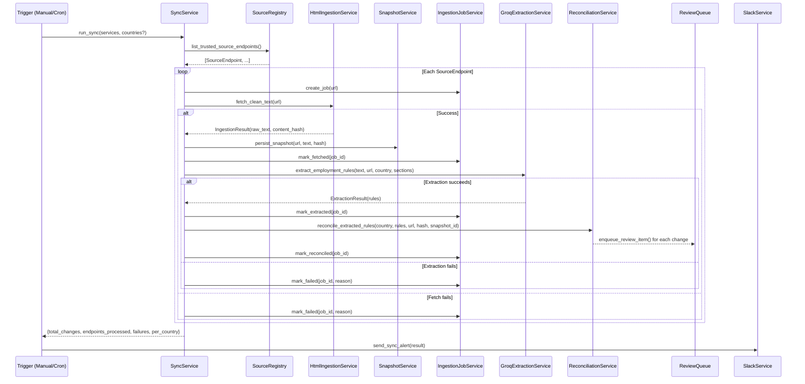

# Sync Pipeline

## 1. Feature Name

**Automated Regulatory Source Synchronization Pipeline**

## 2. Business Problem Solved

Compliance teams cannot manually track regulatory changes across dozens of government websites for 8+ countries. Changes to employment law — minimum wage adjustments, leave entitlement modifications, new tax brackets — are published without notification on ministry websites, official gazettes, and immigration portals. The sync pipeline automates the entire detection lifecycle.

## 3. Operational Pain Points Addressed

- **Missed regulatory updates**: Government websites change without notification; manual checks are sporadic and unreliable
- **Fragmented sources**: Each country has multiple authorities (labor ministry, tax authority, immigration department) publishing independently
- **No change tracking**: Without snapshots, there is no way to determine when a source changed or what changed
- **Inconsistent extraction**: Manual reading of unstructured government HTML produces inconsistent interpretations across analysts

## 4. User Personas Involved

| Persona | Interaction |
|---------|-------------|
| Compliance Lead | Triggers manual sync, monitors pipeline health via metrics cards |
| Platform Engineer | Configures source registry, monitors ingestion job logs, debugs failures |
| Scheduler (automated) | Triggers sync on cron schedule (e.g., daily at 08:00 UTC) |

## 5. Functional Overview


The sync pipeline is a sequential, source-by-source orchestration that:

1. Resolves the list of trusted government source endpoints
2. For each endpoint: fetches HTML, snapshots content, extracts structured rules via LLM, reconciles against the live guide, and enqueues changes for review
3. Tracks every step through an ingestion job state machine
4. Reports results via Slack (region-routed) and API metrics

## 6. End-to-End Workflow



## 7. Technical Architecture

### Source Registry

Sources are defined in an external GitHub-hosted JSON file with a three-level hierarchy:

```
countries → authorities → source_endpoints
```

Each `SourceEndpoint` is a frozen dataclass:

```python
@dataclass(frozen=True)
class SourceEndpoint:
    country: str
    authority: str
    url: str
    sections: tuple[str, ...]
```

Only endpoints with `status: "active"` under authorities with `is_active: true` are returned. This allows individual sources to be disabled without code changes.

### HTML Ingestion

`HtmlIngestionService.fetch_clean_text(url)`:

1. HTTP GET with 30-second timeout and browser-like User-Agent
2. Retry on 5xx/timeout (max 2 attempts); fail fast on 4xx
3. BeautifulSoup parse → strip `<script>`, `<style>`, `<nav>`, `<footer>`, `<header>`, `<aside>`
4. Extract text → filter lines > 30 characters
5. Truncate to 6,000 characters (LLM context budget)
6. Compute MD5 content hash for deduplication

Returns an `IngestionResult` with `status`, `raw_text`, `content_hash`, and failure details if applicable.

### Ingestion Job State Machine

```
queued → fetched → normalized → extracted → reconciled
                                     ↘
                                   failed
```

Each state transition sets the corresponding timestamp column (`queued_at`, `fetched_at`, ..., `failed_at`), creating a built-in latency profile.

### Sync Result

```python
{
    "total_changes": 12,
    "endpoints_processed": 24,
    "failures": 2,
    "per_country": {
        "India": {"changes": 5, "failures": 0},
        "Singapore": {"changes": 3, "failures": 1},
        ...
    }
}
```

## 8. Data Flow

```
External JSON (GitHub) → SourceEndpoint list
    ↓
Government URL → HTTP GET → raw HTML
    ↓
BeautifulSoup → cleaned text (≤6000 chars) + MD5 hash
    ↓
source_snapshots table (immutable archive)
    ↓
ContentChunker → [chunk_1, chunk_2, ...]
    ↓
Groq LLM → raw JSON response per chunk
    ↓
EmploymentRuleParser → validated EmploymentRule objects
    ↓
EmploymentRuleAggregator → deduplicated by section (highest confidence wins)
    ↓
ReconciliationService → compare against country_guide table
    ↓
review_queue table (if change detected)
```

## 9. Backend Components

| Component | File | Lines | Key Method |
|-----------|------|-------|------------|
| `run_sync` | `app/services/sync_service.py` | 129 | `run_sync(services, countries=None)` |
| `HtmlIngestionService` | `app/ingestion/html_ingestion_service.py` | 120 | `fetch_clean_text(url)` |
| `SourceSnapshotService` | `app/ingestion/source_snapshot_service.py` | 45 | `persist_snapshot(url, text, hash)` |
| `IngestionJobService` | `app/ingestion/ingestion_job_service.py` | 55 | `create_job()`, `mark_*()` |
| `SourceRegistryService` | `app/services/source_registry_service.py` | 7 | `list_trusted_source_endpoints()` |

## 10. APIs Involved

| Endpoint | Method | Purpose |
|----------|--------|---------|
| `POST /api/sync` | POST | Trigger manual sync; body: `{"countries": ["India", ...]}` |
| `GET /api/ingestion-jobs` | GET | List recent ingestion jobs with state and timestamps |
| `GET /api/metrics` | GET | Pipeline health KPIs (pending, critical, failures) |

## 11. Risk Mitigation

| Risk | Mitigation |
|------|-----------|
| Government website returns stale cached content | Content hashing detects no-change; review item not created |
| Government website blocks automated requests | Browser-like User-Agent header; configurable retry with backoff |
| LLM extracts hallucinated rules | Confidence scoring + human review gate; low-confidence items are flagged |
| Sync runs during source maintenance window | Failures are logged per-endpoint; other endpoints proceed independently |
| Rate limiting across multiple Groq keys | Keys rotated automatically; failed extractions retry on next sync |

## 12. Observability & Monitoring

- **Ingestion job table**: Every pipeline execution is tracked with per-stage timestamps and failure reasons
- **API metrics endpoint**: Exposes pending reviews, critical changes, average confidence, and failure counts
- **Slack alerts**: Post-sync summary with per-region breakdown, change counts, and failure details
- **Source snapshot archive**: Historical record of every crawled page for debugging extraction quality

## 13. Business Impact

- **Reduction in regulatory blind spots**: Every monitored source is checked on schedule, not when an analyst remembers
- **Faster detection-to-awareness cycle**: Changes detected within hours of publication, not weeks
- **Quantifiable coverage**: Metrics dashboard shows exactly how many sources are monitored, how many changes are pending, and where failures occurred
- **Regional accountability**: Slack alerts route to the responsible compliance owner (APAC: Divya, EMEA: Shweta, Americas: Kathryn)

## 14. Why This Design Is Better Than Manual Workflows

| Manual Workflow | Automated Pipeline |
|----------------|-------------------|
| Analyst visits government website ad-hoc | Every source crawled on schedule |
| Changes noticed by reading; no diff | Semantic diff with before/after comparison |
| No record of when a source was checked | Snapshot with timestamp and content hash |
| Change communicated via email/chat | Structured review queue with materiality scoring |
| No audit trail of detection | Ingestion job log + snapshot + provenance chain |

## 15. Future Enhancements

- **Webhook-based triggers**: Subscribe to government RSS feeds or gazette APIs for real-time change detection
- **Parallel sync execution**: Worker pool with per-country locking for higher throughput
- **Content hash deduplication**: Skip extraction entirely when snapshot hash matches the previous crawl
- **Source health scoring**: Track per-source reliability (uptime, response time, extraction success rate) over time
