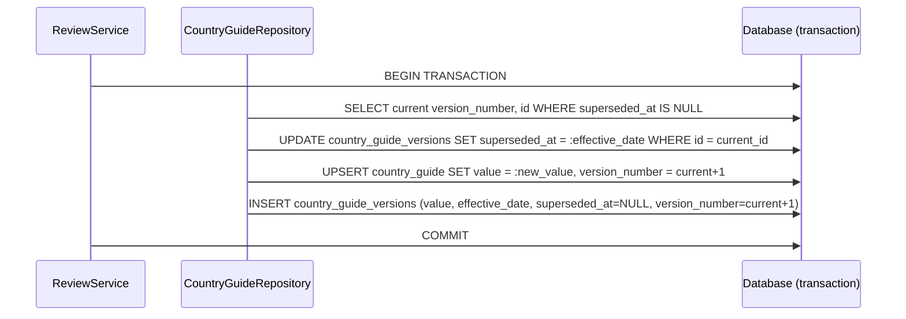

# Temporal Versioning & Historical Rule State

## Legal and Operational Purpose

Employment law compliance is not only about knowing what the current rules are — it is about knowing what the rules were. Employment disputes, contract interpretations, payroll reconciliations, and external audits all reference the regulatory state that was in effect at a specific historical date, not the current state.

The temporal versioning system maintains an immutable, complete version history of every employment rule and provides deterministic point-in-time queries. Given any (country, section, date) triple, the system returns the exact rule value that was effective on that date, backed by an immutable database record.

This is not a "nice-to-have" reporting feature. It is the evidentiary foundation for legal defensibility in employment disputes and audit challenges.

---

## The Valid-Time Data Model

The version table uses the valid-time temporal pattern. Each version row has an open-closed interval `[effective_date, superseded_at)` representing the period during which it was the authoritative rule:

```
Version 1:  effective_date = 2024-01-01,  superseded_at = 2024-07-01
Version 2:  effective_date = 2024-07-01,  superseded_at = 2025-04-01
Version 3:  effective_date = 2025-04-01,  superseded_at = NULL  (currently active)
```

`superseded_at = NULL` identifies the currently active version. There is always exactly one active version per (country, section) pair — the `UNIQUE(country, section, version_number)` constraint enforces this.

**Version interval integrity:** When version N+1 is created with `effective_date = D`, version N's `superseded_at` is set to `D` in the same transaction. This ensures continuous coverage — there is no date for which no version is effective (after the first version was published).

---

## Version Table Schema

```sql
CREATE TABLE country_guide_versions (
    id INTEGER PRIMARY KEY AUTOINCREMENT,
    country TEXT NOT NULL,
    section TEXT NOT NULL,
    value TEXT NOT NULL,
    source_url TEXT,
    source_hash TEXT,
    effective_date TEXT NOT NULL,
    created_at TEXT NOT NULL,
    superseded_at TEXT,              -- NULL = currently active
    version_number INTEGER NOT NULL,
    approval_reference TEXT,
    metadata TEXT DEFAULT '{}',      -- JSON: extraction_confidence, change_type, etc.
    UNIQUE(country, section, version_number)
)
```

**Immutability contract:** Once a version row is created:
- `value`, `effective_date`, `version_number`, and `source_hash` are never modified
- `superseded_at` is set exactly once, when the next version is created
- The row is never deleted

The only exception is `superseded_at`: it transitions from NULL to a timestamp when a new version is published. This is not a violation of immutability — it is the completion of the version's lifecycle record.

---

## Point-in-Time Query Semantics

```sql
SELECT * FROM country_guide_versions
WHERE country = :country
  AND section = :section
  AND date(effective_date) <= date(:as_of_date)
  AND (superseded_at IS NULL OR date(superseded_at) > date(:as_of_date))
ORDER BY version_number DESC
LIMIT 1
```

This query returns the version whose validity interval contains the query date:
- `effective_date <= query_date` — the version had already become effective
- `superseded_at IS NULL OR superseded_at > query_date` — the version had not yet been superseded

The `ORDER BY version_number DESC LIMIT 1` is a safety clause. In a correctly maintained dataset, this query returns exactly one row. The ordering ensures that if, through a system error, two versions overlap, the most recent takes precedence.

**No result:** If no version has an `effective_date` on or before the query date, the query returns no result. This means the organization did not have a published rule for this section on the queried date. The caller should treat this as a coverage gap finding, not a query error.

---

## Version Creation on Approval

Every approval triggers version creation as part of the same atomic transaction:



**Effective date control:** The reviewer sets `effective_date` in the approval payload. This is not the approval date — it is the date the rule becomes effective in the jurisdiction, which may be in the past (retroactive correction) or future (pre-publication of a known upcoming change). The system accepts any valid date.

**Retroactive corrections:** If a historical version had an incorrect effective date, a new version can be published with a past `effective_date`. This supersedes the interval of the incorrect version. Both the error and the correction remain in the version history — the system does not delete or amend historical records.

---

## Temporal Query API

### Point-in-Time Query

```
GET /api/guide/{country}/{section}/at?date=YYYY-MM-DD
```

Returns the rule that was effective on the specified date:

```json
{
    "country": "India",
    "section": "minimum_wage",
    "value": "INR 21,000/month for scheduled employment",
    "effective_date": "2024-07-01",
    "superseded_at": "2025-04-01",
    "version_number": 2,
    "as_of_date": "2024-09-15"
}
```

If no version exists for the query date, the response is HTTP 404 with an explanatory message. The caller can distinguish between "the rule has never existed" and "the rule was not published at this date."

### Version Timeline

```
GET /api/guide/{country}/{section}/history
```

Returns all versions in chronological order with their validity intervals. This enables reconstruction of the full regulatory history for any section.

---

## Legal Defensibility Scenarios

### Scenario 1: Payroll Dispute — Incorrect Overtime Rate Applied

**Claim:** Employee alleges incorrect overtime rate was applied for pay periods in September 2024.

**Evidence retrieval:**
1. `GET /api/guide/Singapore/working_hours/at?date=2024-09-15` — returns the overtime rule that was in effect
2. `GET /api/provenance/Singapore/working_hours` — returns who published this version and what government source it was based on
3. The version record shows `effective_date = 2024-06-01` and the source is the Ministry of Manpower's Employment Act page, crawled on 2024-05-28

**Outcome:** The organization can demonstrate that it was applying the rule from the authoritative source in effect at the time, with a documented trail of how the rule was obtained and verified.

---

### Scenario 2: Audit Question — "What rules were you applying in Q3 2024 for Malaysia?"

**Evidence retrieval:**
1. `GET /api/guide/Malaysia/{section}/at?date=2024-09-01` for each of the 7 regulatory sections
2. Each response includes the `version_number` and `effective_date` of the rule in effect
3. The version history for each section shows when rules were updated, by whom, and based on what source

**Outcome:** The organization can produce a point-in-time compliance snapshot for any jurisdiction at any date, with full provenance for each rule.

---

### Scenario 3: Rule Correction — A Historical Version Had an Incorrect Effective Date

**Situation:** Version 2 of India's minimum wage was published with `effective_date = 2025-01-01` but the correct effective date was 2025-04-01.

**Correction procedure:**
1. Approve a new version (version 3) with the correct values and `effective_date = 2025-04-01`
2. Version 2's `superseded_at` is set to `2025-04-01`
3. The version history now shows: version 2 effective 2025-01-01, superseded 2025-04-01; version 3 effective 2025-04-01
4. Point-in-time queries for dates between 2025-01-01 and 2025-04-01 return version 2 (the incorrect version, as it was in effect during that period)
5. The audit log records the correction with the reviewer's rationale

**Note:** The incorrect version is not deleted. It is superseded. The history of the error and the correction are both visible. This is correct governance — the organization's actual compliance state during the error period is preserved, not erased.

---

## Coverage Gap Detection

A point-in-time query that returns no result indicates a coverage gap: the organization had no published rule for a regulatory section on the queried date. This has two possible interpretations:

1. **Monitored gap:** The section is monitored but no rule had been published at that date (e.g., a new section was added to monitoring after the query date)
2. **Unmonitored gap:** The section was not under active monitoring during that period

Both findings are significant. Organizations maintaining compliance guides should ensure that the date of first publication for each section is accurately reflected in the version history, and that gaps are documented with an explanation.

---

## Backend Components

| Component | File | Key Methods |
|-----------|------|-------------|
| `TemporalRuleService` | `app/services/temporal_rule_service.py` | `get_rule_at_date()`, `build_timeline()`, `list_version_history()` |
| `CountryGuideRepository` | `app/repositories/country_guide_repository.py` | `get_rule_at_date()`, `list_rule_versions()`, version creation in `approve_pending_review_item()` |

---

## Risk Mitigation

| Risk | Mitigation |
|------|-----------|
| Version interval gap — no version covering a date | `superseded_at` of version N is set to `effective_date` of version N+1 in the same transaction; continuous coverage enforced |
| Two versions covering the same date (interval overlap) | `UNIQUE(country, section, version_number)` prevents duplicate version numbers; point-in-time query uses `ORDER BY version_number DESC LIMIT 1` as safety net |
| Retroactive correction changes historical state | Corrections create a new version with a past effective date; the historical version is superseded but not deleted; both are visible in the timeline |
| Effective date set incorrectly at approval | Version history records the error; a corrective version can be published; the error and correction are both in the audit record |
| Version history grows unbounded | Versions are small text rows; at current scale (87 countries × 7 sections × N changes per year) storage is negligible; no pruning policy is needed or appropriate |
