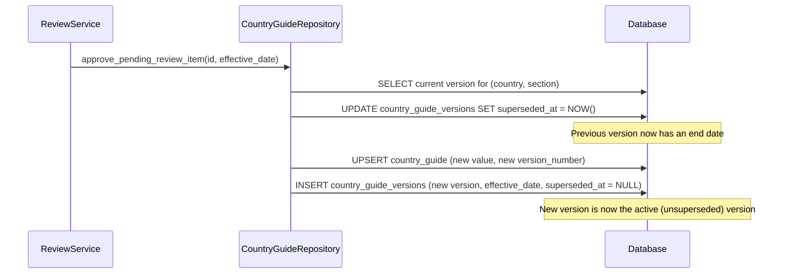

# Temporal Versioning

## 1. Feature Name

**Point-in-Time Rule Versioning & Historical Query Engine**

## 2. Business Problem Solved

Employment law compliance is not just about current rules — it requires answering questions about past regulatory state. "What was the minimum wage when this employee's contract was signed?" "What leave entitlements were effective during this dispute period?" The temporal versioning system maintains an immutable version history of every rule and supports point-in-time queries.

## 3. Operational Pain Points Addressed

- **Retroactive disputes**: Employment disputes reference the rules that were effective at the time of the event, not the current rules
- **Contract validation**: Contracts signed under previous regulations may reference superseded rules
- **Compliance audits**: Auditors may ask "what rules were you applying in Q3 2024?" and expect documentary evidence
- **Payroll reconciliation**: Retroactive payroll adjustments require knowing the exact rule that was in effect for each pay period

## 4. User Personas Involved

| Persona | Interaction |
|---------|-------------|
| Client Advisor | Queries historical rules when advising on disputes or contract interpretation |
| Compliance Lead | Reviews version history to understand how a rule evolved |
| External Auditor | Examines version timeline to verify compliance posture at a specific date |
| Legal Counsel | References point-in-time rules for dispute resolution |

## 5. Functional Overview

Every time a rule is approved and published, the system:

1. Marks the previous version's `superseded_at` timestamp
2. Creates a new version with the new `effective_date`
3. Increments the `version_number`
4. Links to the provenance record

The `TemporalRuleService` then supports three query types:

- **Point-in-time**: What was the rule at date X?
- **Timeline**: The complete version history for a rule
- **Version list**: All versions sorted chronologically

## 6. End-to-End Workflow

### Version Creation (on Approval)



### Point-in-Time Query

```sql
SELECT * FROM country_guide_versions
WHERE country = ? AND section = ?
  AND date(effective_date) <= date(?)
  AND (superseded_at IS NULL OR date(superseded_at) > date(?))
```

This query finds the version that was effective at the requested date — its effective_date is on or before the query date, and it had not yet been superseded.

## 7. Technical Architecture

### Version Table Design

```sql
CREATE TABLE country_guide_versions (
    id INTEGER PRIMARY KEY AUTOINCREMENT,
    country TEXT NOT NULL,
    section TEXT NOT NULL,
    value TEXT NOT NULL,
    source_url TEXT,
    source_hash TEXT,
    effective_date TEXT NOT NULL,
    created_at TEXT NOT NULL,
    superseded_at TEXT,              -- NULL = currently active
    version_number INTEGER NOT NULL,
    approval_reference TEXT,
    metadata TEXT DEFAULT '{}',
    UNIQUE(country, section, version_number)
)
```

**Key design choices**:

- **`superseded_at`**: `NULL` for the currently active version; set when a new version is approved. This enables efficient point-in-time queries without scanning the full history.
- **`version_number`**: Monotonically increasing per (country, section) pair. The UNIQUE constraint prevents duplicate version numbers.
- **`metadata`**: JSON blob for extensibility — stores extraction confidence, change type, or any context that should travel with the version.

### TemporalRuleService Methods

```python
class TemporalRuleService:
    def get_rule_at_date(self, country, section, as_of_date):
        """Return the rule that was effective at the given date."""

    def build_timeline(self, country, section):
        """Return {current: rule, versions: [all versions]}."""

    def list_version_history(self, country, section):
        """Return all versions sorted by version_number."""
```

**Date normalization**: The service accepts ISO datetime strings, `date` objects, or `YYYY-MM-DD` strings and normalizes them for the SQL query.

### Version Timeline Example

```
Version 1: effective 2024-01-01, superseded 2024-07-01
    value: "15 days annual leave"

Version 2: effective 2024-07-01, superseded 2025-04-01
    value: "18 days annual leave"

Version 3: effective 2025-04-01, superseded NULL (current)
    value: "21 days annual leave"
```

Query for `2024-09-15` returns Version 2 ("18 days annual leave").

## 8. APIs Involved

| Endpoint | Method | Purpose |
|----------|--------|---------|
| `GET /api/guide/<country>/<section>/at?date=YYYY-MM-DD` | GET | Rule value at a specific date |
| `GET /api/guide/<country>/<section>/history` | GET | Full version timeline |

### Example Request

```
GET /api/guide/India/minimum_wage/at?date=2024-09-15
```

### Example Response

```json
{
    "country": "India",
    "section": "minimum_wage",
    "value": "INR 21,000/month for scheduled employment",
    "effective_date": "2024-07-01",
    "superseded_at": "2025-04-01",
    "version_number": 2,
    "as_of_date": "2024-09-15"
}
```

## 9. Backend Components

| Component | File | Key Methods |
|-----------|------|-------------|
| `TemporalRuleService` | `app/services/temporal_rule_service.py` (45 lines) | `get_rule_at_date()`, `build_timeline()`, `list_version_history()` |
| `CountryGuideRepository` | `app/repositories/country_guide_repository.py` | `get_rule_at_date()`, `list_rule_versions()` |

## 10. Database Design Implications

The temporal design follows the **valid-time pattern**:

- Each version has a `[effective_date, superseded_at)` half-open interval
- The currently active version has `superseded_at = NULL`
- Point-in-time queries use `effective_date <= ? AND (superseded_at IS NULL OR superseded_at > ?)`

**Index considerations**: For production scale, a composite index on `(country, section, effective_date)` accelerates temporal queries. The `UNIQUE(country, section, version_number)` constraint provides implicit indexing.

**Immutability**: Version rows are never updated except to set `superseded_at` when a new version is created. The `value`, `effective_date`, and `version_number` fields are immutable after insertion.

## 11. Auditability & Traceability

Temporal versioning enables:

- **Historical reconstruction**: Show the complete state of a country's employment guide at any past date
- **Change velocity analysis**: How frequently has a specific rule changed? Which countries have the most regulatory churn?
- **Compliance timeline**: Demonstrate to auditors that the organization was applying the correct rule at any point in time
- **Dispute evidence**: Provide the exact rule text that was effective during a disputed period

## 12. Risk Mitigation

| Risk | Mitigation |
|------|-----------|
| Version gap (period with no effective rule) | `superseded_at` of version N is set to the `effective_date` of version N+1, ensuring continuous coverage |
| Incorrect effective date on approval | Reviewers can set the `effective_date` explicitly during approval; defaults to approval timestamp |
| Version history grows unbounded | Versions are small (text + metadata); storage cost is negligible for the query value provided |
| Retroactive corrections | A new version can be created with a past `effective_date` to correct the timeline |

## 13. Business Impact

- **Legal defensibility**: The organization can prove exactly what rules it was applying at any historical date
- **Payroll accuracy**: Retroactive payroll calculations use the correct historical rule values
- **Client trust**: Advisors can trace rule changes over time and explain when changes took effect
- **Regulatory reporting**: Period-specific compliance reports reference the correct rule versions

## 14. Future Enhancements

- **Diff between versions**: Show semantic diff between version N and version N+1
- **Bulk temporal query**: "What was the full employment guide for India on date X?" (all sections at once)
- **Version annotations**: Add notes to specific versions (e.g., "Budget 2025 update")
- **Change frequency analytics**: Dashboard showing rule change velocity by country and section
- **Export**: Generate point-in-time compliance snapshots as PDF or CSV
